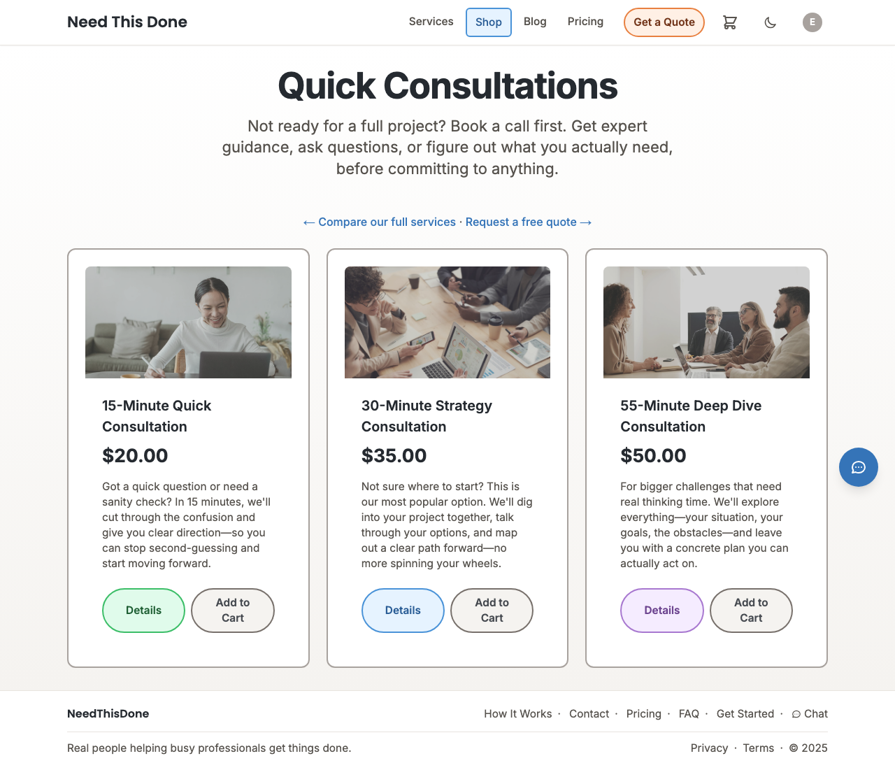
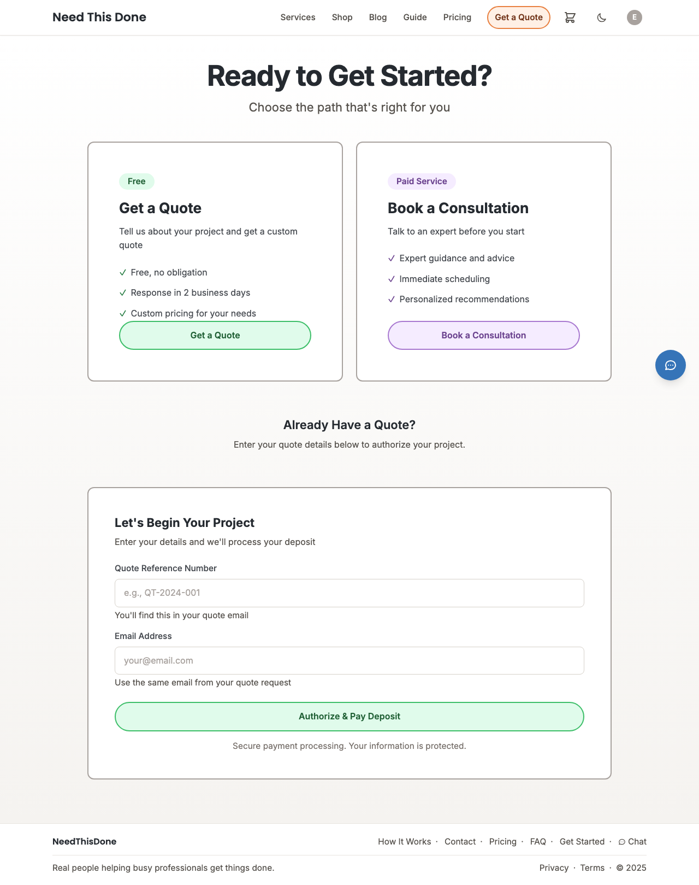
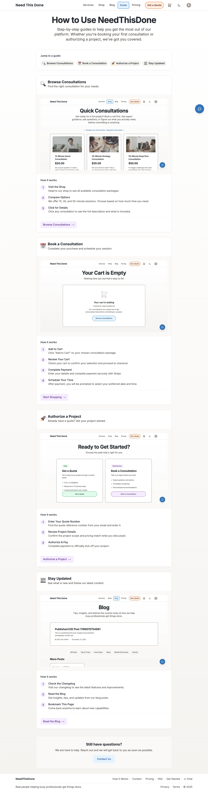
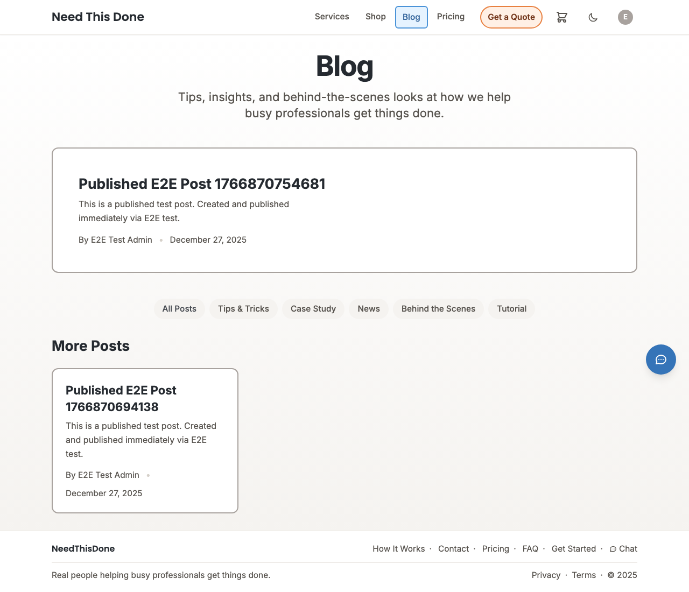

# NeedThisDone.com

Welcome! This is your home base for understanding and working with the NeedThisDone platform.

**What is this?** A professional services platform where clients can browse services, book consultations, and get things done. Built with Next.js and backed by a solid stack of managed services.

**New here?** Start with [Quick Start](#quick-start) to get running in 30 seconds, then explore the [Current State](#current-state-at-a-glance) to see what's already built.

**Looking for something specific?** The [Table of Contents](#table-of-contents) is organized by what you're trying to do.

---

## Current State at a Glance

Here's where we are right now - what's working, what's almost ready, and what's on hold:

```
╔══════════════════════════════════════════════════════════════════════════════╗
║                         PROJECT STATUS DASHBOARD                              ║
╠══════════════════════════════════════════════════════════════════════════════╣
║                                                                              ║
║  CODEBASE METRICS                        PRODUCTION READINESS                ║
║  ─────────────────                       ────────────────────                 ║
║  📄 19 Public Pages                      ✅ Medusa E-commerce (Railway)      ║
║  🔐 16 Admin Pages                       ✅ Stripe Payments                  ║
║  🔌 49 API Routes                        ✅ Supabase Auth & Database         ║
║  🧩 90+ React Components                 ✅ Redis Caching (Upstash)          ║
║  📦 6 Context Providers                  ✅ Email Notifications (Resend)     ║
║  🔧 44 Lib Utilities                     ✅ Google OAuth                     ║
║  🪝 8 Custom Hooks                       ✅ Inline Editing (12 pages)        ║
║  🧪 229 E2E Tests Passing                ✅ WCAG AA Color System (4.5:1)     ║
║                                                                              ║
║  RECENT ADDITIONS (Dec 2025)             VISUAL BUILDER                      ║
║  ────────────────────────────            ──────────────                       ║
║  ✨ Inline Click-to-Edit                 ✅ Puck Page Builder (28 components)║
║  ✨ Pre-built Section Library            ✅ Pre-built Section Templates      ║
║  ✨ Template Marketplace                 ✅ Template Marketplace             ║
║  ✨ Dark Mode w/ WCAG AA                 ✅ TipTap Rich Text Editor          ║
║                                                                              ║
╚══════════════════════════════════════════════════════════════════════════════╝
```

### Tech Stack

```
┌─────────────────────────────────────────────────────────────────────────────┐
│                              TECHNOLOGY STACK                                │
├─────────────────────────────────────────────────────────────────────────────┤
│                                                                             │
│  FRONTEND                     BACKEND                   INFRASTRUCTURE      │
│  ────────                     ───────                   ──────────────      │
│  Next.js 14                   Medusa (Railway)          Vercel (hosting)    │
│  React 18                     Supabase (PostgreSQL)     Railway (Medusa)    │
│  TypeScript 5.3               Upstash (Redis)           Supabase (DB)       │
│  Tailwind CSS 3.4             Stripe (payments)         Upstash (cache)     │
│                               Resend (email)                                │
│                               Google Calendar API                           │
│                                                                             │
│  TESTING                      DEV TOOLS                 AI/SEARCH           │
│  ───────                      ─────────                 ─────────           │
│  Playwright (E2E)             Storybook 10.1            OpenAI GPT          │
│  Vitest (unit)                ESLint                    Vercel AI SDK       │
│  Axe Core (a11y)              TypeScript                Vector embeddings   │
│                                                                             │
└─────────────────────────────────────────────────────────────────────────────┘
```

### Service Architecture

```
┌─────────────────────────────────────────────────────────────────────────────┐
│                           HOW THE PIECES FIT TOGETHER                        │
└─────────────────────────────────────────────────────────────────────────────┘

                              ┌─────────────────┐
                              │     BROWSER     │
                              │   (User/Admin)  │
                              └────────┬────────┘
                                       │ HTTPS
                                       ▼
┌──────────────────────────────────────────────────────────────────────────────┐
│                              VERCEL EDGE                                      │
│                     (CDN, SSL, Global Distribution)                           │
└──────────────────────────────────────┬───────────────────────────────────────┘
                                       │
                                       ▼
┌──────────────────────────────────────────────────────────────────────────────┐
│                           NEXT.JS APP (app/)                                  │
│  ┌──────────────┐  ┌──────────────┐  ┌──────────────┐  ┌──────────────┐      │
│  │  15 PUBLIC   │  │  13 ADMIN    │  │  49 API      │  │  151 REACT   │      │
│  │  PAGES       │  │  PAGES       │  │  ROUTES      │  │  COMPONENTS  │      │
│  └──────────────┘  └──────────────┘  └──────────────┘  └──────────────┘      │
│                                                                              │
│  ┌──────────────────────────────────────────────────────────────────────┐    │
│  │                        5 CONTEXT PROVIDERS                            │    │
│  │  AuthContext │ CartContext │ ToastContext │ StripeContext │ ServiceModal │
│  └──────────────────────────────────────────────────────────────────────┘    │
└──────────────────────────────────────┬───────────────────────────────────────┘
                                       │
         ┌─────────────────────────────┼─────────────────────────────┐
         │                             │                             │
         ▼                             ▼                             ▼
┌─────────────────┐          ┌─────────────────┐          ┌─────────────────┐
│     MEDUSA      │          │    SUPABASE     │          │     UPSTASH     │
│    (Railway)    │          │    (Cloud)      │          │    (Redis)      │
├─────────────────┤          ├─────────────────┤          ├─────────────────┤
│ • Products      │          │ • Auth (users)  │          │ • Product cache │
│ • Carts         │          │ • Database      │          │ • Cart cache    │
│ • Orders        │          │ • File storage  │          │ • Order cache   │
│ • Variants      │          │ • RLS policies  │          │ • Session data  │
└─────────────────┘          └─────────────────┘          └─────────────────┘
         │                             │
         │                             │
         ▼                             ▼
┌─────────────────┐          ┌─────────────────┐          ┌─────────────────┐
│     STRIPE      │          │     RESEND      │          │ GOOGLE CALENDAR │
│   (Payments)    │          │    (Email)      │          │   (Scheduling)  │
├─────────────────┤          ├─────────────────┤          ├─────────────────┤
│ • Checkout      │          │ • Welcome       │          │ • OAuth flow    │
│ • Subscriptions │          │ • Order confirm │          │ • Event create  │
│ • Webhooks      │          │ • Admin alerts  │          │ • Availability  │
└─────────────────┘          └─────────────────┘          └─────────────────┘
```

---

## Table of Contents

**Getting Started**
- [Quick Start (30 seconds)](#quick-start)
- [Development Setup](#development-setup)

**Understanding the System**
- [Current State at a Glance](#current-state-at-a-glance) ← *status dashboard, tech stack, architecture*
- [Project Structure](#project-structure) ← *complete file map, 35 pages, 49 APIs, 151 components*
- [Architecture Overview](#architecture-overview) ← *data flow diagrams*

**Core Features**
- [Shopping Cart & Ecommerce](#shopping-cart--ecommerce)
- [Authentication](#authentication)
- [Email Notifications](#email-notifications)
- [Caching Strategy](#caching-strategy)

**Operations**
- [Deployment](#deployment)
- [Testing](#testing) ← *229 E2E tests*
- [Troubleshooting](#troubleshooting)

**Reference**
- [Puck Visual Builder](#puck-visual-builder) ← *28 components, color utilities*
- [Inline Editing](#inline-editing) ← *click-to-edit on 12 marketing pages*
- [Template System](#template-system) ← *5-step wizard, starter templates*
- [API Patterns](#api-patterns) ← *auth, error handling*
- [Design System](#design-system)
- [Key Files Reference](#key-files-reference)
- [High-Priority Improvements](#high-priority-improvements) ← *3 high-value next steps*

---

## Quick Start

Ready to dive in? You'll be up and running in about 30 seconds:

```bash
cd app && npm install    # First time only
npm run dev              # Start the dev server
```

Open http://localhost:3000 and you're in! The app hot-reloads, so your changes appear instantly.

**Want to explore the component library?** Run `npm run storybook` to see all UI components in isolation.

### Helpful Commands

| Command | What it does |
|---------|--------------|
| `npm run dev` | Start Next.js dev server |
| `npm run build` | Build for production |
| `npm run test` | Run E2E tests |
| `npm run test:a11y` | Run accessibility tests |
| `npm run lint` | Run ESLint |
| `npm run storybook` | Start Storybook |

---

## Deployment

### Production Architecture

| Service | Platform | URL |
|---------|----------|-----|
| Next.js Frontend | Vercel | https://needthisdone.com |
| Medusa Backend | Railway | https://need-this-done-production.up.railway.app |
| Database | Supabase | PostgreSQL (managed) |
| Redis Cache | Upstash | Redis (managed) |

### Branch Workflow

- `main` - Production code, deploys automatically to Vercel
- `dev` - Active development, test changes here first
- `experiment` - Isolated experiments

**Workflow:**
1. Develop and test on `dev` branch locally
2. Push to GitHub - Vercel creates preview deployment
3. Test preview URL, then merge `dev` → `main`
4. Vercel auto-deploys to production

### Deploying Changes

**Frontend (Vercel - Automatic):**
```bash
# Push to main triggers automatic deployment
git checkout main
git merge dev
git push origin main
# Vercel deploys automatically
```

**Medusa Backend (Railway):**
```bash
# Railway auto-deploys from GitHub
# Or manually via Railway CLI:
railway up
```

### Product Management

**Products are managed via Medusa Admin API:**

| Product | Price | Duration | Handle |
|---------|-------|----------|--------|
| 15-Minute Quick Consultation | $20.00 | 15 min | `consultation-15-min` |
| 30-Minute Strategy Consultation | $35.00 | 30 min | `consultation-30-min` |
| 55-Minute Deep Dive Consultation | $50.00 | 55 min | `consultation-55-min` |

**Update product images:**
```bash
cd medusa
MEDUSA_ADMIN_PASSWORD='xxx' node update-product-image.js consultation-15-min "https://example.com/image.jpg"
```

**Admin credentials:**
- Email: Set via `MEDUSA_ADMIN_EMAIL` environment variable
- Password: Set via `MEDUSA_ADMIN_PASSWORD` environment variable

---

## What This Project Is

A modern platform for professional services that combines:

- **E-commerce platform**: Browse products, add to cart, checkout, manage orders
- **User accounts**: Authentication, profiles, order history
- **Admin dashboard**: Manage products, view orders, user management
- **Visual page builder**: Non-technical users can create pages (Puck visual editor)
- **Component library**: Reusable, accessible React components (Storybook)

**Tech Stack:**
- **Frontend**: Next.js 14 (React) with TypeScript, deployed on Vercel
- **Backend**: Next.js API routes + Medusa (ecommerce engine on Railway)
- **Database**: Supabase (PostgreSQL with pgvector for AI chatbot)
- **Ecommerce**: Medusa headless commerce engine
- **Payments**: Stripe (one-time & subscriptions)
- **Email**: Resend (transactional emails) - sends from hello@needthisdone.com
- **Cache**: Upstash Redis for performance
- **Design**: Tailwind CSS with dark mode support
- **Testing**: Playwright E2E tests + Visual regression testing (screenshot baselines)

---

## Architecture Overview


```
┌──────────────────────────────────────────┐
│          Browser / User                  │
└───────────┬────────────────────────────┘
            │
┌───────────▼────────────────────────┐
│   Vercel (CDN + Edge Network)      │
│   - Auto SSL, global edge caching  │
└───────────┬────────────────────────┘
            │
    ┌───────┴───────┬───────────┐
    │               │           │
┌───▼────────┐  ┌──▼──────┐  ┌─▼──────────┐
│ Next.js    │  │ Medusa  │  │ Supabase   │
│ (Vercel)   │  │(Railway)│  │ (Cloud)    │
│ - Pages    │  │ - Cart  │  │ - Auth     │
│ - API      │  │ - Orders│  │ - Database │
└───┬────────┘  └──┬──────┘  └─┬──────────┘
    │              │           │
    └──────────┬───┴───────────┘
               │
    ┌──────────▼──────────┐
    │ Upstash Redis       │
    │ - Products cache    │
    │ - Session data      │
    └─────────────────────┘
```

**Data Flow**:
1. User makes request to needthisdone.com
2. Vercel serves Next.js app (edge-cached, auto SSL)
3. Next.js API routes call Medusa on Railway for ecommerce
4. Next.js calls Supabase for user/auth data
5. Upstash Redis caches frequently accessed data

### Complete System Workflow

The following diagram shows how all system components interact for major user journeys:

```
╔══════════════════════════════════════════════════════════════════════════════╗
║                          USER JOURNEY WORKFLOWS                               ║
╚══════════════════════════════════════════════════════════════════════════════╝

┌─────────────────────────────────────────────────────────────────────────────┐
│ 1. BROWSE & SHOP FLOW                                                        │
└─────────────────────────────────────────────────────────────────────────────┘

  User visits site          CDN + Edge           Next.js App
       │                        │                    │
       ▼                        ▼                    ▼
  ┌─────────┐   HTTPS    ┌───────────┐   SSR    ┌─────────────┐
  │ Browser │ ─────────► │  Vercel   │ ───────► │  App Router │
  └─────────┘            │   Edge    │          └──────┬──────┘
       ▲                 └───────────┘                 │
       │                                               ▼
       │                                    ┌──────────────────┐
       │    Rendered Page                   │ Check Redis Cache│
       │◄───────────────────────────────────├──────────────────┤
       │                                    │ HIT? Return data │
       │                                    │ MISS? Query ↓    │
       │                                    └────────┬─────────┘
       │                                             │
       │                           ┌─────────────────┼─────────────────┐
       │                           ▼                 ▼                 ▼
       │                    ┌───────────┐     ┌───────────┐     ┌───────────┐
       │                    │  Medusa   │     │ Supabase  │     │   Cache   │
       │                    │ (Railway) │     │   (DB)    │     │  (Redis)  │
       │                    └───────────┘     └───────────┘     └───────────┘
       │                    Products, Carts   Users, Auth      Warm Cache
       │                    Orders, Variants  Pages, Media


┌─────────────────────────────────────────────────────────────────────────────┐
│ 2. CART & CHECKOUT FLOW                                                      │
└─────────────────────────────────────────────────────────────────────────────┘

  Add to Cart (Optimistic Updates)
  ═══════════════════════════════

  Click "Add"   UI Updates     Background Sync       Server Response
      │         Instantly           │                     │
      ▼             ▼               ▼                     ▼
  ┌───────┐    ┌────────┐    ┌────────────┐    ┌─────────────────┐
  │ User  │───►│ React  │───►│ POST       │───►│ Medusa validates│
  │ Click │    │ State  │    │ /api/cart  │    │ & confirms      │
  └───────┘    └────────┘    └────────────┘    └────────┬────────┘
                   ▲                                     │
                   │         ┌───────────────────────────┘
                   │         ▼
                   │    ┌───────────────────┐
                   └────│ Replace temp ID   │  (or rollback on failure)
                        │ with server data  │
                        └───────────────────┘


  Checkout Flow
  ═════════════

  

  Cart Page       Guest/Auth        Payment          Order Created
      │               │                │                  │
      ▼               ▼                ▼                  ▼
  ┌────────┐    ┌──────────┐    ┌───────────┐    ┌─────────────────┐
  │ Review │───►│ Email +  │───►│  Stripe   │───►│ Order stored in │
  │ Items  │    │ Shipping │    │ Checkout  │    │ Medusa + Link   │
  └────────┘    └──────────┘    └───────────┘    │ saved in        │
                                      │          │ Supabase        │
                     ┌────────────────┘          └────────┬────────┘
                     ▼                                    │
              ┌─────────────┐                             ▼
              │ Stripe      │                   ┌─────────────────┐
              │ processes   │                   │ Is Consultation?│
              │ payment     │                   └────────┬────────┘
              └─────────────┘                            │
                                          ┌──────────────┴──────────────┐
                                          ▼                             ▼
                                    ┌───────────┐               ┌─────────────┐
                                    │    Yes    │               │     No      │
                                    │ Show      │               │ Confirmation│
                                    │ Booking   │               │ Page Only   │
                                    │ Form      │               └─────────────┘
                                    └─────┬─────┘
                                          │
                                          ▼
                                    ┌─────────────┐
                                    │ Appointment │──► Google Calendar
                                    │ Request     │──► Admin Notification
                                    └─────────────┘──► Email Confirmation


┌─────────────────────────────────────────────────────────────────────────────┐
│ 3. AUTHENTICATION FLOW                                                       │
└─────────────────────────────────────────────────────────────────────────────┘

                         ┌─────────────────────────┐
                         │     User Sign-In        │
                         └───────────┬─────────────┘
                                     │
                    ┌────────────────┴────────────────┐
                    ▼                                 ▼
            ┌───────────────┐                ┌───────────────┐
            │ Google OAuth  │                │ Email/Password│
            │  (NextAuth)   │                │  (Supabase)   │
            └───────┬───────┘                └───────┬───────┘
                    │                                │
                    │ Creates/syncs user             │ Verifies via
                    │ in Supabase Auth               │ Supabase Auth
                    │                                │
                    └────────────────┬───────────────┘
                                     ▼
                          ┌─────────────────────┐
                          │ Unified AuthContext │
                          │ (single state for   │
                          │  all auth methods)  │
                          └──────────┬──────────┘
                                     │
               ┌─────────────────────┼─────────────────────┐
               ▼                     ▼                     ▼
        ┌────────────┐       ┌────────────┐       ┌────────────┐
        │ Dashboard  │       │ Cart Link  │       │ Order      │
        │ Access     │       │ to User    │       │ History    │
        └────────────┘       └────────────┘       └────────────┘


┌─────────────────────────────────────────────────────────────────────────────┐
│ 4. ADMIN & CMS FLOW (Puck Page Builder)                                      │
└─────────────────────────────────────────────────────────────────────────────┘

  Admin User         Puck Editor          Save/Publish         Live Site
       │                  │                    │                   │
       ▼                  ▼                    ▼                   ▼
  ┌─────────┐    ┌────────────────┐    ┌─────────────┐    ┌─────────────┐
  │ Login   │───►│ Visual Editor  │───►│ POST        │───►│ Cached page │
  │ /admin  │    │ - 22 Components│    │ /api/pages  │    │ served via  │
  └─────────┘    │ - Drag & Drop  │    │             │    │ /p/[slug]   │
                 │ - Live Preview │    │ Supabase    │    └─────────────┘
                 └────────────────┘    │ storage     │
                                       └─────────────┘

  Component Categories:
  ┌──────────────────────────────────────────────────────────────────┐
  │ Layout   │ Hero, Columns, Cards, Container, Grid, Section        │
  │ Media    │ Image, Gallery, Video, MediaLibrary                   │
  │ Content  │ Text, Heading, List, Divider, Spacer, RichText       │
  │ Inter.   │ Button, Accordion, Tabs, ContactForm                  │
  │ Commerce │ ProductCard, ProductGrid, PriceDisplay, AddToCart    │
  └──────────────────────────────────────────────────────────────────┘


┌─────────────────────────────────────────────────────────────────────────────┐
│ 5. EMAIL NOTIFICATION FLOW                                                   │
└─────────────────────────────────────────────────────────────────────────────┘

  Trigger Event           Email Service          Resend API
       │                       │                     │
       ▼                       ▼                     ▼
  ┌──────────────┐    ┌─────────────────┐    ┌─────────────┐
  │ Order placed │───►│ email-service.ts│───►│   Resend    │──► User Inbox
  │ User signs up│    │ - Retry logic   │    │ (SMTP API)  │
  │ Appointment  │    │ - Idempotency   │    └─────────────┘
  │ Form submit  │    │ - React Email   │
  └──────────────┘    └─────────────────┘

  Email Types:
  ├── Welcome (signup)
  ├── Login Notification (security)
  ├── Order Confirmation
  ├── Appointment Confirmation
  ├── Admin Notification (new project/order)
  └── Client Confirmation (form submission)
```

**Why This Design**:
- ✅ **Zero-ops deployment** - Push to GitHub, auto-deploys everywhere
- ✅ **Global edge network** - Vercel CDN for fast page loads
- ✅ **Managed services** - No servers to maintain
- ✅ **Independent scaling** - Each service scales automatically
- ✅ **Cost-effective** - Pay only for what you use

### Medusa Backend (Current State)

Real Medusa implementation with database-persisted products, carts, and orders. All consultation products require appointment scheduling before fulfillment.

| Feature | Status | Tested | Details |
|---------|--------|--------|---------|
| Products | ✅ Working | 12 E2E tests | 3 consultation tiers, seeded via `npm run seed` |
| Carts | ✅ Working | 8 E2E tests | Stored in Medusa PostgreSQL |
| Checkout | ✅ Working | 6 E2E tests | Guest + authenticated checkout flows |
| Orders | ✅ Working | 4 E2E tests | Full order objects, linked in Supabase |
| Email | ✅ Working | 9 unit tests | 4 email types via Resend |

**All 229 E2E tests passing** - See [Testing](#testing) for complete coverage map.

**Consultation Products** (seeded via `medusa/seed-products.js` using Admin API):
| Product | Price | Duration | Handle |
|---------|-------|----------|--------|
| 15-Minute Quick Consultation | $20 | 15 min | `consultation-15-min` |
| 30-Minute Strategy Consultation | $35 | 30 min | `consultation-30-min` |
| 55-Minute Deep Dive Consultation | $50 | 55 min | `consultation-55-min` |

**Admin Credentials** (for Medusa Admin panel):
- Email: Set via `MEDUSA_ADMIN_EMAIL` environment variable
- Password: Set via `MEDUSA_ADMIN_PASSWORD` environment variable

**Security Note:** The `MEDUSA_ADMIN_PASSWORD` environment variable is required for all environments. Scripts will fail if not set - no fallback passwords.

---

## Local Development

### Prerequisites

```bash
# Install Node.js (v18 or higher)
node --version

# Install Supabase CLI (macOS)
brew install supabase/tap/supabase

# Or Linux:
# https://supabase.com/docs/guides/cli

# Verify installation
supabase --version
```

### Starting Development Environment

**Terminal 1: Start the Next.js development server**
```bash
cd app
npm install  # First time only
npm run dev
```

App will be available at: `http://localhost:3000`

**Terminal 2: Start Supabase (auth & user database)**
```bash
supabase start
```

Supabase will start with:
- PostgreSQL (port 54322)
- Supabase API (port 54321)
- Realtime server
- Database migrations applied automatically

**For Storybook (optional third terminal):**
```bash
cd app
npm run storybook
```

Storybook will be available at: `http://localhost:6006`

### Environment Configuration

The app automatically connects to:
- **Frontend**: Next.js dev server on localhost:3000
- **Backend**: Medusa API on Railway (via `MEDUSA_BACKEND_URL` from `.env.local`)
- **Database**: Supabase (local instance started with `supabase start`)
- **Cache**: Upstash Redis (configured in Railway)

**Required `.env.local` variables** (create this file in the `app/` directory):
```bash
# Supabase (local development)
NEXT_PUBLIC_SUPABASE_URL=http://127.0.0.1:54321
NEXT_PUBLIC_SUPABASE_ANON_KEY=eyJhbGciOiJIUzI1NiIsInR5cCI6IkpXVCJ9...  # Get from: supabase status
SUPABASE_SERVICE_ROLE_KEY=eyJhbGciOiJIUzI1NiIsInR5cCI6IkpXVCJ9...  # Get from: supabase status

# Medusa (Railway)
MEDUSA_BACKEND_URL=https://need-this-done-production.up.railway.app
MEDUSA_ADMIN_EMAIL=your_admin_email  # Required for Medusa admin authentication
MEDUSA_ADMIN_PASSWORD=your_admin_password  # Required for product management scripts

# Stripe (payments)
STRIPE_SECRET_KEY=sk_test_...
NEXT_PUBLIC_STRIPE_PUBLISHABLE_KEY=pk_test_...
STRIPE_WEBHOOK_SECRET=whsec_...

# Email (Resend)
RESEND_API_KEY=re_...
RESEND_FROM_EMAIL=your_verified_email@domain.com
RESEND_ADMIN_EMAIL=your_admin_notification_email

# AI Chatbot (optional)
OPENAI_API_KEY=sk-...
NEXT_PUBLIC_CHATBOT_MODEL=gpt-4o-mini

# Site Configuration
NEXT_PUBLIC_SITE_URL=http://localhost:3000  # Development
NODE_ENV=development
```

**To get Supabase keys:**
```bash
supabase status
```

### Stopping Services

```bash
# Stop Next.js dev server
# Press Ctrl+C in terminal 1

# Stop Storybook
# Press Ctrl+C in terminal 3

# Stop Supabase
supabase stop

# Reset Supabase (clears all data)
supabase db reset
```

---

## Project Structure

```
┌─────────────────────────────────────────────────────────────────────────────┐
│                            COMPLETE FILE MAP                                 │
└─────────────────────────────────────────────────────────────────────────────┘

/home/user/Need_This_Done/
├── README.md              ← You are here (single source of truth)
├── TODO.md                ← Task tracker (In Progress / Done)
├── CLAUDE.md              ← AI assistant instructions
│
├── app/                   ← NEXT.JS APPLICATION
│   ├── app/               ← Pages & API routes (Next.js App Router)
│   ├── components/        ← 151 React components
│   ├── context/           ← 5 state providers
│   ├── lib/               ← 44 utility files
│   ├── hooks/             ← 8 custom React hooks
│   ├── emails/            ← Email templates (React Email)
│   ├── e2e/               ← 25 Playwright test files
│   └── __tests__/         ← Unit & accessibility tests
│
├── supabase/              ← DATABASE
│   └── migrations/        ← Schema migrations
│
└── medusa/                ← E-COMMERCE BACKEND (Railway)
    ├── src/               ← Medusa customizations
    └── seed-products.js   ← Product seeding script
```

### Complete Page Inventory (35 pages total)

```
┌─────────────────────────────────────────────────────────────────────────────┐
│                          PUBLIC PAGES (19 pages)                             │
├─────────────────────────────────────────────────────────────────────────────┤
│                                                                             │
│  MARKETING                    E-COMMERCE                   AUTH             │
│  /                 (home)     /shop             (catalog)  /login           │
│  /services                    /shop/[productId] (detail)   /auth/callback   │
│  /pricing                     /cart                                         │
│  /how-it-works               /checkout                     LEGAL            │
│  /faq                         /dashboard        (orders)   /privacy         │
│  /contact                                                  /terms           │
│  /get-started                 DYNAMIC                      CONTENT          │
│                               /p/[slug]         (CMS)      /blog            │
│                                                            /blog/[slug]     │
│                                                            /changelog       │
│                                                            /guide           │
│                                                                             │
└─────────────────────────────────────────────────────────────────────────────┘

┌─────────────────────────────────────────────────────────────────────────────┐
│                          ADMIN PAGES (16 pages)                              │
├─────────────────────────────────────────────────────────────────────────────┤
│                                                                             │
│  SHOP MANAGEMENT              CONTENT (Puck ⛔)            OTHER            │
│  /admin/shop                  /admin/pages       (list)    /admin/users     │
│  /admin/shop/products         /admin/pages/new   (create)  /admin/appointments│
│  /admin/shop/products/new     /admin/pages/[slug]/edit     /admin/dev       │
│  /admin/shop/orders                                                         │
│  /admin/orders       (legacy) /admin/content     (alt CMS) BLOG             │
│  /admin/products     (legacy) /admin/content/[slug]/edit   /admin/blog      │
│                                                            /admin/blog/new  │
│                                                            /admin/blog/[slug]/edit│
│                                                                             │
│  Note: Puck has 28 components ready - needs E2E tests before production     │
│                                                                             │
└─────────────────────────────────────────────────────────────────────────────┘
```

### Complete API Route Inventory (49 routes)

```
┌─────────────────────────────────────────────────────────────────────────────┐
│                           API ROUTES BY CATEGORY                             │
└─────────────────────────────────────────────────────────────────────────────┘

AUTHENTICATION (4 routes)
├── POST /api/auth/[...nextauth]     NextAuth handler (Google OAuth + credentials)
├── POST /api/auth/login             Email/password login
├── POST /api/auth/signup            New user registration
└── POST /api/auth/logout            Session termination

SHOPPING & E-COMMERCE (8 routes)
├── GET/POST /api/cart               Create or get cart
├── GET/POST/DELETE /api/cart/[cartId]/items   Manage cart items
├── GET /api/shop/products           List all products (cached)
├── GET /api/shop/products/[productId]   Single product detail
├── POST /api/checkout/session       Create Stripe checkout session
├── POST /api/checkout/check-appointment   Validate appointment requirements
├── GET/POST /api/orders             Order management
└── GET /api/user/orders             User's order history

ADMIN MANAGEMENT (9 routes)
├── GET/POST /api/admin/products     Product CRUD (Medusa Admin API)
├── POST /api/admin/products/upload-image    Upload product images
├── POST /api/admin/products/update-image    Update existing images
├── GET/POST /api/admin/orders       View all orders
├── PUT /api/admin/orders/[id]/status    Update order status
├── GET/POST /api/admin/appointments     Appointment queue
├── PUT /api/admin/appointments/[id]/approve   Approve booking
├── PUT /api/admin/appointments/[id]/cancel    Cancel booking
└── GET/POST /api/admin/users        User management

PAYMENTS (3 routes)
├── POST /api/stripe/create-payment-intent   One-time payments
├── POST /api/stripe/create-subscription     Recurring payments
└── POST /api/stripe/webhook         Handle Stripe events

CONTENT & PAGES (5 routes)
├── GET/POST /api/pages              Dynamic page management
├── GET /api/page-content/[slug]     Get page content by slug
├── GET /api/pages/[slug]            Get full page data
├── GET/POST /api/blog               Blog post listing and creation
└── GET/PUT/DELETE /api/blog/[slug]  Single blog post CRUD

GOOGLE INTEGRATION (2 routes)
├── POST /api/google/connect         Initiate OAuth flow
└── GET /api/google/callback         Handle OAuth callback

PROJECTS (5 routes)
├── GET/POST /api/projects           Project submissions
├── GET /api/projects/mine           User's projects
├── GET /api/projects/all            All projects (admin)
├── PUT /api/projects/[id]/status    Update status
└── POST /api/projects/[id]/comments Add comments

MEDIA (3 routes)
├── GET/POST /api/media              Upload/list media
├── GET/DELETE /api/media/[id]       Get/delete media item
└── GET /api/files/[...path]         Serve uploaded files

AI & SEARCH (5 routes)
├── POST /api/chat                   AI chatbot (GPT-powered)
├── POST /api/embeddings/index       Index content for search
├── POST /api/embeddings/check       Check indexing status
├── GET /api/embeddings/status       Embedding status
└── GET /api/embeddings/debug        Debug embeddings

MISC (4 routes)
├── GET /api/health                  Service health check
├── POST /api/appointments/request   Request appointment
├── POST /api/email-forward          Forward emails
└── GET /api/demo/*                  Demo/testing endpoints
```

### Component Inventory (151 components)

```
┌─────────────────────────────────────────────────────────────────────────────┐
│                        COMPONENTS BY MODULE                                  │
└─────────────────────────────────────────────────────────────────────────────┘

CORE UI (37 components)
├── Layout:        Navigation, Footer, DarkModeToggle
├── Design System: Button, Card, PageHeader, CTASection, CircleBadge
├── Cards:         PricingCard, ServiceCard, StepCard, FeatureCard, ProjectCard
├── Dashboards:    AdminDashboard, UserDashboard
├── Forms:         AppointmentRequestForm, AppointmentStepForm, PaymentForm
├── Modals:        ProjectDetailModal, ServiceDetailModal
└── Demos:         AuthDemo, DatabaseDemo, HealthStatus, SpeedDemo

CHATBOT MODULE (6 components)
├── ChatbotWidget      Main chat interface
├── ChatbotModal       Modal wrapper
├── ChatbotButton      Trigger button
├── ChatMessage        Message bubbles
├── PageIndexer        Content indexer
└── IndexingContext    State management

CONTENT EDITOR MODULE (13 components)
├── Core:     ContentEditor, PagePreview
├── Fields:   TextField, TextAreaField, SelectField, ArrayField
├── Forms:    HomepageForm, HowItWorksForm, FAQForm, PricingForm, ServicesForm
└── Previews: HomepagePreview, HowItWorksPreview, FAQPreview, PricingPreview

PUCK PAGE BUILDER (3 helper components) ⛔ DISABLED
├── ImageField        Custom image picker
├── ProductPicker     Product selection
└── RichTextField     WYSIWYG field

MEDIA MODULE (2 components)
├── ImageUpload       Upload interface
└── MediaLibrary      Media browser

PROJECT MODAL MODULE (4 components)
├── ProjectModalHeader
├── ProjectModalDetails
├── ProjectComments
└── AdminStatusSection

SHOP MODULE (2 components)
├── ShopClient        Product grid
└── ProductDetailClient   Product page

UI PRIMITIVES (2 components)
├── ConfirmDialog     Confirmation modals
└── Toast             Notifications

STORYBOOK STORIES (8 files)
└── Button, Card, PageHeader, CTASection, CircleBadge, PricingCard, etc.
```

### Lib Utilities (44 files)

```
┌─────────────────────────────────────────────────────────────────────────────┐
│                          UTILITY LIBRARIES                                   │
└─────────────────────────────────────────────────────────────────────────────┘

EXTERNAL SERVICE CLIENTS
├── medusa-client.ts     Medusa API (products, carts, orders) with retry logic
├── supabase.ts          Supabase client (browser)
├── supabase-server.ts   Supabase client (server)
├── redis.ts             Upstash Redis with reconnection
├── stripe.ts            Stripe client singleton
├── email.ts             Resend email client
├── email-service.ts     Email notification logic
└── google-calendar.ts   Google Calendar OAuth + API

AUTHENTICATION & API
├── auth.ts              NextAuth session helpers
├── auth-options.ts      NextAuth config (Google + credentials)
├── api-auth.ts          API route authentication (verifyAdmin, verifyAuth)
└── api-errors.ts        Standardized error responses (handleApiError, badRequest)

CACHING & PERFORMANCE
├── cache.ts             Type-safe cache wrapper with TTL
└── cache-stats.ts       Cache hit/miss rate monitoring

DESIGN SYSTEM
├── colors.ts            Central color definitions (WCAG AA anchors)
├── service-colors.ts    Service type → accent color mapping
└── wcag-contrast.ts     WCAG contrast ratio calculator

INLINE EDITING SYSTEM
├── content-discovery.ts     Auto-discover editable content files
├── content-path-mapper.ts   Click-to-edit JSON path finding
├── editable-routes.ts       Route → page slug mapping
├── fetch-page-content.ts    Page content fetching with fallback
├── default-page-content.ts  Default content templates
└── page-content-types.ts    TypeScript type definitions

PUCK PAGE BUILDER
├── puck-config.tsx      22 page builder components (2,100+ lines)
├── puck-utils.tsx       Shared utilities (getPuckAccentColors, etc.)
├── puck-editable.tsx    Puck editor integration
└── sections/index.ts    Pre-built section templates

TEMPLATES SYSTEM
├── templates/index.ts           Template registry
├── templates/config.ts          Template configuration
├── templates/types.ts           Template type definitions
├── templates/utils.ts           Template utilities
└── templates/starter-templates.ts  Pre-built starter templates

UTILITIES
├── format.ts            Price/date formatting (formatPrice)
├── object-utils.ts      Nested value access (getNestedValue, setNestedValue)
├── validation.ts        File upload & form validation rules
├── appointment-utils.ts Appointment scheduling helpers
├── loop-state.ts        Auto-loop state management (Claude Code)
└── media-types.ts       Supported media format definitions

CONTENT TYPES
├── service-modal-content.ts  Service modal content
├── blog-types.ts             Blog type definitions
└── generated/content-manifest.ts  Auto-generated route manifest

AI/CHATBOT
├── chatbot/index.ts
├── chatbot/content-extractor.ts
├── chatbot/content-hash.ts
└── chatbot/text-chunker.ts
```

### Custom Hooks (8 files)

```
┌─────────────────────────────────────────────────────────────────────────────┐
│                           REACT HOOKS                                        │
└─────────────────────────────────────────────────────────────────────────────┘

INLINE EDITING
├── useEditableContent.ts   Page content initialization for inline editing
│                           Replaces 15+ lines of boilerplate with one call
└── useUniversalClick.ts    Global click-to-edit handler for edit mode
                            Auto-detects JSON paths from clicked text

ANALYTICS
├── usePageViewTracking.ts  Tracks page views for Puck CMS analytics
└── useProductTracking.ts   Product interactions for recommendations engine
                            Events: view, cart_add, purchase, wishlist

PROJECT MANAGEMENT
├── useComments.ts          Comment CRUD operations for project modals
│                           Handles fetching, submission, auto-scroll
└── useProjectStatus.ts     Admin project status updates
                            Manages status change + optional notes

UI UTILITIES
├── useBackdropClose.ts     Modal click-outside handler + Escape key
│                           Consistent close behavior across all modals
└── useCurrency.ts          Currency conversion and formatting
                            Fetches rates, caches, converts, formats
```

**Feeling overwhelmed?** Don't worry - you don't need to understand everything at once. Most tasks only touch a few files. Start with the feature you're working on and explore outward from there.

---

## Shopping Cart & Ecommerce



### How It Works

The cart system is a **three-tier architecture**:

1. **Medusa Backend** (port 9000) - In-memory cart storage with REST API
2. **Next.js API Routes** (`/api/cart/*`) - Bridge between frontend and Medusa
3. **React CartContext** - Frontend state management with localStorage persistence

### Cart Data Flow


```
User clicks "Add to Cart"
      ↓
CartContext.addItem(variant_id, quantity)
      ↓
┌─────────────────────────────────────┐
│ OPTIMISTIC UPDATE (instant)        │
│ UI shows item immediately          │
│ Cart badge updates, toast appears  │
└─────────────────────────────────────┘
      ↓ (background)
POST /api/cart/{cartId}/items
      ↓
POST {MEDUSA_BACKEND_URL}/store/carts/{cartId}/line-items
      ↓
┌─────────────────────────────────────┐
│ Server confirms or rollback        │
│ Success: Replace temp with real ID │
│ Failure: Restore previous state    │
└─────────────────────────────────────┘
```

### Optimistic Updates

Cart operations update the UI **immediately**, then sync with the server in the background. This makes the cart feel instant even with network latency.

**How it works:**

1. **User clicks "Add to Cart"** → UI updates instantly with temporary item
2. **Background sync** → Request sent to Medusa API
3. **Server response** → Replace optimistic data with server response
4. **On failure** → Rollback to previous state, show error

**Cart Context signals:**

| Signal | Meaning |
|--------|---------|
| `isSyncing` | Background sync in progress |
| `isCartReady` | Cart synced, safe for checkout |
| `hasTemporaryItems` | Items pending server confirmation |

**Usage:**

```typescript
const { addItem, isSyncing, isCartReady } = useCart();

// UI responds instantly
await addItem(variantId, quantity, {
  title: product.title,
  unit_price: price,
  thumbnail: image,
});

// Disable checkout while syncing
<Button disabled={!isCartReady}>Proceed to Checkout</Button>
```

**Rollback behavior:** If the server request fails, the cart automatically restores to its previous state and displays an error message. No manual intervention needed.

### Medusa API Endpoints

```bash
# Create a new cart
POST /store/carts
→ Returns: {cart: {id, items: [], subtotal: 0, total: 0}}

# Get cart details
GET /store/carts/{cartId}
→ Returns: {cart: {id, items: [...], subtotal, total}}

# Add item to cart
POST /store/carts/{cartId}/line-items
Body: {variant_id: "variant_prod_1_default", quantity: 1}
→ Returns: {cart: {...updated cart with new item...}}

# Update item quantity
POST /store/carts/{cartId}/line-items/{itemId}
Body: {quantity: 2}
→ Returns: {cart: {...}}

# Remove item from cart
DELETE /store/carts/{cartId}/line-items/{itemId}
→ Returns: {cart: {...updated cart...}}
```

### Frontend Usage

```typescript
import { useCart } from '@/context/CartContext';

function ShopPage() {
  const { addItem, cart } = useCart();

  const handleAddToCart = async (variantId: string, quantity: number) => {
    try {
      await addItem(variantId, quantity);
      // Cart updated, UI refreshes automatically
    } catch (error) {
      // Show error to user
    }
  };

  return (
    <>
      <button onClick={() => handleAddToCart('variant_prod_1_default', 1)}>
        Add to Cart
      </button>
      <span>Items in cart: {cart?.items.length || 0}</span>
    </>
  );
}
```

### Appointment Booking Requirements

Consultation products include built-in booking constraints for quality service:

| Constraint | Value | Enforced By |
|------------|-------|-------------|
| Advance booking | 24 hours minimum | `api/appointments/availability` |
| Daily limit | 5 appointments max | `api/appointments/availability` |
| Buffer time | 30 minutes between appointments | Google Calendar validation |
| Business hours | 9 AM - 5 PM, Monday-Friday | Appointment form time picker |

**Why these constraints:**
- 24-hour advance booking: Allows proper preparation for each consultation
- Daily limit: Maintains quality by preventing over-scheduling
- Buffer time: Accounts for transitions, notes, and breaks
- Business hours: Ensures availability during working hours

**Implementation:**
- Form validation in `components/AppointmentRequestForm.tsx`
- Backend validation in `api/appointments/request/route.ts`
- Real-time availability check via `api/appointments/availability`

### Testing the Cart

**Manual browser test**:
```bash
# 1. Navigate to http://localhost:3000/shop (or production URL)
# 2. Click "Add to Cart" on a product
# 3. Should see success toast
# 4. Cart badge should update
# 5. Click cart icon to view items
```

**Automated E2E tests**:
```bash
cd app
npm run test:e2e -- e2e/shop-cart.spec.ts
```

---

## Caching Strategy

### Why Caching Matters

Without caching, every user request hits the database (slow).
With caching (Redis), most requests are answered from cache (fast).

**Impact**:
- 60-80% reduction in database queries
- 15-50x faster response times on cache hits
- Significantly lower Supabase costs

### Cache-Aside Pattern

The caching system uses a simple, effective pattern:

```
Request comes in
    ↓
Check Redis cache
    ├─ HIT: return cached data (2ms)
    └─ MISS: query database
         ↓
      Store result in Redis with TTL
         ↓
      Return data to user (200-300ms first time)
```

### Adding Caching to Routes

```typescript
import { cache, CACHE_KEYS, CACHE_TTL } from '@/lib/cache';

// In your API route
export async function GET(request: Request) {
  const result = await cache.wrap(
    CACHE_KEYS.myData('some-id'),
    async () => {
      // This function only runs on cache MISS
      const { data, error } = await supabase
        .from('my_table')
        .select('*');

      if (error) throw new Error('Failed to fetch');
      return data;
    },
    CACHE_TTL.MEDIUM  // 60 seconds
  );

  return NextResponse.json(result);
}

// When data changes (create, update, delete)
await cache.invalidate(CACHE_KEYS.myData('some-id'));
```

### Cache Configuration

**TTL Values**:
- `CACHE_TTL.SHORT` (30s) - Frequently updated data
- `CACHE_TTL.MEDIUM` (60s) - Dashboard data (default)
- `CACHE_TTL.LONG` (300s / 5m) - Admin data
- `CACHE_TTL.STATIC` (3600s / 1h) - Services, pricing

**Current Cache Keys**:
```
products:all              All products (1m)
cart:{cartId}            Cart data (30s)
order:{orderId}          Order details (5m)
user:projects:{userId}   User's projects (1m)
admin:projects:all       All projects (5m)
```

> **Deep Dive**: For detailed cache invalidation patterns by feature, see [docs/CACHE_STRATEGY.md](docs/CACHE_STRATEGY.md).

---

## Email Notifications

### How It Works

Email is handled by **Resend** with a two-layer architecture:

1. **email.ts** - Core infrastructure (client, retry logic, idempotency)
2. **email-service.ts** - Business logic (what emails to send and when)

### Current Email Capabilities

| Email Type | Status | Trigger |
|------------|--------|---------|
| Welcome email | ✅ Ready | After account creation |
| Login notification | ✅ Ready | After each sign-in (security) |
| Admin notifications | ✅ Ready | New project submission |
| Client confirmation | ✅ Ready | After form submission |

### Email Configuration

```bash
RESEND_API_KEY=re_...                    # API key from resend.com
RESEND_FROM_EMAIL=hello@needthisdone.com # Must match verified domain
RESEND_ADMIN_EMAIL=abe.raise@gmail.com   # Where admin alerts go
```

### Sending Emails

```typescript
import { sendEmailWithRetry } from '@/lib/email';
import { sendAdminNotification, sendClientConfirmation } from '@/lib/email-service';

// Option 1: Use business logic functions (recommended)
await sendAdminNotification({ name: 'John', email: 'john@example.com', ... });
await sendClientConfirmation('john@example.com', { name: 'John' });

// Option 2: Send custom email with retry logic
await sendEmailWithRetry(
  'recipient@example.com',
  'Subject Line',
  <YourReactEmailComponent {...props} />
);
```

### Email Templates

React Email templates are in `app/emails/`:
- `WelcomeEmail.tsx` - Welcome message after account creation
- `LoginNotificationEmail.tsx` - Security alert after each sign-in
- `AdminNotification.tsx` - New project alert for admin
- `ClientConfirmation.tsx` - Submission confirmation for clients
- `OrderConfirmationEmail.tsx` - Order confirmation after checkout
- `AppointmentConfirmationEmail.tsx` - Appointment confirmation for consultations
- `AppointmentRequestNotificationEmail.tsx` - Admin notification for appointment requests
- `PurchaseReceiptEmail.tsx` - Detailed receipt after payment
- `AbandonedCartEmail.tsx` - Cart recovery reminder with optional discount

### Testing Emails

```bash
# Send all email types to verify they work
cd app && npm run test:emails
```

---

## Authentication

### How It Works

Authentication uses a **hybrid approach** combining NextAuth.js (for Google OAuth) and Supabase Auth (for email/password):

```
┌─────────────────────────────────────────────────────────┐
│                    User Sign-In                         │
└───────────────────────┬─────────────────────────────────┘
                        │
        ┌───────────────┴───────────────┐
        │                               │
┌───────▼───────┐              ┌────────▼────────┐
│ Google OAuth  │              │ Email/Password  │
│  (NextAuth)   │              │   (Supabase)    │
└───────┬───────┘              └────────┬────────┘
        │                               │
        │  Creates/links user           │ Verifies via
        │  in Supabase Auth             │ Supabase Auth API
        │                               │
        └───────────────┬───────────────┘
                        │
              ┌─────────▼─────────┐
              │  AuthContext      │
              │  (unified state)  │
              └───────────────────┘
```

**Why this design:**
- **Google OAuth via NextAuth** → Users see `needthisdone.com` during sign-in (not a third-party URL)
- **Email/password via Supabase** → Existing password auth continues to work
- **User sync** → Google users are synced to Supabase Auth so RLS policies work
- **Single AuthContext** → Frontend has one source of truth for auth state

### Configuration

**Required environment variables:**

```bash
# NextAuth (for Google OAuth)
NEXTAUTH_URL=https://needthisdone.com
NEXTAUTH_SECRET=your-secret-key  # Generate with: openssl rand -base64 32

# Google OAuth
GOOGLE_CLIENT_ID=your-client-id.apps.googleusercontent.com
GOOGLE_CLIENT_SECRET=your-client-secret

# Supabase (for email/password and database)
NEXT_PUBLIC_SUPABASE_URL=https://xxx.supabase.co
NEXT_PUBLIC_SUPABASE_ANON_KEY=eyJhbGciOi...
SUPABASE_SERVICE_ROLE_KEY=eyJhbGciOi...  # For user sync
```

**Google Cloud Console setup:**
1. Create project at [console.cloud.google.com](https://console.cloud.google.com)
2. Enable Google+ API
3. Create OAuth 2.0 credentials
4. Add authorized redirect URI: `https://needthisdone.com/api/auth/callback/google`

### Usage

```typescript
// Sign in with Google
import { signIn } from 'next-auth/react';
await signIn('google', { callbackUrl: '/dashboard' });

// Sign in with email/password (uses Supabase)
import { signIn } from 'next-auth/react';
await signIn('credentials', { email, password, callbackUrl: '/dashboard' });

// Get current user in components
import { useAuth } from '@/context/AuthContext';
const { user, isAuthenticated, isLoading, logout } = useAuth();

// Protected API routes
import { getServerSession } from 'next-auth';
import { authOptions } from '@/lib/auth-options';

export async function GET(request: Request) {
  const session = await getServerSession(authOptions);
  if (!session) {
    return new Response('Unauthorized', { status: 401 });
  }
  // ... authenticated logic
}
```

### Key Files

| File | Purpose |
|------|---------|
| `app/lib/auth-options.ts` | NextAuth configuration (providers, callbacks) |
| `app/api/auth/[...nextauth]/route.ts` | NextAuth API route handler |
| `app/context/AuthContext.tsx` | Unified auth state (NextAuth + Supabase) |
| `app/components/providers/SessionProvider.tsx` | NextAuth session wrapper |
| `app/types/next-auth.d.ts` | TypeScript type extensions |

---

## Testing

### Test Summary

| Category | Tests | Status | Command |
|----------|-------|--------|---------|
| E2E Shop & Cart | ~50 | ✅ Passing | `npm run test:e2e -- e2e/shop*.spec.ts` |
| E2E Submissions | 5 | ✅ Passing | `npm run test:e2e -- e2e/submission.spec.ts` |
| E2E Chatbot | 17 | ✅ Passing | `npm run test:e2e -- e2e/chatbot.spec.ts` |
| E2E Appointments | 19 | ✅ Passing | `npm run test:e2e -- e2e/appointments.spec.ts` |
| E2E Service Modals | 12 | ✅ Passing | `npm run test:e2e -- e2e/service-modals.spec.ts` |
| E2E UX Flow | 3 | ✅ Passing | `npm run test:e2e -- e2e/ux-flow.spec.ts` |
| E2E Accessibility | 10 | ✅ Passing | `npm run test:e2e -- e2e/accessibility.a11y.test.ts` |
| E2E Visual Regression | 10 | ✅ Passing | `npm run test:e2e -- e2e/checkout-screenshots.spec.ts` |
| E2E Admin Project Flow | 6 | ✅ Passing | `npm run test:e2e -- e2e/admin-project-flow.spec.ts` |
| **Total** | **177** | ✅ **All Passing** | `npm run test:e2e` |

### Feature → Test Coverage Map

Every feature has automated tests. Here's exactly where each is tested:

<details>
<summary><strong>E-commerce - Shop Flow (32 tests)</strong> - <code>e2e/shop.spec.ts</code></summary>

| Test Suite | Test Name | Verifies |
|------------|-----------|----------|
| Product Catalog | `product listing page displays all products with pricing` | Shop displays products with $20/$35/$50 pricing |
| Product Catalog | `product detail page shows full product information` | Title, price, add to cart, quantity selector |
| Product Catalog | `cart icon in navigation shows item count` | Cart badge displays current count |
| Add to Cart | `add to cart updates cart count on page` | Success toast, count updates |
| Add to Cart | `can adjust quantity before adding to cart` | Quantity selector works |
| Add to Cart | `can add different products to cart` | Multiple products can be added |
| Add to Cart | `shows success feedback when adding to cart` | Toast appears, button re-enables |
| Cart Management | `view cart shows all items with quantities and prices` | Heading, subtotal, order summary |
| Cart Management | `can update item quantity in cart` | + button increases quantity |
| Cart Management | `can remove items from cart` | Remove button works |
| Cart Management | `shows empty cart message when no items` | Empty state displays |
| Cart Management | `persists cart across page navigation` | Cart survives navigation |
| Guest Checkout | `guest can checkout without authentication` | Email and shipping form shown |
| Guest Checkout | `checkout form validates required fields` | Prevents empty submission |
| Guest Checkout | `displays order confirmation after guest checkout` | Success page appears |
| Auth Checkout | `authenticated user can checkout with autofilled email` | Login/guest options shown |
| Auth Checkout | `authenticated user order appears in dashboard` | Orders visible in dashboard |
| Auth Checkout | `order history shows order details correctly` | ID, date, total, status shown |
| Admin Integration | `admin can access shop dashboard` | Returns 200/302/401 |
| Admin Integration | `product management endpoints are protected` | POST returns 401 |
| Admin Integration | `orders endpoint returns data for authorized requests` | GET returns 401 unauth |
| Cache | `product list is cached efficiently` | API caches responses |
| Cache | `product detail is cached` | Single product caching |
| Error Handling | `handles invalid product ID gracefully` | Shows loading/error/not found |
| Error Handling | `handles network errors in cart operations gracefully` | Shows toast and View Cart |
| Error Handling | `checkout with empty cart shows appropriate message` | Redirects or shows message |
| Integration | `complete flow: browse → add → cart → checkout → confirmation` | Full user journey |
| Variant Regression | `all products in API have variants` | Variants array exists |
| Variant Regression | `each variant has required pricing data` | Has id, prices, currency |
| Variant Regression | `product detail page variant dropdown does not show errors` | No "No variants" error |
| Variant Regression | `add to cart works without variant errors` | No variant errors |
| Variant Regression | `all consultation products have variants` | 15/30/55-min have variants |

</details>

<details>
<summary><strong>E-commerce - Cart Operations (8 tests)</strong> - <code>e2e/shop-cart.spec.ts</code></summary>

| Test Suite | Test Name | Verifies |
|------------|-----------|----------|
| Add to Cart | `can add single item to cart from shop page` | Success toast, View Cart link |
| Add to Cart | `can add multiple different items to cart` | Multiple products added |
| Add to Cart | `displays correct pricing for added items` | Correct price displays |
| Cart Operations | `can update item quantity in cart` | Quantity input works |
| Cart Operations | `can remove item from cart` | Remove button works |
| Error Handling | `shows error when add to cart fails` | Error messages display |
| Error Handling | `cart persists after page refresh` | localStorage/session works |
| Integration | `complete checkout flow: add items, update quantity, proceed to cart` | Full cart flow |

</details>

<details>
<summary><strong>E-commerce - Product Variants (12 tests)</strong> - <code>e2e/shop-variants.spec.ts</code></summary>

| Test Suite | Test Name | Verifies |
|------------|-----------|----------|
| Add to Cart Workflow | `products display on shop page without variant errors` | All 3 consultations visible |
| Add to Cart Workflow | `can add 15-Minute Consultation to cart from shop page` | Details link, success toast |
| Add to Cart Workflow | `product detail page shows variant dropdown` | Add to Cart visible |
| Add to Cart Workflow | `can add product from detail page with variant` | Direct URL works |
| Add to Cart Workflow | `can add multiple different products to cart` | Multiple via Details pages |
| Add to Cart Workflow | `cart displays added products correctly` | Shows subtotal |
| Add to Cart Workflow | `standard variant is selected by default` | Pre-selected value |
| Add to Cart Workflow | `can adjust quantity before adding to cart` | Quantity controls work |
| Add to Cart Workflow | `all three products have variants available` | All have Add to Cart |
| Variant Data Integrity | `product API returns variants for all products` | Variants array exists |
| Variant Data Integrity | `variants have correct pricing` | $20/$35/$50 correct |
| Variant Data Integrity | `variants have required fields` | id, title, prices present |

</details>

<details>
<summary><strong>Form Submissions (5 tests)</strong> - <code>e2e/submission.spec.ts</code></summary>

| Test Name | Verifies |
|-----------|----------|
| `submits request WITHOUT attachments` | Form works without files, data saved to DB |
| `submits request WITH 1 attachment` | Single file upload, stored in Supabase |
| `submits request WITH 2 attachments` | Multiple files work simultaneously |
| `submits request WITH 3 attachments (max allowed)` | Max 3 files enforced |
| `admin can retrieve uploaded attachment via API` | Full round-trip: upload → storage → retrieval |

</details>

<details>
<summary><strong>AI Chatbot Widget (14 tests)</strong> - <code>e2e/chatbot.spec.ts</code></summary>

| Test Suite | Test Name | Verifies |
|------------|-----------|----------|
| Button Tests | `should display chatbot button on homepage` | Button visible on home |
| Button Tests | `should display chatbot button on all public pages` | Button on all 6 pages |
| Button Tests | `should have proper button styling and accessibility` | ARIA label, title, role |
| Modal Tests | `should open modal when button is clicked` | Modal appears with title |
| Modal Tests | `should close modal when close button is clicked` | Close button works |
| Modal Tests | `should close modal when Escape key is pressed` | Keyboard shortcut works |
| Modal Tests | `should close modal when clicking outside panel area` | Panel stays stable |
| Modal Tests | `should hide chat button when modal is open` | Button visibility toggles |
| Chat Input | `should display welcome message when modal opens` | Welcome text appears |
| Chat Input | `should focus input field when modal opens` | Auto-focus works |
| Chat Input | `should allow typing in the input field` | Text input works |
| Chat Input | `should disable send button when input is empty` | Button state changes |
| Accessibility | `should have proper ARIA attributes on modal` | aria-modal, aria-labelledby |
| Accessibility | `should be navigable with keyboard` | Enter key opens chat |
| Dark Mode | `should work correctly in dark mode` | Dark styling applied |
| Clear Chat | `should show clear button only when there are messages` | Conditional visibility |

</details>

<details>
<summary><strong>Appointment Booking (23 tests)</strong> - <code>e2e/appointments.spec.ts</code></summary>

| Test Suite | Test Name | Verifies |
|------------|-----------|----------|
| Request Form | `appointment form appears after checkout for consultation products` | Form shows post-payment |
| Request Form | `appointment request API validates required fields` | Missing fields return 400 |
| Request Form | `appointment request API validates weekday dates` | Weekend dates rejected |
| Request Form | `appointment request API validates business hours` | 9 AM - 5 PM enforced |
| Request Form | `appointment request API returns 404 for non-existent order` | Invalid order handled |
| Admin Dashboard | `admin appointments page requires authentication` | Auth redirect works |
| Admin Dashboard | `admin appointments API requires authentication` | GET returns 401 unauth |
| Admin Dashboard | `admin appointments approve endpoint requires authentication` | POST returns 401 |
| Admin Dashboard | `admin appointments cancel endpoint requires authentication` | POST returns 401 |
| Form UI | `appointment form component displays correctly` | Products load, prices visible |
| Form UI | `business hours are displayed correctly in time options` | 9 AM - 5 PM shown |
| Integration | `consultation product has requires_appointment metadata` | All 3 products exist |
| Integration | `checkout session endpoint returns appointment info for consultation` | Toast appears on add |
| Integration | `complete checkout flow shows appointment form` | Payment button visible |
| Integration | `admin navigation includes appointments link` | Page loads without error |
| Dashboard Layout | `admin navigation includes appointments link` | Page loads successfully |
| Dashboard Layout | `admin appointments page structure is correct` | Endpoint exists (401 not 404) |
| Email Notifications | `appointment request notification email template exists` | Endpoint returns 400 not 404 |
| Email Notifications | `appointment confirmation email is sent on approval` | Endpoint exists (401 not 404) |
| Status Management | `appointment statuses are correctly defined` | pending/approved/modified/canceled |

</details>

<details>
<summary><strong>Admin Project Management (6 tests)</strong> - <code>e2e/admin-project-flow.spec.ts</code></summary>

| Test Suite | Test Name | Verifies |
|------------|-----------|----------|
| Dashboard | `admin can view projects in dashboard` | Projects list loads, search filter works |
| Dashboard | `admin can open project modal and see details` | Modal shows name, email, service, message |
| Status Updates | `admin can update project status` | Status dropdown works, status note saved |
| Comments | `admin can add a comment` | Comment appears in thread |
| Comments | `admin can add an internal note` | Internal flag works, badge displays |
| UI | `admin can close modal` | X button and Escape key close modal |

</details>

<details>
<summary><strong>Visual Regression - Checkout Flow (14 screenshots)</strong> - <code>e2e/checkout-screenshots.spec.ts</code></summary>

| Screenshot | Captures |
|------------|----------|
| Checkout Start | Empty cart → initial checkout page |
| Guest Details Form | Email and shipping address fields |
| Order Summary (Sticky) | Sidebar stays visible while scrolling |
| Appointment Scheduling | Post-checkout appointment request form |
| Payment Form | Stripe Elements integration |
| Order Confirmation | Success page with order details |
| Dark Mode Variants | All above in dark theme |

**Purpose:** Documents the full checkout journey visually. Any unintended UI changes trigger screenshot diffs in CI, preventing accidental regressions before they ship.

**Update baselines:** `npm run test:e2e -- --update-snapshots`

</details>

<details>
<summary><strong>Email Templates (10 tests)</strong> - <code>__tests__/lib/email.unit.test.ts</code></summary>

| Test Suite | Test Name | Verifies |
|------------|-----------|----------|
| Email Templates | `WelcomeEmail renders to valid HTML` | Name, "Start Your First Project" CTA |
| Email Templates | `LoginNotificationEmail renders to valid HTML` | Timestamp, IP, browser, reset link |
| Email Templates | `AdminNotification renders to valid HTML` | Project ID, client details, service type |
| Email Templates | `ClientConfirmation renders to valid HTML` | Name, service type, response time |
| Email Templates | `WelcomeEmail handles missing name gracefully` | Falls back to email prefix |
| Service Functions | `sendWelcomeEmail calls Resend with correct parameters` | Correct recipient, subject |
| Service Functions | `sendLoginNotification calls Resend with correct parameters` | "Sign-In" in subject |
| Service Functions | `sendAdminNotification sends to admin email` | "New Project" + client name |
| Service Functions | `sendClientConfirmation sends to client email` | "We Got Your Message" |

</details>

<details>
<summary><strong>Accessibility - E2E Pages (10 tests)</strong> - <code>e2e/accessibility.a11y.test.ts</code></summary>

| Page | Modes | Verifies |
|------|-------|----------|
| Home (/) | Light, Dark | WCAG AA via axe-core |
| Services (/services) | Light, Dark | WCAG AA via axe-core |
| Pricing (/pricing) | Light, Dark | WCAG AA via axe-core |
| How It Works (/how-it-works) | Light, Dark | WCAG AA via axe-core |
| FAQ (/faq) | Light, Dark | WCAG AA via axe-core |

**Not tested:** Contact, Login, Get Started (hardcoded colors), Shop/Cart/Checkout (external services)

</details>

<details>
<summary><strong>Accessibility - Components (8 tests)</strong> - <code>__tests__/components/*.a11y.test.tsx</code></summary>

| Component | Test Name | Verifies |
|-----------|-----------|----------|
| AuthDemo | `Light mode violations` | No a11y violations in light mode |
| AuthDemo | `Dark mode violations` | No a11y violations in dark mode |
| AuthDemo | `Contrast in both modes` | Sufficient color contrast |
| DatabaseDemo | `Light mode violations` | No a11y violations in light mode |
| DatabaseDemo | `Dark mode violations` | No a11y violations in dark mode |
| DatabaseDemo | `Contrast in both modes` | Sufficient color contrast |
| DatabaseDemo | `Keyboard navigation` | Focus indicators, keyboard accessible |
| DatabaseDemo | `Flow trace contrast` | Contrast in populated state |

</details>

<details>
<summary><strong>Redis Integration (6 tests)</strong> - <code>__tests__/lib/redis.integration.test.ts</code></summary>

| Test Name | Verifies |
|-----------|----------|
| `should connect to Redis and respond to ping` | Connection established, PONG response |
| `should set and get a value` | SET and GET commands work |
| `should handle expiring keys` | SETEX with 1s TTL expires correctly |
| `should handle multiple keys` | Multiple key-value pairs work |
| `should increment counters` | INCR command works atomically |
| `should handle lists` | RPUSH and LRANGE work |

</details>

<details>
<summary><strong>Health API (4 tests)</strong> - <code>__tests__/api/health.integration.test.ts</code></summary>

| Test Name | Verifies |
|-----------|----------|
| `should be able to reach the health endpoint` | Accessible, returns 200 or 500 |
| `should report service statuses` | Reports all configured services |
| `should include valid timestamp` | ISO timestamp within 5 seconds |
| `should respond within reasonable time` | Completes within 10 seconds |

</details>

### Running Tests

```bash
cd app

# Run ALL tests (E2E + unit)
npm run test:all

# Run only E2E tests
npm run test:e2e

# Run only unit/integration tests (fast, no browser)
npm run test:run

# Run only accessibility tests
npm run test:a11y

# Run specific feature tests
npx playwright test e2e/shop-cart.spec.ts        # Cart operations
npx playwright test e2e/shop-variants.spec.ts    # Product variants
npx playwright test e2e/submission.spec.ts       # Form submissions

# Run specific test by name
npx playwright test -k "can add to cart"

# Run with visible browser (debugging)
npx playwright test --headed
```

### Test Architecture

```
Tests are organized by what they verify:

E2E Tests (app/e2e/)
├── shop.spec.ts              # 35 tests: Full shop flow (browse→cart→checkout)
├── shop-cart.spec.ts         # 9 tests: Cart-specific operations
├── shop-variants.spec.ts     # 13 tests: Product variant handling
├── submission.spec.ts        # 5 tests: Form submissions with attachments
├── chatbot.spec.ts           # 14 tests: AI chatbot interactions
├── appointments.spec.ts      # 23 tests: Appointment booking flow
└── accessibility.a11y.test.ts # 10 tests: WCAG AA page compliance

Unit/Integration Tests (app/__tests__/)
├── lib/email.unit.test.ts           # 10 tests: Email template rendering
├── lib/redis.integration.test.ts    # 6 tests: Cache operations
├── api/health.integration.test.ts   # 4 tests: Health endpoint
└── components/
    ├── AuthDemo.a11y.test.tsx       # 3 tests: Auth component accessibility
    └── DatabaseDemo.a11y.test.tsx   # 5 tests: Database component accessibility
```

### Continuous Testing Workflow

Tests run automatically in CI/CD. Before deploying:

1. **All E2E tests must pass** - Verifies user flows work end-to-end
2. **All unit tests must pass** - Verifies utilities and services work
3. **All accessibility tests must pass** - Verifies WCAG AA compliance

**No broken windows policy**: If a test fails, fix it before shipping. We don't skip tests or ignore failures.

### Dark Mode Testing

All pages are tested in both light and dark modes using axe-playwright:

```typescript
// e2e/accessibility.a11y.test.ts
test(`${page.name} - Dark Mode Accessibility`, async ({ page: browserPage }) => {
  // Apply dark mode BEFORE navigation
  await browserPage.emulateMedia({ colorScheme: 'dark' });
  await browserPage.goto(page.path);

  // Run axe accessibility audit
  const results = await new AxeBuilder({ page: browserPage }).analyze();
  expect(results.violations).toEqual([]);
});
```

Common dark mode issues & fixes are documented in [docs/DESIGN_SYSTEM.md](docs/DESIGN_SYSTEM.md).

---

## Developer Tools

### Claude Code Skills

Custom skills in `.claude/skills/` provide specialized agent capabilities:

| Skill | Purpose | Trigger |
|-------|---------|---------|
| `auto-loop` | Hours of autonomous work through TODO.md tasks | "/auto-loop" or "keep going" |
| `launch-a-swarm` | Spawn 5 parallel agents for comprehensive code review | "launch a swarm" |
| `frontend-design` | Generate distinctive, production-grade UI | Building web interfaces |
| `worktree-swarm` | Orchestrate parallel development with git worktrees | "parallelize", "spawn worktrees" |

#### Auto-Loop Skill (Autonomous Work Mode)

Enables Claude to work autonomously for hours without intervention. Based on the [Ralph Wiggum technique](https://awesomeclaude.ai/ralph-wiggum) - when Claude tries to exit, the stop hook blocks with exit code 2 and feeds the next task back as a prompt.

**How it works:**
```
1. /auto-loop or "work through TODO.md"
2. Claude works on first [ ] task in TODO.md
3. When done, marks [x] and commits with /dac
4. Stop hook blocks exit, shows next task
5. Claude continues automatically
6. Ends when: all done, 5h limit, or /cancel-loop
```

**Task markers in TODO.md:**
- `[ ]` = ready to work
- `[→]` = in progress (only 1 at a time)
- `[x]` = completed
- `[!]` = blocked (needs human)

**Files:**
- `.claude/hooks/stop-check.sh` - blocks exit, shows next task
- `.claude/hooks/lib/loop-helper.sh` - task parsing utilities
- `.claude/loop-state.json` - tracks iterations, time, progress
- `app/lib/loop-state.ts` - TypeScript API for loop state

#### Launch-a-Swarm Skill

Spawns 5 specialized agents working in parallel to review code quality across all critical dimensions:

```
Structure   → DRY, clear organization, minimal coupling
Protection  → Security, input validation, least privilege
Correctness → Tests, data flow, error handling
Evolution   → Flexibility, configuration, adaptability
Value       → User need, automation, documentation
```

**Usage:**
```
User: "launch a swarm to review my changes"
→ 5 agents spawn in parallel
→ Each checks from their domain perspective
→ Results synthesized into prioritized action items
```

**When to use:**
- Planning new features (prevention-focused)
- Building code (real-time guidance)
- Validating before merge/deploy (comprehensive review)

See `.claude/skills/launch-a-swarm.md` for full documentation.

---

## Troubleshooting

### Issue: Code changes not appearing

**Symptom**: Made code changes but they don't show up in browser

**Solutions**:
1. Wait 3 seconds for hot reload (usually auto-refreshes)
2. Hard refresh the browser (Ctrl+Shift+R / Cmd+Shift+R)
3. Restart the dev server (Ctrl+C, then `npm run dev`)
4. Check the terminal for build errors
5. Clear `.next` cache: `rm -rf .next && npm run dev`

### Issue: "Failed to add item to cart"

**Symptom**: Error when clicking "Add to Cart"

**Solutions**:
```bash
# 1. Check Medusa is accessible
curl https://need-this-done-production.up.railway.app/health
# Should return 200

# 2. Check variant exists
curl http://localhost:3000/api/shop/products | jq '.products[0].variants'
# Should show variant array

# 3. Check browser console for errors
# Look for network errors or CORS issues
```

### Issue: Pages loading slowly

**Symptom**: Product page takes 5+ seconds

**Solutions**:
- Check your network connection
- Ensure `SKIP_CACHE=false` in production
- Check Railway/Upstash dashboards for service health

### Issue: Dark mode contrast problems

**Symptom**: Text hard to read in dark mode

**Solutions**:
```bash
# Run accessibility tests
cd app && npm run test:a11y

# Test locally in browser
# Toggle dark mode → Check all text readable
```

**Fix**: Always use centralized colors from `app/lib/colors.ts`:
```typescript
// ❌ Wrong: hardcoded Tailwind classes
<p className="text-gray-800">Text</p>

// ✅ Right: use color system
import { headingColors, formInputColors } from '@/lib/colors';

<h2 className={headingColors.primary}>Heading</h2>
<p className={formInputColors.helper}>Helper text</p>
```

Available color utilities: `headingColors`, `formInputColors`, `formValidationColors`, `titleColors`, `accentColors`, `navigationColors`, `dangerColors`, `linkColors`, `mutedTextColors`, `alertColors`, `dividerColors`, `placeholderColors`, `checkmarkColors`, `cardHoverColors`, `topBorderColors`, `groupHoverColors`, `cardBgColors`, `cardBorderColors`. See [app/lib/colors.ts](app/lib/colors.ts) for the full list.

### Issue: Supabase connection errors

**Symptom**: "Failed to connect to Supabase"

**Solutions**:
```bash
# Verify Supabase is running
supabase status

# Check credentials in .env.local
cat .env.local | grep SUPABASE

# Restart Supabase
supabase stop
supabase start

# Reset if needed (WARNING: clears data)
supabase db reset
```

---

## Puck Visual Builder



Puck enables drag-and-drop page building with a live preview. Admins can create and edit pages visually without touching code.

**Recent Enhancements (December 2025):**
- Pre-built section library for rapid page assembly
- Template marketplace for sharing/selling page designs
- TipTap WYSIWYG rich text editor integration
- Inline click-to-edit on 12 marketing pages

### 30+ Available Components

| Category | Components |
|----------|------------|
| **Layout** | Spacer, Container, Columns, Divider, TextBlock |
| **Media** | Image, Hero, ImageText, ImageGallery, RichText, VideoEmbed |
| **Interactive** | Accordion, Tabs, FeatureGrid, Button, Card, CircleBadge |
| **E-Commerce** | ProductCard, ProductGrid, FeaturedProduct, PricingTable |
| **Social Proof** | Testimonials, StatsCounter |
| **CTA** | CTASection, PageHeader |

### Puck Color Utilities

All Puck components use centralized colors from `lib/puck-utils.tsx`:

```typescript
import { getPuckAccentColors, getPuckFullColors } from '@/lib/puck-utils';

// Basic colors (bg, text, border, hover states)
const colors = getPuckAccentColors('purple');

// Full colors (includes buttonBg, iconBg, subtleBg, etc.)
const fullColors = getPuckFullColors('blue');
```

**Layout maps:** `puckColumnsMap`, `puckGapMap`, `puckAspectMap`, `puckContainerWidthMap`
**Icons:** `puckIcons` - 15+ SVG icons (star, check, heart, shield, etc.)

### Adding New Puck Components

Edit `lib/puck-config.tsx` and add to the `components` object:

```typescript
MyComponent: {
  fields: {
    title: { type: 'text', label: 'Title' },
    variant: {
      type: 'select',
      label: 'Variant',
      options: [
        { label: 'Primary', value: 'primary' },
        { label: 'Secondary', value: 'secondary' },
      ]
    },
  },
  defaultProps: {
    title: 'Default Title',
    variant: 'primary',
  },
  render: ({ title, variant }) => (
    <div className={variant === 'primary' ? 'bg-purple-100' : 'bg-gray-100'}>
      <h2>{title}</h2>
    </div>
  ),
},
```

Each component needs:
- `fields` - Editor inputs (text, select, radio, etc.)
- `defaultProps` - Default values
- `render` - React component that renders the output

---

## Inline Editing

Marketing pages support click-to-edit functionality for admins. Click the pencil icon on any page to open the edit sidebar, then click any section or field to edit it.

### Supported Pages (12 total)

| Page | Content Type | Fields |
|------|--------------|--------|
| Home | Hero, Features, CTA | All text, colors, buttons |
| Services | Service cards, CTAs | Titles, descriptions, pricing |
| Pricing | Tiers, features, FAQ | All tier details, toggle monthly/annual |
| FAQ | Questions, answers | Add/remove/reorder items |
| How It Works | Steps, illustrations | Step content, icons, order |
| Contact | Form, locations, hours | Contact info, form fields |
| Guide | Getting started sections | Section titles and content |
| Privacy | Policy sections | Legal text, last updated |
| Terms | Terms sections | Legal text, last updated |
| Blog | Posts listing | Post content via CMS |
| Changelog | Updates listing | Version notes, dates |
| Get Started | Wizard steps | Wizard configuration |

### How It Works

1. **Admin clicks pencil icon** - Opens edit sidebar
2. **Click any section** - Fields appear in sidebar
3. **Edit inline** - Changes update in real-time
4. **Save/Publish** - Persists to Supabase

### Technical Implementation

- `InlineEditContext` - Global state for edit mode
- `EditableSection` - Wrapper for editable sections
- `EditableItem` - Wrapper for array items (FAQ, pricing tiers)
- `AdminSidebar` - Field editor UI
- Content stored in Supabase `page_content` table

> **Deep Dive**: For detailed architecture and data flow diagrams, see [docs/INLINE_EDITING.md](docs/INLINE_EDITING.md).

---

## Template System

Templates are pre-built page layouts users customize through a 5-step wizard.

### Architecture

```
lib/templates/
├── types.ts          # PageTemplate, TemplateSection, WizardState
├── config.ts         # CATEGORY_INFO, COLOR_OPTIONS
├── utils.ts          # filterByCategory, searchTemplates, etc.
├── starter-templates.ts  # Ready-to-use templates
└── index.ts          # Re-exports everything
```

### Template Categories

| Category | Purpose | Icon |
|----------|---------|------|
| landing | Sales pages, launches, promotions | 🚀 |
| course | Online courses, training programs | 📚 |
| shop | Products, collections, e-commerce | 🛒 |
| content | Blog, portfolio, about pages | 📝 |
| utility | Contact, thank you, simple pages | ⚙️ |

### Creating a New Template

Add to `lib/templates/starter-templates.ts`:

```typescript
export const myTemplate: PageTemplate = {
  id: 'my-template',
  name: 'My Template',
  description: 'What this template is for',
  category: 'landing',
  audience: 'business',
  tags: ['keyword1', 'keyword2'],
  defaultColor: 'purple',
  sections: [
    { type: 'Hero', props: { title: '...', subtitle: '...' } },
    { type: 'FeatureGrid', props: { features: [...] } },
    // ... more sections
  ],
  placeholders: [
    { id: 'headline', label: 'Headline', type: 'text', sectionIndex: 0, propPath: 'title' },
  ],
};
```

---

## API Patterns

### Authentication

Use the centralized auth helpers from `lib/api-auth.ts`:

```typescript
import { verifyAdmin, verifyAuth } from '@/lib/api-auth';

export async function GET() {
  // For admin-only routes
  const authResult = await verifyAdmin();
  if (authResult.error) return authResult.error;

  const user = authResult.user; // Guaranteed admin user
  // ... rest of handler
}
```

**Available functions:**
- `verifyAdmin()` - Requires admin role, returns user or error response
- `verifyAuth()` - Requires any authenticated user

### Error Handling

Use the centralized error helpers from `lib/api-errors.ts`:

```typescript
import { handleApiError, badRequest, unauthorized } from '@/lib/api-errors';

export async function POST(request: Request) {
  try {
    const body = await request.json();

    if (!body.requiredField) {
      return badRequest('requiredField is required');
    }

    // ... operation
  } catch (error) {
    return handleApiError(error, 'POST /api/endpoint');
  }
}
```

**Available functions:**
- `badRequest(message)` - Returns 400 with message
- `unauthorized(message?)` - Returns 401
- `notFound(message?)` - Returns 404
- `handleApiError(error, context)` - Logs and returns 500

---

## Design System

See [.claude/rules/design-system.md](.claude/rules/design-system.md) for:

- **Color System** - Centralized colors in `app/lib/colors.ts`
- **Accessibility Standards** - WCAG AA compliance, 5:1 contrast minimum
- **Dark Mode Requirements** - Every component must work in light & dark
- **Component Testing** - Automated a11y tests, testing utilities
- **Dark Mode Testing Guide** - Common issues and fixes
- **Component Patterns** - Existing components, building new components

---

## Key Files Reference

### Configuration & Setup
| File | Purpose |
|------|---------|
| `.env.local` | Environment variables (used by Next.js) |
| `app/tsconfig.json` | TypeScript configuration |
| `vercel.json` | Vercel deployment configuration (if present) |

### Core Libraries
| File | Purpose |
|------|---------|
| `app/lib/colors.ts` | All color definitions |
| `app/lib/auth.ts` | Authentication utilities (legacy) |
| `app/lib/auth-options.ts` | NextAuth configuration (Google OAuth + Credentials) |
| `app/lib/supabase.ts` | Supabase client setup |
| `app/lib/redis.ts` | Redis cache client |
| `app/lib/medusa-client.ts` | Medusa API wrapper |
| `app/lib/cache.ts` | Caching utility & keys |
| `app/lib/stripe.ts` | Stripe server client |
| `app/lib/email.ts` | Resend email client & helpers |
| `app/lib/email-service.ts` | Email business logic (notifications, confirmations) |

### State Management
| File | Purpose |
|------|---------|
| `app/context/CartContext.tsx` | Shopping cart state |
| `app/context/AuthContext.tsx` | User authentication state |
| `app/context/StripeContext.tsx` | Stripe Elements provider |
| `app/context/ToastContext.tsx` | Global toast notification state |
| `app/context/ServiceModalContext.tsx` | Service detail modal state |

### UI Components
| File | Purpose |
|------|---------|
| `app/components/Navigation.tsx` | Site-wide navigation with cart icon badge |
| `app/components/ui/ConfirmDialog.tsx` | Confirmation dialog component (danger/warning/info variants) |
| `app/components/ui/Toast.tsx` | Toast notification component |

**ConfirmDialog** - Branded confirmation modal replacing browser alerts:
```typescript
import { ConfirmDialog } from '@/components/ui/ConfirmDialog';

const [showConfirm, setShowConfirm] = useState(false);

<ConfirmDialog
  isOpen={showConfirm}
  onClose={() => setShowConfirm(false)}
  onConfirm={handleDelete}
  title="Delete Page?"
  message="This action cannot be undone."
  variant="danger"
/>
```

**Toast Notifications** - Global notification system with auto-dismiss:
```typescript
import { useToast } from '@/context/ToastContext';

const { showToast } = useToast();
showToast('Changes saved!', 'success');
```

All UI components are WCAG AA compliant with keyboard navigation and ARIA attributes.

### Backend Services
| File | Purpose |
|------|---------|
| `medusa/src/index.ts` | Medusa Express server (deployed on Railway) |
| `medusa/medusa-config.js` | Medusa configuration |
| `supabase/migrations/` | Database schema |

### Testing
| File | Purpose |
|------|---------|
| `app/e2e/` | Playwright E2E tests |
| `app/__tests__/setup/a11y-utils.ts` | Accessibility test utilities |
| `app/playwright.config.ts` | Playwright configuration |

---

## Coding Standards

See [.claude/rules/coding-standards.md](.claude/rules/coding-standards.md) for:
- DRY principle (Don't Repeat Yourself)
- Code organization and structure
- Comment style and guidelines
- File naming conventions

See [.claude/rules/design-brief.md](.claude/rules/design-brief.md) for:
- Brand identity and visual style
- Color palette and typography
- Design system philosophy
- Creative direction

---

## High-Priority Improvements

Here's what's been recently completed and what's next on the roadmap:

### ✅ Recently Completed (December 2025)

These improvements are **done and working**:

| Component | What It Does | Status |
|-----------|--------------|--------|
| **ProductCardComponent** | Fetches live product data from Medusa API | ✅ Implemented |
| **ProductGridComponent** | Grid of products with parallel fetching | ✅ Implemented |
| **TabsComponent** | Interactive client-side tabs with useState | ✅ Implemented |
| **AccordionComponent** | Interactive accordion with allowMultiple | ✅ Implemented |
| **MediaPickerField** | Visual media library browser modal | ✅ Implemented |
| **TestimonialsComponent** | Carousel/grid of customer reviews | ✅ Implemented |
| **VideoEmbedComponent** | YouTube/Vimeo embed with lazy loading | ✅ Implemented |
| **StatsCounterComponent** | Animated count-up numbers | ✅ Implemented |
| **Order Status Emails** | Automatic email on status change | ✅ Implemented |
| **Blog Content System** | Full blog with admin CRUD, public pages, LinkedIn repurposing | ✅ Implemented |
| **Customer Page Audit** | 20 high-value UI consistency fixes across all customer pages | ✅ Implemented |
| **Changelog Page** | Public `/changelog` showing all updates with screenshots | ✅ Implemented |
| **Visual Documentation** | Automated screenshot capture for feature documentation | ✅ Implemented |
| **User Guide Page** | Public `/guide` with step-by-step platform instructions | ✅ Implemented |



**Blog System** (`/blog`, `/admin/blog`):



- Public blog listing and individual post pages
- Admin dashboard for creating, editing, and managing posts
- SEO-friendly slugs and metadata
- Designed for easy LinkedIn content repurposing
- Supabase migration: `021_create_blog_posts_table.sql`

**Customer Page Improvements** (December 2025):
- Consistent color system usage across cart, checkout, contact, login pages
- Improved form styling and validation feedback
- StatusBadge and PricingCard component refinements
- Better accessibility with proper color contrast

**Changelog & Documentation** (`/changelog`):
- Public changelog page showing all platform updates
- Visual documentation with screenshots for each feature
- Automated screenshot capture workflow (`npm run screenshot:affected`)
- Screenshots stored in `public/screenshots/` for public access

**Puck Component Library**: Now 28 components across 6 categories:
- **Layout** (4): Spacer, Container, Columns, Divider
- **Media** (5): Image, ImageGallery, Hero, ImageText, VideoEmbed
- **Content** (4): TextBlock, RichText, PageHeader, CTASection
- **Interactive** (6): Accordion, Tabs, FeatureGrid, Button, Card, CircleBadge
- **Social Proof** (2): Testimonials, StatsCounter
- **E-Commerce** (4): ProductCard, ProductGrid, FeaturedProduct, PricingTable

Plus supporting utilities: MediaPickerField, shared puck-utils.ts

---

### 🔜 Next Up (High Value)

#### 1. Enable Puck Page Builder in Production

**Current State**: Puck is fully built (28 components) but disabled pending testing.

**What's Needed**:
- E2E tests for Puck admin workflows (create, edit, publish, delete)
- Test public page rendering and cache behavior
- Permission enforcement testing

**Value**: Unlocks visual page building for non-technical users.

---

#### 2. Google Calendar Integration Testing

**Current State**: OAuth flow built, event creation API ready (90% complete).

**What's Needed**:
- Manual testing of appointment booking flow
- Test calendar event creation on appointment approval
- Deploy to production

**Value**: Automatic calendar invites when appointments are booked.

---

#### 3. Admin Analytics Dashboard

**Current State**: Order and appointment data exists but no visualization.

**What's Needed**:
- Revenue trends chart (daily/weekly/monthly)
- Order status breakdown
- Popular products/services
- Customer acquisition metrics

**Value**: Business insights for decision-making.

---

## What's Next?

See [TODO.md](TODO.md) for the current task tracker with prioritized work items.

### How to Add Features

1. **Understand the architecture** - Review relevant sections above
2. **Check existing components** - Don't reinvent the wheel (`app/components/`)
3. **Write tests first** - Add E2E test in `app/e2e/`
4. **Implement feature** - Follow coding standards
5. **Test dark mode** - Run `npm run test:a11y`
6. **Test complete flow** - Run `npm run test:e2e`
7. **Update this README** - Add to relevant section

### How to Add a Custom Hook

Create reusable hooks in `app/hooks/` when logic is repeated across multiple components.

**1. Create the file:**
```bash
touch app/hooks/useMyHook.ts
```

**2. Follow the documentation pattern:**
```typescript
'use client';

import { useState, useEffect } from 'react';

// ============================================================================
// useMyHook Hook - [Short description]
// ============================================================================
// What: [What it does]
// Why: [Why it exists - what problem it solves]
// How: [How to use it]

interface UseMyHookOptions {
  someOption: string;
  optionalThing?: boolean;
}

export function useMyHook({ someOption, optionalThing = false }: UseMyHookOptions) {
  const [data, setData] = useState(null);
  const [isLoading, setIsLoading] = useState(false);

  // Your hook logic here

  return { data, isLoading };
}
```

**3. Add tests in `__tests__/hooks/`:**
```typescript
import { renderHook } from '@testing-library/react';
import { useMyHook } from '@/hooks/useMyHook';

describe('useMyHook', () => {
  it('should initialize with loading false', () => {
    const { result } = renderHook(() => useMyHook({ someOption: 'test' }));
    expect(result.current.isLoading).toBe(false);
  });
});
```

**4. Document in README** - Add to the [Custom Hooks](#custom-hooks-8-files) section.

**Reference hooks:** `useBackdropClose`, `useEditableContent`, `useCurrency`

### How to Add a New Context

Use React Context when you need shared state across multiple components without prop drilling.

**1. Create the context file:**
```bash
touch app/context/MyContext.tsx
```

**2. Follow the context pattern:**
```typescript
'use client';

import { createContext, useContext, useState, useCallback, ReactNode } from 'react';

// ============================================================================
// MyContext - [Short description of what this manages]
// ============================================================================
// What: [What state/functionality it provides]
// Why: [Why components need shared access to this]
// How: [Brief usage note]

interface MyContextType {
  someValue: string;
  updateValue: (value: string) => void;
}

const MyContext = createContext<MyContextType | undefined>(undefined);

// ============================================================================
// MyProvider - Wrap components that need access
// ============================================================================
export function MyProvider({ children }: { children: ReactNode }) {
  const [someValue, setSomeValue] = useState('default');

  const updateValue = useCallback((value: string) => {
    setSomeValue(value);
  }, []);

  return (
    <MyContext.Provider value={{ someValue, updateValue }}>
      {children}
    </MyContext.Provider>
  );
}

// ============================================================================
// useMyContext - Hook for consuming the context
// ============================================================================
export function useMyContext() {
  const context = useContext(MyContext);
  if (!context) {
    throw new Error('useMyContext must be used within MyProvider');
  }
  return context;
}
```

**3. Add to the provider tree in `app/layout.tsx`:**
```typescript
<MyProvider>
  <AuthProvider>
    {/* other providers */}
    {children}
  </AuthProvider>
</MyProvider>
```

**4. Use in components:**
```typescript
import { useMyContext } from '@/context/MyContext';

function MyComponent() {
  const { someValue, updateValue } = useMyContext();
  return <button onClick={() => updateValue('new')}>{someValue}</button>;
}
```

**Existing contexts:** `AuthContext`, `CartContext`, `ToastContext`, `InlineEditContext`

---

## Getting Help

Stuck on something? Here's where to look:

| If you need help with... | Check out... |
|--------------------------|--------------|
| Getting the app running | [Quick Start](#quick-start) or [Development Setup](#development-setup) |
| How the cart/shop works | [Shopping Cart & Ecommerce](#shopping-cart--ecommerce) |
| Running or writing tests | [Testing](#testing) |
| Colors, components, accessibility | [Design System](#design-system) |
| Something's not working | [Troubleshooting](#troubleshooting) |
| Code style and patterns | [.claude/rules/coding-standards.md](.claude/rules/coding-standards.md) |

**Using Claude Code?** See [CLAUDE.md](CLAUDE.md) for project-specific instructions that help Claude understand this codebase.

---

Thanks for being here. This project is actively maintained and growing - your contributions make it better for everyone.

**Last Updated**: December 2025
