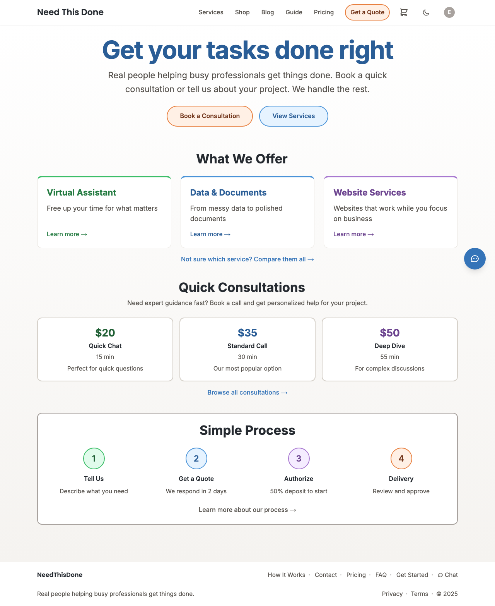
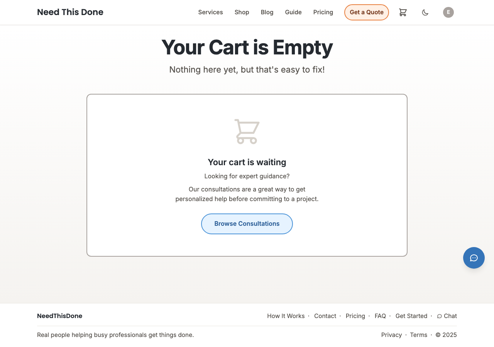
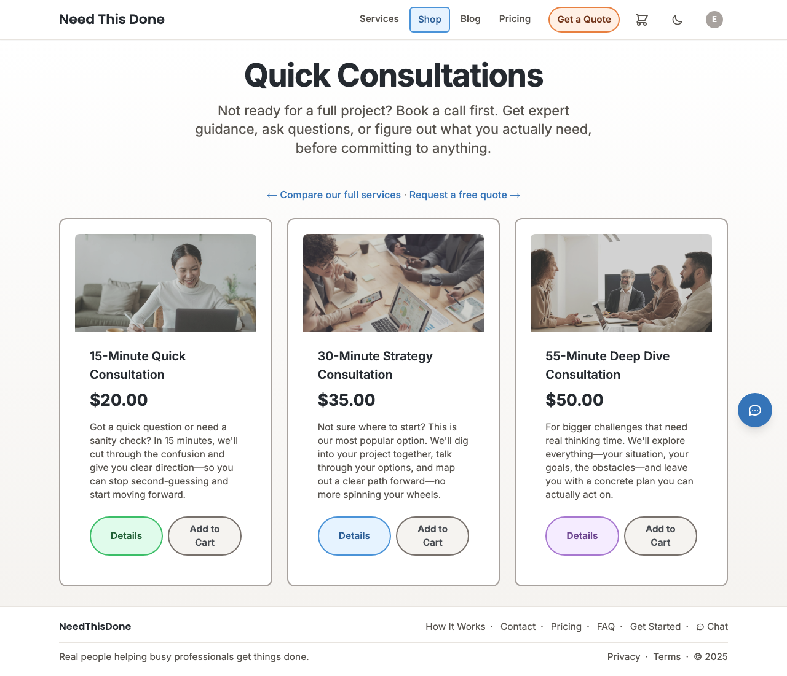

# NeedThisDone.com

Welcome! This is your home base for understanding and working with the NeedThisDone platform.

**What is this?** A professional services platform where clients can browse services, book consultations, and get things done. Built with Next.js and backed by a solid stack of managed services.

**New here?** Start with [Quick Start](#quick-start) to get running in 30 seconds, then explore the [Current State](#current-state-at-a-glance) to see what's already built.

**Looking for something specific?** The [Table of Contents](#table-of-contents) is organized by what you're trying to do.

---

## Current State at a Glance

Here's where we are right now - what's working, what's almost ready, and what's on hold:

```
╔══════════════════════════════════════════════════════════════════════════════╗
║                         PROJECT STATUS DASHBOARD                              ║
╠══════════════════════════════════════════════════════════════════════════════╣
║                                                                              ║
║  CODEBASE METRICS                        PRODUCTION READINESS                ║
║  ─────────────────                       ────────────────────                 ║
║  📄 30 Public Pages                      ✅ Medusa E-commerce (Railway)      ║
║  🔐 35 Admin Pages                       ✅ Stripe Payments                  ║
║  🔌 122 API Routes                       ✅ Supabase Auth & Database         ║
║  🧩 193 React Components                ✅ Redis Caching (Upstash)          ║
║  📦 9 Context Providers                  ✅ Email Notifications (Resend)     ║
║  🔧 74 Lib Utilities                     ✅ Google OAuth                     ║
║  🪝 10 Custom Hooks                      ✅ Inline Editing (12 pages)        ║
║  🧪 67 E2E Test Files                   ✅ WCAG AA Color System (5:1)       ║
║  📧 21 Email Templates                   ✅ 63 DB Migrations                 ║
║                                                                              ║
║  RECENT WORK (Mar 2026)                  RECENT WORK (Feb 2026)              ║
║  ──────────────────────                  ──────────────────────               ║
║  ✅ API Security Audit (11 routes)       ✅ Workflow Automation (Phase 1A)   ║
║  ✅ SEO: Internal linking, structured    ✅ DB Security Hardening (055-063)  ║
║     data, sitemap boost                  ✅ Pricing Restructure (3 tiers)    ║
║  ✅ Blog: 7 new posts (Feb 20-26)        ✅ Portfolio /work page             ║
║  ✅ Glassmorphism floating buttons       ✅ 5 Blog Posts Seeded              ║
║  ✅ Blog category pills by post count    ✅ SEO: OG tags, sitemap            ║
║                                                                              ║
╚══════════════════════════════════════════════════════════════════════════════╝
```

### Tech Stack

```
┌─────────────────────────────────────────────────────────────────────────────┐
│                              TECHNOLOGY STACK                                │
├─────────────────────────────────────────────────────────────────────────────┤
│                                                                             │
│  FRONTEND                     BACKEND                   INFRASTRUCTURE      │
│  ────────                     ───────                   ──────────────      │
│  Next.js 14                   Medusa (Railway)          Vercel (hosting)    │
│  React 18                     Supabase (PostgreSQL)     Railway (Medusa)    │
│  TypeScript 5.3               Upstash (Redis)           Supabase (DB)       │
│  Tailwind CSS 3.4             Stripe (payments)         Upstash (cache)     │
│                               Resend (email)                                │
│                               Google Calendar API                           │
│                                                                             │
│  TESTING                      DEV TOOLS                 AI/SEARCH           │
│  ───────                      ─────────                 ─────────           │
│  Playwright (E2E)             ESLint                    OpenAI GPT          │
│  Vitest (unit)                TypeScript                Vercel AI SDK       │
│  Axe Core (a11y)              TypeScript                Vector embeddings   │
│                                                                             │
└─────────────────────────────────────────────────────────────────────────────┘
```

### Service Architecture

```
┌─────────────────────────────────────────────────────────────────────────────┐
│                           HOW THE PIECES FIT TOGETHER                        │
└─────────────────────────────────────────────────────────────────────────────┘

                              ┌─────────────────┐
                              │     BROWSER     │
                              │   (User/Admin)  │
                              └────────┬────────┘
                                       │ HTTPS
                                       ▼
┌──────────────────────────────────────────────────────────────────────────────┐
│                              VERCEL EDGE                                      │
│                     (CDN, SSL, Global Distribution)                           │
└──────────────────────────────────────┬───────────────────────────────────────┘
                                       │
                                       ▼
┌──────────────────────────────────────────────────────────────────────────────┐
│                           NEXT.JS APP (app/)                                  │
│  ┌──────────────┐  ┌──────────────┐  ┌──────────────┐  ┌──────────────┐      │
│  │  30 PUBLIC   │  │  35 ADMIN    │  │  122 API     │  │  193 REACT   │      │
│  │  PAGES       │  │  PAGES       │  │  ROUTES      │  │  COMPONENTS  │      │
│  └──────────────┘  └──────────────┘  └──────────────┘  └──────────────┘      │
│                                                                              │
│  ┌────────────────────────────────────────────────────────────────────────┐  │
│  │                          9 CONTEXT PROVIDERS                            │  │
│  │  Auth │ Cart │ Toast │ Stripe │ ServiceModal │ InlineEdit               │  │
│  │  BrowsingHistory │ Comparison │ Wishlist                                │  │
│  └────────────────────────────────────────────────────────────────────────┘  │
└──────────────────────────────────────┬───────────────────────────────────────┘
                                       │
         ┌─────────────────────────────┼─────────────────────────────┐
         │                             │                             │
         ▼                             ▼                             ▼
┌─────────────────┐          ┌─────────────────┐          ┌─────────────────┐
│     MEDUSA      │          │    SUPABASE     │          │     UPSTASH     │
│    (Railway)    │          │    (Cloud)      │          │    (Redis)      │
├─────────────────┤          ├─────────────────┤          ├─────────────────┤
│ • Products      │          │ • Auth (users)  │          │ • Product cache │
│ • Carts         │          │ • Database      │          │ • Cart cache    │
│ • Orders        │          │ • File storage  │          │ • Order cache   │
│ • Variants      │          │ • RLS policies  │          │ • Session data  │
└─────────────────┘          └─────────────────┘          └─────────────────┘
         │                             │
         │                             │
         ▼                             ▼
┌─────────────────┐          ┌─────────────────┐          ┌─────────────────┐
│     STRIPE      │          │     RESEND      │          │ GOOGLE CALENDAR │
│   (Payments)    │          │    (Email)      │          │   (Scheduling)  │
├─────────────────┤          ├─────────────────┤          ├─────────────────┤
│ • Checkout      │          │ • Welcome       │          │ • OAuth flow    │
│ • Subscriptions │          │ • Order confirm │          │ • Event create  │
│ • Webhooks      │          │ • Admin alerts  │          │ • Availability  │
└─────────────────┘          └─────────────────┘          └─────────────────┘
```

---

## Table of Contents

**Getting Started**
- [Quick Start (30 seconds)](#quick-start)
- [Local Development](#local-development)

**Understanding the System**
- [Current State at a Glance](#current-state-at-a-glance) ← *status dashboard, tech stack, architecture*
- [Project Structure](#project-structure) ← *complete file map, 64 pages, 122 APIs, 193 components*
- [Architecture Overview](#architecture-overview) ← *data flow diagrams*

**Core Features**
- [Shopping Cart & Ecommerce](#shopping-cart--ecommerce)
- [Quotes System](#quotes-system) ← *inquiry → quote → deposit workflow*
- [Authentication](#authentication)
- [Email Notifications](#email-notifications) ← *21 templates via React Email + Resend*
- [Caching Strategy](#caching-strategy)

**Customer Features**
- [Loyalty & Referrals](#loyalty--referrals) ← *points, rewards, referral tracking*
- [Wishlist & Comparison](#wishlist--comparison) ← *save products, side-by-side compare*
- [Reviews & Coupons](#reviews--coupons) ← *customer reviews, discount codes*

**Platform Features**
- [Workflow Automation](#workflow-automation) ← *visual builder, BullMQ engine, 12 triggers*
- [Cron Jobs & Background Tasks](#cron-jobs--background-tasks) ← *5 automated jobs*
- [Security & Reliability](#security--reliability) ← *rate limiting, dedup, input guards*
- [SEO](#seo) ← *sitemap, robots.txt, JSON-LD, structured data*

**Operations**
- [Deployment](#deployment)
- [Testing](#testing) ← *65+ E2E test files, unit, a11y*
- [Troubleshooting](#troubleshooting)

**Reference**
- [Inline Editing](#inline-editing) ← *click-to-edit on 12 pages + version history*
- [API Patterns](#api-patterns) ← *auth, error handling*
- [Design System](#design-system)
- [Key Files Reference](#key-files-reference)

---

## Quick Start

Ready to dive in? You'll be up and running in about 30 seconds:

```bash
cd app && npm install    # First time only
npm run dev              # Start the dev server
```

Open http://localhost:3000 and you're in! The app hot-reloads, so your changes appear instantly.

### Helpful Commands

| Command | What it does |
|---------|--------------|
| `npm run dev` | Start Next.js dev server |
| `npm run build` | Build for production |
| `npm run test` | Run E2E tests |
| `npm run test:a11y` | Run accessibility tests |
| `npm run lint` | Run ESLint |

---

## Deployment

### Production Architecture

| Service | Platform | URL |
|---------|----------|-----|
| Next.js Frontend | Vercel | https://needthisdone.com |
| Medusa Backend | Railway | https://need-this-done-production.up.railway.app |
| Database | Supabase | PostgreSQL (managed) |
| Redis Cache | Upstash | Redis (managed) |

### Branch Workflow

Three-branch strategy with clear separation of concerns:

| Branch | Purpose | Deploys To |
|--------|---------|-----------|
| `production` | Live production site | Vercel production (needthisdone.com) |
| `testing` | QA and pre-production testing | Vercel staging preview |
| `dev` | Active development | Vercel preview deployments |

**Workflow:**
1. Develop and test on `dev` branch locally
2. Push to GitHub - Vercel creates preview deployment
3. Test preview URL, then merge `dev` → `testing` for QA
4. Test on staging, then merge `testing` → `production`
5. Production deployment is automatic

### Deploying Changes

**Frontend (Vercel - Automatic):**
```bash
# Standard workflow: dev → testing → production
git checkout testing
git merge dev
git push origin testing
# Vercel creates staging preview, test it

# Then promote to production
git checkout production
git merge testing
git push origin production
# Vercel deploys automatically to production
```

**Medusa Backend (Railway):**
```bash
# Railway auto-deploys from GitHub
# Or manually via Railway CLI:
railway up
```

### Product Management

Products are managed via Medusa Admin API. See [Medusa Backend](#medusa-backend-current-state) for product details and credentials.

**Update product images:**
```bash
cd medusa
MEDUSA_ADMIN_PASSWORD='xxx' node update-product-image.js consultation-15-min "https://example.com/image.jpg"
```

---

## What This Project Is

A modern platform for professional services that combines:

- **E-commerce platform**: Browse products, add to cart, checkout with Stripe, manage orders
- **User accounts**: Authentication (Google OAuth + email), profiles, order history, saved addresses
- **Admin dashboard**: 35 admin pages covering products, orders, users, analytics, reviews, loyalty, referrals, email campaigns, waitlists, and workflow automation
- **Customer engagement**: Loyalty points, referral program, wishlist, product comparison, reviews, coupons
- **Workflow automation**: Visual builder with 12 triggers, 7 actions, BullMQ async engine
- **Content management**: Inline click-to-edit on 12 pages, blog CMS, version history
- **AI chatbot**: RAG-powered chat with vector embeddings, trained on site content
- **Component library**: 193 reusable, WCAG AA accessible React components

> **Tech Stack**: See [Current State at a Glance](#current-state-at-a-glance) for the complete technology stack.

---

## Architecture Overview



```
┌──────────────────────────────────────────┐
│          Browser / User                  │
└───────────┬────────────────────────────┘
            │
┌───────────▼────────────────────────┐
│   Vercel (CDN + Edge Network)      │
│   - Auto SSL, global edge caching  │
└───────────┬────────────────────────┘
            │
    ┌───────┴───────┬───────────┐
    │               │           │
┌───▼────────┐  ┌──▼──────┐  ┌─▼──────────┐
│ Next.js    │  │ Medusa  │  │ Supabase   │
│ (Vercel)   │  │(Railway)│  │ (Cloud)    │
│ - Pages    │  │ - Cart  │  │ - Auth     │
│ - API      │  │ - Orders│  │ - Database │
└───┬────────┘  └──┬──────┘  └─┬──────────┘
    │              │           │
    └──────────┬───┴───────────┘
               │
    ┌──────────▼──────────┐
    │ Upstash Redis       │
    │ - Products cache    │
    │ - Session data      │
    └─────────────────────┘
```

**Data Flow**:
1. User makes request to needthisdone.com
2. Vercel serves Next.js app (edge-cached, auto SSL)
3. Next.js API routes call Medusa on Railway for ecommerce
4. Next.js calls Supabase for user/auth data
5. Upstash Redis caches frequently accessed data

### Complete System Workflow

The following diagram shows how all system components interact for major user journeys:

```
╔══════════════════════════════════════════════════════════════════════════════╗
║                          USER JOURNEY WORKFLOWS                               ║
╚══════════════════════════════════════════════════════════════════════════════╝

┌─────────────────────────────────────────────────────────────────────────────┐
│ 1. BROWSE & SHOP FLOW                                                        │
└─────────────────────────────────────────────────────────────────────────────┘

  User visits site          CDN + Edge           Next.js App
       │                        │                    │
       ▼                        ▼                    ▼
  ┌─────────┐   HTTPS    ┌───────────┐   SSR    ┌─────────────┐
  │ Browser │ ─────────► │  Vercel   │ ───────► │  App Router │
  └─────────┘            │   Edge    │          └──────┬──────┘
       ▲                 └───────────┘                 │
       │                                               ▼
       │                                    ┌──────────────────┐
       │    Rendered Page                   │ Check Redis Cache│
       │◄───────────────────────────────────├──────────────────┤
       │                                    │ HIT? Return data │
       │                                    │ MISS? Query ↓    │
       │                                    └────────┬─────────┘
       │                                             │
       │                           ┌─────────────────┼─────────────────┐
       │                           ▼                 ▼                 ▼
       │                    ┌───────────┐     ┌───────────┐     ┌───────────┐
       │                    │  Medusa   │     │ Supabase  │     │   Cache   │
       │                    │ (Railway) │     │   (DB)    │     │  (Redis)  │
       │                    └───────────┘     └───────────┘     └───────────┘
       │                    Products, Carts   Users, Auth      Warm Cache
       │                    Orders, Variants  Pages, Media


┌─────────────────────────────────────────────────────────────────────────────┐
│ 2. CART & CHECKOUT FLOW                                                      │
└─────────────────────────────────────────────────────────────────────────────┘

  Add to Cart (Optimistic Updates)
  ═══════════════════════════════

  Click "Add"   UI Updates     Background Sync       Server Response
      │         Instantly           │                     │
      ▼             ▼               ▼                     ▼
  ┌───────┐    ┌────────┐    ┌────────────┐    ┌─────────────────┐
  │ User  │───►│ React  │───►│ POST       │───►│ Medusa validates│
  │ Click │    │ State  │    │ /api/cart  │    │ & confirms      │
  └───────┘    └────────┘    └────────────┘    └────────┬────────┘
                   ▲                                     │
                   │         ┌───────────────────────────┘
                   │         ▼
                   │    ┌───────────────────┐
                   └────│ Replace temp ID   │  (or rollback on failure)
                        │ with server data  │
                        └───────────────────┘


  Checkout Flow
  ═════════════

  

  Cart Page       Guest/Auth        Payment          Order Created
      │               │                │                  │
      ▼               ▼                ▼                  ▼
  ┌────────┐    ┌──────────┐    ┌───────────┐    ┌─────────────────┐
  │ Review │───►│ Email +  │───►│  Stripe   │───►│ Order stored in │
  │ Items  │    │ Shipping │    │ Checkout  │    │ Medusa + Link   │
  └────────┘    └──────────┘    └───────────┘    │ saved in        │
                                      │          │ Supabase        │
                     ┌────────────────┘          └────────┬────────┘
                     ▼                                    │
              ┌─────────────┐                             ▼
              │ Stripe      │                   ┌─────────────────┐
              │ processes   │                   │ Is Consultation?│
              │ payment     │                   └────────┬────────┘
              └─────────────┘                            │
                                          ┌──────────────┴──────────────┐
                                          ▼                             ▼
                                    ┌───────────┐               ┌─────────────┐
                                    │    Yes    │               │     No      │
                                    │ Show      │               │ Confirmation│
                                    │ Booking   │               │ Page Only   │
                                    │ Form      │               └─────────────┘
                                    └─────┬─────┘
                                          │
                                          ▼
                                    ┌─────────────┐
                                    │ Appointment │──► Google Calendar
                                    │ Request     │──► Admin Notification
                                    └─────────────┘──► Email Confirmation


┌─────────────────────────────────────────────────────────────────────────────┐
│ 3. AUTHENTICATION FLOW                                                       │
└─────────────────────────────────────────────────────────────────────────────┘

                         ┌─────────────────────────┐
                         │     User Sign-In        │
                         └───────────┬─────────────┘
                                     │
                    ┌────────────────┴────────────────┐
                    ▼                                 ▼
            ┌───────────────┐                ┌───────────────┐
            │ Google OAuth  │                │ Email/Password│
            │  (NextAuth)   │                │  (Supabase)   │
            └───────┬───────┘                └───────┬───────┘
                    │                                │
                    │ Creates/syncs user             │ Verifies via
                    │ in Supabase Auth               │ Supabase Auth
                    │                                │
                    └────────────────┬───────────────┘
                                     ▼
                          ┌─────────────────────┐
                          │ Unified AuthContext │
                          │ (single state for   │
                          │  all auth methods)  │
                          └──────────┬──────────┘
                                     │
               ┌─────────────────────┼─────────────────────┐
               ▼                     ▼                     ▼
        ┌────────────┐       ┌────────────┐       ┌────────────┐
        │ Dashboard  │       │ Cart Link  │       │ Order      │
        │ Access     │       │ to User    │       │ History    │
        └────────────┘       └────────────┘       └────────────┘


┌─────────────────────────────────────────────────────────────────────────────┐
│ 4. EMAIL NOTIFICATION FLOW                                                   │
└─────────────────────────────────────────────────────────────────────────────┘

  Trigger Event           Email Service          Resend API
       │                       │                     │
       ▼                       ▼                     ▼
  ┌──────────────┐    ┌─────────────────┐    ┌─────────────┐
  │ Order placed │───►│ email-service.ts│───►│   Resend    │──► User Inbox
  │ User signs up│    │ - Retry logic   │    │ (SMTP API)  │
  │ Appointment  │    │ - Idempotency   │    └─────────────┘
  │ Form submit  │    │ - React Email   │
  └──────────────┘    └─────────────────┘

  Email Types (21 templates):
  ├── Welcome (signup)                    ├── Order Canceled
  ├── Login Notification (security)       ├── Order Ready for Delivery
  ├── Order Confirmation                  ├── Order Status Update
  ├── Purchase Receipt                    ├── Review Approved
  ├── Appointment Confirmation            ├── Review Rejected
  ├── Appointment Cancellation            ├── Waitlist Back in Stock
  ├── Appointment Reminder                ├── Final Payment Failed
  ├── Admin Notification (project/order)  ├── Campaign Email
  ├── Client Confirmation (form)          ├── Abandoned Cart Recovery
  ├── Quote Email                         └── Deposit Confirmation
  └── Appointment Request Notification
```

**Why This Design**:
- ✅ **Zero-ops deployment** - Push to GitHub, auto-deploys everywhere
- ✅ **Global edge network** - Vercel CDN for fast page loads
- ✅ **Managed services** - No servers to maintain
- ✅ **Independent scaling** - Each service scales automatically
- ✅ **Cost-effective** - Pay only for what you use

### Medusa Backend (Current State)

Real Medusa implementation with database-persisted products, carts, and orders. Products are seeded via `scripts/seed-products.ts`.

| Feature | Status | Details |
|---------|--------|---------|
| Products | ✅ Working | 4 website packages + 10 add-ons + 2 services, seeded via script |
| Carts | ✅ Working | Stored in Medusa PostgreSQL |
| Checkout | ✅ Working | Guest + authenticated checkout flows |
| Orders | ✅ Working | Full order objects, linked in Supabase |
| Email | ✅ Working | 21 email templates via Resend |

**Website Packages** (seeded via `npx tsx scripts/seed-products.ts`):
| Product | Price | Deposit | Handle |
|---------|-------|---------|--------|
| Starter Site | $500 | 50% | `starter-site` |
| Growth Site | $1,500 | 50% | `growth-site` |
| Pro Site | $5,000 | 50% | `pro-site` |

**Add-ons** (`website-addons` collection):
| Add-on | Price | Handle |
|--------|-------|--------|
| Extra Page | $100 | `additional-page` |
| Blog | $300 | `blog-setup` |
| Edit Your Own Site (CMS) | $500 | `cms-integration` |
| Calendar Booking | $200 | `calendar-booking` |
| File Uploads | $150 | `contact-form-files` |
| Accept Payments | $400 | `payment-integration` |
| Customer Accounts | $400 | `customer-accounts` |
| AI Chatbot | $600 | `ai-chatbot` |
| Logo Design | $300 | `logo-design` |
| Online Store | $2,000 | `online-store` |

**Services** (`automation-services` collection):
| Service | Price | Type |
|---------|-------|------|
| Automation Setup | $150/workflow | One-time |
| Managed AI | $500/month | Subscription |

**Admin Credentials** (for Medusa Admin panel):
- Email: Set via `MEDUSA_ADMIN_EMAIL` environment variable
- Password: Set via `MEDUSA_ADMIN_PASSWORD` environment variable

**Security Note:** The `MEDUSA_ADMIN_PASSWORD` environment variable is required for all environments. Scripts will fail if not set - no fallback passwords.

---

## Local Development

### Prerequisites

```bash
# Install Node.js (v18 or higher)
node --version

# Install Supabase CLI (macOS)
brew install supabase/tap/supabase

# Or Linux:
# https://supabase.com/docs/guides/cli

# Verify installation
supabase --version
```

### Starting Development Environment

**Terminal 1: Start the Next.js development server**
```bash
cd app
npm install  # First time only
npm run dev
```

App will be available at: `http://localhost:3000`

**Terminal 2: Start Supabase (auth & user database)**
```bash
supabase start
```

Supabase will start with:
- PostgreSQL (port 54322)
- Supabase API (port 54321)
- Realtime server
- Database migrations applied automatically

### Environment Configuration

Create `.env.local` in the `app/` directory. Copy from `.env.example` and fill in your values.

**Service connections:**
- **Frontend**: Next.js dev server on localhost:3000
- **Backend**: Medusa API on Railway (via `MEDUSA_BACKEND_URL`)
- **Database**: Supabase (local via `supabase start` or cloud)
- **Cache**: Upstash Redis (via `REDIS_URL`)

### Complete Environment Variables Reference

```
┌─────────────────────────────────────────────────────────────────────────────┐
│                     ENVIRONMENT VARIABLES BY SERVICE                         │
└─────────────────────────────────────────────────────────────────────────────┘
```

#### Supabase (Database & Auth) — 3 vars, REQUIRED

| Variable | Purpose | Where to get it |
|----------|---------|-----------------|
| `NEXT_PUBLIC_SUPABASE_URL` | Supabase API endpoint (browser) | `supabase status` or Supabase dashboard |
| `NEXT_PUBLIC_SUPABASE_ANON_KEY` | Public API key for client-side auth | `supabase status` or Supabase dashboard |
| `SUPABASE_SERVICE_ROLE_KEY` | Server-side admin key (bypasses RLS) | `supabase status` or Supabase dashboard |

**Used by:** `lib/supabase.ts`, `lib/supabase-server.ts`, all API routes needing database access

#### Site URLs — 3 vars, REQUIRED

| Variable | Purpose | Example |
|----------|---------|---------|
| `NEXT_PUBLIC_SITE_URL` | Canonical production URL | `https://needthisdone.com` |
| `NEXT_PUBLIC_APP_URL` | Current app URL (dev or prod) | `http://localhost:3000` |
| `NEXT_PUBLIC_BASE_URL` | Base URL for API calls | `http://localhost:3000` |

**Used by:** Email links, OAuth callbacks, SEO metadata, absolute URL generation

#### Stripe (Payments) — 3 vars, REQUIRED

| Variable | Purpose | Where to get it |
|----------|---------|-----------------|
| `NEXT_PUBLIC_STRIPE_PUBLISHABLE_KEY` | Client-side Stripe.js key | [Stripe Dashboard → API Keys](https://dashboard.stripe.com/apikeys) |
| `STRIPE_SECRET_KEY` | Server-side API key | [Stripe Dashboard → API Keys](https://dashboard.stripe.com/apikeys) |
| `STRIPE_WEBHOOK_SECRET` | Validates webhook signatures | [Stripe Dashboard → Webhooks](https://dashboard.stripe.com/webhooks) |

**Used by:** `lib/stripe.ts`, `context/StripeContext.tsx`, `api/stripe/*` routes

#### Medusa (E-commerce Backend) — 5 vars, REQUIRED

| Variable | Purpose | Notes |
|----------|---------|-------|
| `NEXT_PUBLIC_MEDUSA_URL` | Public Medusa storefront API | Railway deployment URL |
| `NEXT_PUBLIC_MEDUSA_PUBLISHABLE_KEY` | Client-side API key | From Medusa Admin |
| `MEDUSA_BACKEND_URL` | Server-side Medusa API | Same as above, used in API routes |
| `MEDUSA_ADMIN_EMAIL` | Admin panel login email | Set during Medusa setup |
| `MEDUSA_ADMIN_PASSWORD` | Admin panel login password | Required for product scripts |

**Used by:** `lib/medusa-client.ts`, shop pages, cart operations, product management scripts

#### Google (OAuth + Calendar) — 3 vars, REQUIRED for social login

| Variable | Purpose | Where to get it |
|----------|---------|-----------------|
| `GOOGLE_CLIENT_ID` | OAuth 2.0 client ID | [Google Cloud Console](https://console.cloud.google.com) |
| `GOOGLE_CLIENT_SECRET` | OAuth 2.0 client secret | [Google Cloud Console](https://console.cloud.google.com) |
| `GOOGLE_REDIRECT_URI` | OAuth callback URL | `https://yoursite.com/api/auth/callback/google` |

**Used by:** `lib/auth-options.ts`, `lib/google-calendar.ts`, Google sign-in flow

#### Resend (Email) — 4 vars, REQUIRED

| Variable | Purpose | Where to get it |
|----------|---------|-----------------|
| `RESEND_API_KEY` | Email sending API key | [Resend Dashboard](https://resend.com/api-keys) |
| `RESEND_FROM_EMAIL` | Sender email address | Must match verified domain |
| `RESEND_ADMIN_EMAIL` | Where admin notifications go | Your admin inbox |
| `RESEND_WEBHOOK_SECRET` | Validates email webhooks | Resend webhook settings |

**Used by:** `lib/email.ts`, `lib/email-service.ts`, all email templates in `emails/`

#### Upstash Redis (Cache) — 1 var, REQUIRED

| Variable | Purpose | Where to get it |
|----------|---------|-----------------|
| `REDIS_URL` | Redis connection string | [Upstash Console](https://console.upstash.com) |

**Used by:** `lib/redis.ts`, `lib/cache.ts`, product/cart/order caching

#### Vector Search & Chat (Optional) — 2 vars

| Variable | Purpose | Default |
|----------|---------|---------|
| `VECTOR_SEARCH_SIMILARITY_THRESHOLD` | Minimum similarity score for search results | `0.7` |
| `VECTOR_SEARCH_MAX_RESULTS` | Maximum results returned | `5` |

**Used by:** AI chatbot, semantic search features

#### Cron Jobs (Optional) — 4 vars

| Variable | Purpose | Default |
|----------|---------|---------|
| `CRON_SECRET` | Authenticates cron job requests | Required if using cron |
| `ABANDONED_CART_HOURS` | Hours before cart is considered abandoned | `2` |
| `MAX_CART_REMINDERS` | Maximum reminder emails per cart | `3` |
| `REMINDER_INTERVAL_HOURS` | Hours between reminder emails | `24` |

**Used by:** `api/cron/*` routes, abandoned cart emails

#### E2E Testing (Development Only) — 7 vars

| Variable | Purpose |
|----------|---------|
| `E2E_ADMIN_EMAIL` | Test admin account email |
| `E2E_ADMIN_PASSWORD` | Test admin account password |
| `E2E_USER_EMAIL` | Test user account email |
| `E2E_USER_PASSWORD` | Test user account password |
| `NEXT_PUBLIC_E2E_ADMIN_BYPASS` | Skip auth in E2E tests (`true`) |
| `SKIP_WEBSERVER` | Use existing dev server (`true`) |
| `BASE_URL` | Test server URL |

**Used by:** Playwright tests in `e2e/`

#### Development Flags (Optional) — 2 vars

| Variable | Purpose | When to use |
|----------|---------|-------------|
| `SKIP_CACHE` | Bypass Redis cache | Debugging cache issues |
| `SKIP_EMAILS` | Don't send real emails | Local development |

### Quick Setup by Environment

**Local Development:**
```bash
# Get Supabase keys
supabase start
supabase status  # Copy URL and keys

# Minimum viable .env.local
NEXT_PUBLIC_SUPABASE_URL=http://127.0.0.1:54321
NEXT_PUBLIC_SUPABASE_ANON_KEY=<from supabase status>
SUPABASE_SERVICE_ROLE_KEY=<from supabase status>
MEDUSA_BACKEND_URL=https://need-this-done-production.up.railway.app
NEXT_PUBLIC_MEDUSA_URL=https://need-this-done-production.up.railway.app  # Same as MEDUSA_BACKEND_URL for client-side access
NEXT_PUBLIC_MEDUSA_PUBLISHABLE_KEY=pk_...  # Get from Medusa admin dashboard
MEDUSA_ADMIN_EMAIL=your_admin_email  # Required for Medusa admin authentication
MEDUSA_ADMIN_PASSWORD=your_admin_password  # Required for product management scripts

# Stripe (payments)
STRIPE_SECRET_KEY=sk_test_...
NEXT_PUBLIC_STRIPE_PUBLISHABLE_KEY=pk_test_...
STRIPE_WEBHOOK_SECRET=whsec_...

# Email (Resend)
RESEND_API_KEY=re_...
RESEND_FROM_EMAIL=your_verified_email@domain.com
RESEND_ADMIN_EMAIL=your_admin_notification_email

# AI Chatbot (optional)
OPENAI_API_KEY=sk-...
NEXT_PUBLIC_CHATBOT_MODEL=gpt-4o-mini

# Site Configuration
NEXT_PUBLIC_SITE_URL=http://localhost:3000  # Development
NODE_ENV=development
SKIP_EMAILS=true
SKIP_CACHE=true
```

**Production (Vercel):**
All variables should be set in Vercel Environment Variables dashboard. Never commit real credentials to git.

### Stopping Services

```bash
# Stop Next.js dev server
# Press Ctrl+C in terminal

# Stop Supabase
supabase stop

# Reset Supabase (clears all data)
supabase db reset
```

---

## Project Structure

```
┌─────────────────────────────────────────────────────────────────────────────┐
│                            COMPLETE FILE MAP                                 │
└─────────────────────────────────────────────────────────────────────────────┘

Need_This_Done/
├── README.md              ← You are here (single source of truth)
├── CLAUDE.md              ← AI assistant instructions
│
├── app/                   ← NEXT.JS APPLICATION
│   ├── app/               ← Pages & API routes (Next.js App Router)
│   ├── components/        ← 193 React components
│   ├── context/           ← 9 state providers
│   ├── lib/               ← 74 utility files
│   ├── hooks/             ← 10 custom React hooks
│   ├── emails/            ← 21 email templates (React Email)
│   ├── scripts/           ← Seed scripts, automation
│   ├── e2e/               ← 67 Playwright test files
│   └── __tests__/         ← Unit & accessibility tests
│
└── supabase/              ← DATABASE
    └── migrations/        ← 63 schema migrations

# Note: Medusa backend is deployed on Railway (not in this repo)
# See https://need-this-done-production.up.railway.app
```

### Complete Page Inventory (65 pages total)

```
┌─────────────────────────────────────────────────────────────────────────────┐
│                          PUBLIC PAGES (30 pages)                             │
├─────────────────────────────────────────────────────────────────────────────┤
│                                                                             │
│  MARKETING                    E-COMMERCE                   AUTH             │
│  /                 (home)     /pricing          (packages)  /login          │
│  /services                    /pricing/success                              │
│  /how-it-works               /shop              (browse)   LEGAL            │
│  /faq                         /shop/[productId]  (detail)   /privacy        │
│  /contact                     /cart                         /terms           │
│  /get-started                 /checkout                                     │
│  /about                                                                     │
│  /resume                      BUILD-A-PROJECT              CONTENT          │
│  /work           (portfolio)  /build                        /blog           │
│  /quote                       /build/success                /blog/[slug]    │
│                                                             /guide          │
│  CUSTOMER                                                                   │
│  /account                     /orders                                       │
│  /dashboard                   /orders/[orderId]                             │
│  /wishlist                    /recently-viewed                              │
│  /quotes/[ref]                                                              │
│                                                                             │
└─────────────────────────────────────────────────────────────────────────────┘

┌─────────────────────────────────────────────────────────────────────────────┐
│                          ADMIN PAGES (35 pages)                              │
├─────────────────────────────────────────────────────────────────────────────┤
│                                                                             │
│  SHOP MANAGEMENT              CONTENT & BLOG               ANALYTICS        │
│  /admin/shop                  /admin/content               /admin/analytics │
│  /admin/shop/inventory        /admin/content/[slug]/edit   /admin/product-  │
│  /admin/shop/orders           /admin/blog                    analytics      │
│  /admin/shop/products/new     /admin/blog/new                               │
│  /admin/orders                /admin/blog/[slug]/edit      CUSTOMER         │
│  /admin/products                                           /admin/reviews   │
│  /admin/products/manage       ENGAGEMENT                   /admin/reviews/  │
│  /admin/products/categories   /admin/loyalty                 analytics      │
│                               /admin/referrals             /admin/enrollments│
│  AUTOMATION                   /admin/communication                          │
│  /admin/automation                                         SYSTEM           │
│  /admin/automation/builder    WAITLIST                     /admin/users     │
│  /admin/automation/[id]       /admin/waitlist-analytics    /admin/settings  │
│                               /admin/waitlist-campaigns    /admin/dev       │
│  QUOTES                       /admin/waitlist-campaigns/   /admin/dev/      │
│  /admin/quotes                  new                          preview        │
│  /admin/appointments          /admin/waitlist-campaigns/   /admin/colors    │
│                                 [id]                                        │
│                                                                             │
└─────────────────────────────────────────────────────────────────────────────┘
```

### Complete API Route Inventory (122 routes)

<details>
<summary><strong>Click to expand full API inventory</strong></summary>

```
┌─────────────────────────────────────────────────────────────────────────────┐
│                           API ROUTES BY CATEGORY                             │
└─────────────────────────────────────────────────────────────────────────────┘

AUTHENTICATION (4 routes)
├── GET/POST /api/auth/[...nextauth]     NextAuth handler (Google OAuth + credentials)
├── POST /api/auth/login                 Email/password login
├── POST /api/auth/signup                New user registration
└── POST /api/auth/logout                Session termination

ACCOUNT (3 routes)
├── GET/PUT /api/account/profile                    User profile CRUD
├── GET/PUT /api/account/notification-preferences   Email notification settings
└── GET/POST/PUT/DELETE /api/account/saved-addresses  Saved shipping addresses

SHOPPING & E-COMMERCE (6 routes)
├── GET/POST /api/cart                       Create or get cart
├── POST/PATCH/DELETE /api/cart/[cartId]/items  Manage cart items
├── GET /api/shop/products                   List all products (cached)
├── GET /api/shop/products/[productId]       Single product detail
├── GET /api/pricing/products                Products for pricing page
└── GET /api/orders                          Order listing

CHECKOUT (2 routes)
├── POST /api/checkout/session               Create Stripe checkout session
└── POST /api/checkout/check-appointment     Validate appointment requirements

PAYMENTS (5 routes)
├── POST /api/stripe/create-payment-intent   One-time payments
├── POST /api/stripe/create-subscription     Recurring payments
├── POST /api/stripe/create-build-checkout   Build-a-project checkout
├── POST /api/stripe/customer-portal         Stripe customer portal link
└── POST /api/stripe/webhook                 Handle Stripe events

USER (4 routes)
├── GET /api/user/orders                     User's order history
├── GET /api/user/appointments               User's appointments
├── GET /api/user/reviews                    User's submitted reviews
└── GET /api/user/spending-analytics         Spending analytics

PRODUCTS — PUBLIC (3 routes)
├── GET /api/products/categories             Product categories
├── GET /api/products/search                 Product search
└── GET/POST /api/products/waitlist          Join/view product waitlist

CUSTOMER FEATURES (7 routes)
├── GET/POST /api/wishlist                   View/add wishlist items
├── DELETE /api/wishlist/[productId]         Remove from wishlist
├── GET/POST /api/reviews                    View/submit product reviews
├── GET/POST /api/coupons                    Validate/apply coupon codes
├── GET /api/subscriptions                   View active subscriptions
├── GET/POST /api/enrollments                Course enrollments
└── GET/POST /api/recommendations            Product recommendations

LOYALTY & REFERRALS (6 routes)
├── GET /api/loyalty/balance                 Loyalty points balance
├── POST /api/loyalty/earn                   Earn loyalty points
├── POST /api/loyalty/redeem                 Redeem loyalty points
├── POST /api/referrals/track                Track referral click
├── POST /api/referrals/complete             Complete referral conversion
└── GET /api/referrals/my-referral           User's referral info

QUOTES (2 routes)
├── POST /api/quotes/authorize               Customer authorizes quote
└── POST /api/quotes/deposit-confirmed       Confirm deposit payment

ADMIN — PRODUCTS (9 routes)
├── GET/POST /api/admin/products             Product CRUD
├── PUT/DELETE /api/admin/products/[id]      Single product management
├── POST /api/admin/products/upload-image    Upload product images
├── POST /api/admin/products/update-image    Update existing images
├── GET /api/admin/products/export           Export products
├── POST /api/admin/products/import          Import products
├── POST /api/admin/products/notify-waitlist Notify waitlist customers
├── GET/POST /api/admin/product-categories   Category CRUD
└── PATCH/DELETE /api/admin/product-categories/[id]  Single category

ADMIN — ORDERS (5 routes)
├── GET /api/admin/orders                    View all orders
├── GET /api/admin/orders/[id]/details       Order detail
├── PATCH /api/admin/orders/[id]/status      Update order status
├── POST /api/admin/orders/[id]/cancel       Cancel order
└── POST /api/admin/orders/[id]/ready-for-delivery  Mark ready

ADMIN — APPOINTMENTS (4 routes)
├── GET /api/admin/appointments              Appointment queue
├── POST /api/admin/appointments/[id]/approve    Approve booking
├── POST /api/admin/appointments/[id]/cancel     Cancel booking
└── GET /api/admin/appointments/failed-notifications  Failed notifications

ADMIN — QUOTES (4 routes)
├── GET/POST /api/admin/quotes               Quote listing and creation
├── GET/PATCH/DELETE /api/admin/quotes/[id]   Single quote CRUD
└── POST /api/admin/quotes/[id]/send         Send quote email

ADMIN — REVIEWS & USERS (3 routes)
├── GET/POST /api/admin/reviews              Review moderation
├── GET/PATCH /api/admin/users               User management
└── GET/DELETE /api/admin/enrollments        Enrollment management

ADMIN — EMAIL CAMPAIGNS (4 routes)
├── GET/POST /api/admin/email-campaigns      Campaign CRUD
├── POST /api/admin/email-campaigns/send     Send campaign
└── GET/POST /api/admin/email-templates      Email template management

ADMIN — WAITLIST CAMPAIGNS (4 routes)
├── GET/POST /api/admin/waitlist-campaigns         Campaign CRUD
├── GET/PATCH/DELETE /api/admin/waitlist-campaigns/[id]  Single campaign
└── POST /api/admin/waitlist-campaigns/[id]/send   Send campaign

ADMIN — ANALYTICS (6 routes)
├── GET /api/admin/analytics                 Dashboard analytics
├── GET/POST /api/admin/cache-stats          Cache hit/miss rates
├── GET /api/admin/product-analytics         Product performance
├── GET /api/admin/loyalty-analytics         Loyalty program stats
├── GET /api/admin/referral-analytics        Referral program stats
├── GET /api/admin/waitlist-analytics        Waitlist metrics
└── GET /api/admin/inventory                 Inventory management

CONTENT & CMS (5 routes)
├── GET/PUT /api/page-content/[slug]         Page content CRUD
├── GET /api/page-content/[slug]/history     Version history
├── POST /api/page-content/[slug]/restore    Restore version
├── GET/PUT /api/layout-content              Layout content
└── GET /api/changelog                       Public changelog

BLOG (2 routes)
├── GET/POST /api/blog                       Blog post listing and creation
└── GET/PUT/DELETE /api/blog/[slug]          Single blog post CRUD

WORKFLOWS (4 routes)
├── GET/POST /api/workflows                  Workflow CRUD
├── GET/PUT/DELETE /api/workflows/[id]       Single workflow
├── POST /api/workflows/[id]/execute         Execute workflow
└── POST /api/workflows/[id]/test-run        Test run workflow

CRON JOBS (5 routes)
├── GET/POST /api/cron/abandoned-carts       Abandoned cart recovery emails
├── GET/POST /api/cron/appointment-reminders Appointment reminder emails
├── GET/POST /api/cron/changelog             Auto-generate changelog entries
├── POST /api/cron/retry-failed-emails       Retry failed email sends
└── POST /api/cron/waitlist-notifications    Back-in-stock notifications

GOOGLE INTEGRATION (4 routes)
├── GET /api/google/connect                  Initiate OAuth flow
├── GET /api/google/callback                 Handle OAuth callback
├── POST /api/google/disconnect              Disconnect Google account
└── GET /api/google/status                   Check Google connection

PROJECTS (5 routes)
├── POST /api/projects                       Submit project
├── GET /api/projects/mine                   User's projects
├── GET /api/projects/all                    All projects (admin)
├── PATCH /api/projects/[id]/status          Update status
└── GET/POST /api/projects/[id]/comments     Project comments

MEDIA (2 routes)
├── GET/POST /api/media                      Upload/list media
└── GET/PATCH/DELETE /api/media/[id]         Single media management

AI & SEARCH (6 routes)
├── POST /api/chat                           AI chatbot (GPT-powered)
├── GET /api/chatbot/health                  Chatbot health check
├── POST /api/embeddings/index               Index content for search
├── GET /api/embeddings/check                Check indexing status
├── GET /api/embeddings/status               Embedding status
└── GET /api/embeddings/debug                Debug embeddings

MARKETPLACE & WIZARD (2 routes)
├── GET/POST/PATCH/DELETE /api/marketplace   Template marketplace
└── POST/PATCH /api/wizard/sessions          Wizard session management

MISC (5 routes)
├── GET /api/health                          Service health check
├── POST /api/appointments/request           Request appointment
├── POST /api/email-forward                  Forward emails
├── GET /api/files/[...path]                 Serve uploaded files
├── GET/POST /api/currencies                 Currency exchange rates
├── GET /api/demo/items                      Demo items
└── GET /api/demo/speed                      Speed test
│
└── POST /api/graphql                        GraphQL endpoint
```

</details>

### Component Inventory (193 components)

<details>
<summary><strong>Click to expand full component inventory</strong></summary>

```
┌─────────────────────────────────────────────────────────────────────────────┐
│                        COMPONENTS BY MODULE                                  │
└─────────────────────────────────────────────────────────────────────────────┘

CORE UI (~53 root-level components)
├── Layout:        Navigation, Footer, PageContainer, PageHeader
├── Design System: Button, Card, CTASection, CircleBadge, StatusBadge
├── Cards:         PricingCard, ServiceCard, StepCard, FeatureCard, ProjectCard
│                  CourseCard, ReviewCard, ProductCard
├── E-commerce:    ProductAvailability, ProductComparisonModal, CompareButton
│                  ProductRecommendations, CouponInput, DepositPaymentCard
│                  AddressSelector, CurrencySelector, OrderInvoice
├── Dashboards:    AdminDashboard, UserDashboard, ReferralDashboard
├── Forms:         AppointmentRequestForm, AppointmentStepForm, PaymentForm
│                  ConsultationCalendar, StarRating
├── Modals:        ProjectDetailModal, ServiceDetailModal, ReadyForDeliveryModal
├── Education:     Certificate, LessonPlayer, QuizBlock, ProgressBar, EnrollButton
├── Marketing:     HowItWorks, FAQ, WhatCanYouBuild, SystemOverview
└── Demos:         AuthDemo, DatabaseDemo, HealthStatus, SpeedDemo

INLINE EDITOR MODULE (24 components)
├── Core:      AdminSidebar, Editable, EditableCard, EditableSection, EditableItem
├── Fields:    FieldEditors, InlineTextEditor, AlignmentToolbar, IconPicker
├── Views:     SectionListView, ItemEditorView, SectionNavigation
├── UI:        EditModeBar, EditModeTutorial, SidebarHeader, SidebarFooter
│              AdminSidebarToggle, ChoiceMenu, ResizableWrapper
├── Sorting:   SortableItemsWrapper, SortableSections
├── History:   VersionHistoryPanel
└── Preview:   HeroPreviewDetector

CONTENT EDITOR MODULE (14 components)
├── Core:     ContentEditor, PagePreview
├── Fields:   TextField, TextAreaField, SelectField, ArrayField
│             ButtonField, FieldWrapper, CollapsibleSection
├── Forms:    HomepageForm, HowItWorksForm, FAQForm, PricingForm, ServicesForm
└── Previews: HomepagePreview, HowItWorksPreview, FAQPreview, PricingPreview
│             ServicesPreview

WORKFLOW BUILDER MODULE (8 components)
├── Canvas             Main drag-and-drop workflow canvas
├── DemoCanvas         Read-only demo with 3 pre-loaded workflows
├── TriggerNode        Workflow trigger node
├── ActionNode         Workflow action node
├── ConditionNode      Conditional branch node
├── NodeConfigPanel    Node configuration side panel
├── NodePalette        Palette of available node types
└── TestRunPanel       Test workflow execution panel

WIZARD MODULE (8 components)
├── WizardModal, WizardWidget, WizardFloatingButton
├── WizardProvider, WizardContent, WizardStep
├── WizardResults, ScenarioCard

DEVICE SHOWCASE MODULE (7 components)
├── DeviceShowcase, DeviceMockup, DeviceFrame
├── PhoneFrame, TabletFrame, MonitorFrame
├── ScaledIframe, ShowcaseControls

ACCOUNT MODULE (7 components)
├── AccountSettingsClient, LoyaltyPointsSection
├── MyReviewsSection, NotificationPreferencesSection
├── SavedAddressesSection, SpendingAnalyticsSection
└── SubscriptionSection

HOME MODULE (6 components)
├── HomePageClient, Hero, HeroDevice
├── GeometricAccents, ServiceIcons
└── HeroLayoutDebug

CHATBOT MODULE (6 components)
├── ChatbotWidget, ChatbotModal, ChatbotButton
├── ChatMessage, PageIndexer, IndexingContext

BLOG MODULE (5 components)
├── BlogPageClient, BlogPostCard, BlogPostCTA
├── MarkdownContent, RelatedPosts

WORK/PORTFOLIO MODULE (5 components)
├── WorkPageClient, CaseStudyCard, StatCounter
├── ArchitectureDiagram, TechStackBadge

MOTION MODULE (4 components)
├── FadeIn, RevealSection, StaggerContainer, StaggerItem

PROJECT MODAL MODULE (4 components)
├── ProjectModalHeader, ProjectModalDetails
├── ProjectComments, AdminStatusSection

UI PRIMITIVES (9 components)
├── ConfirmDialog, Toast, EmptyState, LoadingSpinner
├── Skeleton, FieldError
└── Icons: CheckIcon, CheckmarkCircle, CloseIcon

PAGE CLIENT COMPONENTS (10+ components)
├── PricingPageClient, UnifiedPricingPage, AddToCartButton
├── ServicesPageClient, FAQPageClient, GuidePageClient
├── PrivacyPageClient, TermsPageClient
├── QuoteAuthorizationClient
├── ShopClient (shop/), ProductDetailClient, ReviewForm, ReviewSection
├── Dashboard: DashboardStatsOverview, ActiveAppointmentsSection
└── Admin: AdminProductsClient, LoyaltyAnalyticsDashboard

MEDIA MODULE (2 components)
├── ImageUpload       Upload interface
└── MediaLibrary      Media browser

SEO (1 component)
└── JsonLd            JSON-LD structured data injector

PROVIDERS (1 component)
└── SessionProvider   NextAuth session wrapper
```

</details>

### Lib Utilities (74 files)

<details>
<summary><strong>Click to expand full lib inventory</strong></summary>

```
┌─────────────────────────────────────────────────────────────────────────────┐
│                          UTILITY LIBRARIES                                   │
└─────────────────────────────────────────────────────────────────────────────┘

EXTERNAL SERVICE CLIENTS (8 files)
├── medusa-client.ts       Medusa API (products, carts, orders) with retry logic
├── medusa-helpers.ts      Cart/order helpers for Medusa
├── supabase.ts            Supabase admin client (server-side)
├── supabase-server.ts     Supabase client (server, with user session)
├── supabase-client-safe.ts  Safe client-side Supabase client
├── redis.ts               Upstash Redis with circuit breaker
├── stripe.ts              Stripe client singleton
└── google-calendar.ts     Google Calendar OAuth + API

EMAIL (4 files)
├── email.ts                       Resend client + send helper
├── email-service.ts               High-level email sending with retry + failure tracking
├── appointment-notifications.ts   Appointment confirmation/cancellation/reminder emails
└── review-notifications.ts        Review approved/rejected notification emails

AUTHENTICATION & API SECURITY (10 files)
├── auth.ts                NextAuth session helpers
├── auth-options.ts        NextAuth config (Google + credentials)
├── auth-utils.ts          Session helpers, role checks
├── api-auth.ts            API route authentication (verifyAdmin, verifyAuth)
├── api-errors.ts          Standardized error responses
├── api-input-guard.ts     Input sanitization and validation
├── api-timeout.ts         Handler timeout protection
├── api-validation.ts      Zod-based request body validators
├── rate-limit.ts          Redis-backed rate limiting
└── request-size-limit.ts  Rejects oversized request bodies

RELIABILITY & SECURITY (3 files)
├── request-dedup.ts       SHA-256 fingerprint deduplication
├── supabase-retry.ts      Retry wrapper for flaky Supabase calls
└── webhook-reliability.ts Idempotent webhook processing

CACHING & PERFORMANCE (3 files)
├── cache.ts               In-memory + Redis cache layer with TTL
├── cache-stats.ts         Cache hit/miss rate monitoring
└── request-context.ts     Request ID and tracing context

PAYMENTS (3 files)
├── deposit-utils.ts       50% deposit calculation math
├── deposit-validation.ts  Validates deposit payment amounts
└── payment-attempts.ts    Tracks payment attempt history

DESIGN SYSTEM (5 files)
├── colors.ts              Central color definitions (WCAG AA anchors)
├── contrast.ts            Color contrast ratio utilities
├── service-colors.ts      Service type → accent color mapping
├── wcag-contrast.ts       WCAG contrast ratio calculator
└── premium-design.ts      Premium/glassmorphism design tokens

INLINE EDITING SYSTEM (6 files)
├── content-path-mapper.ts   Click-to-edit JSON path finding
├── default-page-content.ts  Default content templates
├── editable-routes.ts       Route → page slug mapping
├── fetch-page-content.ts    Page content fetching with fallback
├── inline-edit-utils.ts     Shared inline edit state utilities
└── page-content-types.ts    TypeScript type definitions

WORKFLOW AUTOMATION (3 files)
├── workflow-engine.ts     BullMQ async workflow execution engine
├── workflow-events.ts     Workflow event emitters (triggers)
└── workflow-validator.ts  Trigger/action/condition registries + Zod validation

WIZARD (2 files)
├── wizard-engine.ts       Wizard step logic and scoring engine
└── wizard-analytics.ts    Tracks wizard interactions and completions

AI/CHATBOT (5 files)
├── chatbot/index.ts               Chatbot query handler (vector search + OpenAI)
├── chatbot/content-extractor.ts   Page text extraction for indexing
├── chatbot/content-hash.ts        MD5 hash to detect changed content
├── chatbot/text-chunker.ts        Split content into embedding-sized chunks
└── embedding-utils.ts             OpenAI embedding generation helpers

APPOINTMENTS (3 files)
├── appointment-utils.ts     Time slot generation, duration filtering
├── consultation-slots.ts    Consultation-specific slot generation
└── appointment-notifications.ts  (see Email above)

SEO & CONFIG (3 files)
├── seo-config.ts          Site-wide SEO metadata defaults
├── page-config.ts         Per-page metadata and configuration
└── env-validation.ts      Validates required env vars at startup

UTILITIES (9 files)
├── format.ts              Price/date formatting
├── object-utils.ts        Nested value access (getNestedValue, setNestedValue)
├── validation.ts          File upload & form validation rules
├── sanitize-html.ts       XSS prevention (strips dangerous HTML)
├── media-types.ts         Supported media format definitions
├── time-utils.ts          Time formatting, relative time
├── timing.ts              Performance timing / benchmark helpers
├── scroll-utils.ts        Smooth scroll utilities
├── aria-utils.ts          ARIA attribute helpers for accessibility
├── error-alerts.ts        Error reporting hooks
├── error-recovery.ts      Graceful error recovery
└── loop-state.ts          Auto-loop state management

CONTENT & DATA (4 files)
├── service-modal-content.ts  Service modal content
├── blog-types.ts             Blog type definitions
├── portfolio-data.ts         Portfolio/case study static data
└── mockProjects.ts           Mock project data for dev/demos
```

</details>

### Custom Hooks (10 files)

```
┌─────────────────────────────────────────────────────────────────────────────┐
│                           REACT HOOKS                                        │
└─────────────────────────────────────────────────────────────────────────────┘

INLINE EDITING
├── useEditableContent.ts   Page content initialization for inline editing
│                           Replaces 15+ lines of boilerplate with one call
└── useUniversalClick.ts    Global click-to-edit handler for edit mode
                            Auto-detects JSON paths from clicked text

ANALYTICS & DATA
├── useProductTracking.ts   Product interactions for recommendations engine
│                           Events: view, cart_add, purchase, wishlist
└── useDashboard.tsx        Aggregates data for the admin dashboard
                            Fetches stats, recent orders, appointments

PROJECT MANAGEMENT
├── useComments.ts          Comment CRUD operations for project modals
│                           Handles fetching, submission, auto-scroll
└── useProjectStatus.ts     Admin project status updates
                            Manages status change + optional notes

UI UTILITIES
├── useBackdropClose.ts     Modal click-outside handler + Escape key
│                           Consistent close behavior across all modals
├── useCurrency.ts          Currency conversion and formatting
│                           Fetches rates, caches, converts, formats
├── useFocusTrap.ts         Traps keyboard focus inside modals (a11y)
│                           Ensures Tab key stays within dialog boundaries
└── useIsDesktop.ts         Media query hook for responsive breakpoints
                            Returns true when viewport is desktop width
```

**Feeling overwhelmed?** Don't worry - you don't need to understand everything at once. Most tasks only touch a few files. Start with the feature you're working on and explore outward from there.

---

## Shopping Cart & Ecommerce



### How It Works

The cart system is a **three-tier architecture**:

1. **Medusa Backend** (port 9000) - In-memory cart storage with REST API
2. **Next.js API Routes** (`/api/cart/*`) - Bridge between frontend and Medusa
3. **React CartContext** - Frontend state management with localStorage persistence

### Cart Data Flow


```
User clicks "Add to Cart"
      ↓
CartContext.addItem(variant_id, quantity)
      ↓
┌─────────────────────────────────────┐
│ OPTIMISTIC UPDATE (instant)        │
│ UI shows item immediately          │
│ Cart badge updates, toast appears  │
└─────────────────────────────────────┘
      ↓ (background)
POST /api/cart/{cartId}/items
      ↓
POST {MEDUSA_BACKEND_URL}/store/carts/{cartId}/line-items
      ↓
┌─────────────────────────────────────┐
│ Server confirms or rollback        │
│ Success: Replace temp with real ID │
│ Failure: Restore previous state    │
└─────────────────────────────────────┘
```

### Optimistic Updates

Cart operations update the UI **immediately**, then sync with the server in the background. This makes the cart feel instant even with network latency.

**How it works:**

1. **User clicks "Add to Cart"** → UI updates instantly with temporary item
2. **Background sync** → Request sent to Medusa API
3. **Server response** → Replace optimistic data with server response
4. **On failure** → Rollback to previous state, show error

**Cart Context signals:**

| Signal | Meaning |
|--------|---------|
| `isSyncing` | Background sync in progress |
| `isCartReady` | Cart synced, safe for checkout |
| `hasTemporaryItems` | Items pending server confirmation |

**Usage:**

```typescript
const { addItem, isSyncing, isCartReady } = useCart();

// UI responds instantly
await addItem(variantId, quantity, {
  title: product.title,
  unit_price: price,
  thumbnail: image,
});

// Disable checkout while syncing
<Button disabled={!isCartReady}>Proceed to Checkout</Button>
```

**Rollback behavior:** If the server request fails, the cart automatically restores to its previous state and displays an error message. No manual intervention needed.

### Medusa API Endpoints

```bash
# Create a new cart
POST /store/carts
→ Returns: {cart: {id, items: [], subtotal: 0, total: 0}}

# Get cart details
GET /store/carts/{cartId}
→ Returns: {cart: {id, items: [...], subtotal, total}}

# Add item to cart
POST /store/carts/{cartId}/line-items
Body: {variant_id: "variant_prod_1_default", quantity: 1}
→ Returns: {cart: {...updated cart with new item...}}

# Update item quantity
POST /store/carts/{cartId}/line-items/{itemId}
Body: {quantity: 2}
→ Returns: {cart: {...}}

# Remove item from cart
DELETE /store/carts/{cartId}/line-items/{itemId}
→ Returns: {cart: {...updated cart...}}
```

### Frontend Usage

```typescript
import { useCart } from '@/context/CartContext';

function ShopPage() {
  const { addItem, cart } = useCart();

  const handleAddToCart = async (variantId: string, quantity: number) => {
    try {
      await addItem(variantId, quantity);
      // Cart updated, UI refreshes automatically
    } catch (error) {
      // Show error to user
    }
  };

  return (
    <>
      <button onClick={() => handleAddToCart('variant_prod_1_default', 1)}>
        Add to Cart
      </button>
      <span>Items in cart: {cart?.items.length || 0}</span>
    </>
  );
}
```

### Appointment Booking Requirements

Consultation products include built-in booking constraints for quality service:

| Constraint | Value | Enforced By |
|------------|-------|-------------|
| Advance booking | 24 hours minimum | `api/appointments/request/route.ts` |
| Daily limit | 5 appointments max | `api/appointments/request/route.ts` |
| Buffer time | 30 minutes between appointments | Google Calendar validation |
| Business hours | 9 AM - 5 PM, Monday-Friday | Appointment form time picker |

**Why these constraints:**
- 24-hour advance booking: Allows proper preparation for each consultation
- Daily limit: Maintains quality by preventing over-scheduling
- Buffer time: Accounts for transitions, notes, and breaks
- Business hours: Ensures availability during working hours

**Implementation:**
- Form validation in `components/AppointmentRequestForm.tsx`
- Backend validation in `api/appointments/request/route.ts`

### Testing the Cart

**Manual browser test**:
```bash
# 1. Navigate to http://localhost:3000/shop (or production URL)
# 2. Click "Add to Cart" on a product
# 3. Should see success toast
# 4. Cart badge should update
# 5. Click cart icon to view items
```

**Automated E2E tests**:
```bash
cd app
npm run test:e2e -- e2e/shop-cart.spec.ts
```

---

## Caching Strategy

### Why Caching Matters

Without caching, every user request hits the database (slow).
With caching (Redis), most requests are answered from cache (fast).

**Impact**:
- 60-80% reduction in database queries
- 15-50x faster response times on cache hits
- Significantly lower Supabase costs

### Cache-Aside Pattern

The caching system uses a simple, effective pattern:

```
Request comes in
    ↓
Check Redis cache
    ├─ HIT: return cached data (2ms)
    └─ MISS: query database
         ↓
      Store result in Redis with TTL
         ↓
      Return data to user (200-300ms first time)
```

### Adding Caching to Routes

```typescript
import { cache, CACHE_KEYS, CACHE_TTL } from '@/lib/cache';

// In your API route
export async function GET(request: Request) {
  const result = await cache.wrap(
    CACHE_KEYS.myData('some-id'),
    async () => {
      // This function only runs on cache MISS
      const { data, error } = await supabase
        .from('my_table')
        .select('*');

      if (error) throw new Error('Failed to fetch');
      return data;
    },
    CACHE_TTL.MEDIUM  // 60 seconds
  );

  return NextResponse.json(result);
}

// When data changes (create, update, delete)
await cache.invalidate(CACHE_KEYS.myData('some-id'));
```

### Cache Configuration

**TTL Values**:
- `CACHE_TTL.SHORT` (30s) - Frequently updated data
- `CACHE_TTL.MEDIUM` (60s) - Dashboard data (default)
- `CACHE_TTL.LONG` (300s / 5m) - Admin data
- `CACHE_TTL.STATIC` (3600s / 1h) - Services, pricing

**Current Cache Keys**:
```
products:all              All products (1m)
cart:{cartId}            Cart data (30s)
order:{orderId}          Order details (5m)
user:projects:{userId}   User's projects (1m)
admin:projects:all       All projects (5m)
```

> **Deep Dive**: For detailed cache invalidation patterns by feature, see [docs/CACHE_STRATEGY.md](docs/CACHE_STRATEGY.md).

---

## Quotes System

Convert project inquiries into paid work with a structured deposit workflow.

### How It Works

```
Contact Form → Admin Creates Quote → Customer Pays Deposit → Project Starts
     │                  │                      │                   │
     ▼                  ▼                      ▼                   ▼
  Inquiry saved    Quote email sent     50% deposit via      Balance due
  in Supabase      with payment link    Stripe checkout      before delivery
```

### Quote Flow

1. **Customer submits contact form** → Inquiry saved to database
2. **Admin creates quote** → Set total amount, project details, expiration (30 days)
3. **Send quote email** → Customer receives email with unique reference (NTD-MMDDYY-HHMM)
4. **Customer pays deposit** → 50% payment via Stripe, order created
5. **Project begins** → Remaining balance due before final delivery

### Admin Dashboard

Access at `/admin/quotes` to:
- Create new quotes from project inquiries
- Filter by status: draft, sent, deposit_paid, balance_paid, completed
- Send quote emails with one click
- Track conversion from quote → order

### Key Files

| File | Purpose |
|------|---------|
| `supabase/migrations/037_*.sql` | Quotes table + reference generator |
| `supabase/migrations/038_*.sql` | Orders.quote_id column |
| `app/api/quotes/authorize/route.ts` | Customer quote authorization |
| `app/api/admin/quotes/route.ts` | Admin quote CRUD |
| `app/emails/QuoteEmail.tsx` | Quote email template |
| `app/emails/DepositConfirmationEmail.tsx` | Deposit receipt template |

---

## Email Notifications

### How It Works

Email is handled by **Resend** with a two-layer architecture:

1. **email.ts** - Core infrastructure (client, retry logic, idempotency)
2. **email-service.ts** - Business logic (what emails to send and when)

### Current Email Capabilities

| Email Type | Status | Trigger |
|------------|--------|---------|
| Welcome email | ✅ Ready | After account creation |
| Login notification | ✅ Ready | After each sign-in (security) |
| Admin notifications | ✅ Ready | New project submission |
| Client confirmation | ✅ Ready | After form submission |
| Quote email | ✅ Ready | Admin sends quote to customer |
| Deposit confirmation | ✅ Ready | Customer pays quote deposit |

### Email Configuration

```bash
RESEND_API_KEY=re_...                    # API key from resend.com
RESEND_FROM_EMAIL=hello@needthisdone.com # Must match verified domain
RESEND_ADMIN_EMAIL=your_admin_email@example.com   # Where admin alerts go
```

### Sending Emails

```typescript
import { sendEmailWithRetry } from '@/lib/email';
import { sendAdminNotification, sendClientConfirmation } from '@/lib/email-service';

// Option 1: Use business logic functions (recommended)
await sendAdminNotification({ name: 'John', email: 'john@example.com', ... });
await sendClientConfirmation('john@example.com', { name: 'John' });

// Option 2: Send custom email with retry logic
await sendEmailWithRetry(
  'recipient@example.com',
  'Subject Line',
  <YourReactEmailComponent {...props} />
);
```

### Email Templates (21 total)

React Email templates are in `app/emails/`:

**Account & Auth:**
- `WelcomeEmail.tsx` - Welcome message after account creation
- `LoginNotificationEmail.tsx` - Security alert after each sign-in

**Orders & Payments:**
- `OrderConfirmationEmail.tsx` - Order confirmation after checkout
- `PurchaseReceiptEmail.tsx` - Detailed receipt after payment
- `OrderCanceledEmail.tsx` - Order cancellation notification
- `OrderReadyForDeliveryEmail.tsx` - Ready for delivery notification
- `OrderStatusUpdateEmail.tsx` - General order status change
- `DepositConfirmationEmail.tsx` - Confirmation after customer pays deposit
- `FinalPaymentFailedEmail.tsx` - Failed final payment alert

**Appointments:**
- `AppointmentConfirmationEmail.tsx` - Appointment confirmation for consultations
- `AppointmentCancellationEmail.tsx` - Appointment cancellation notification
- `AppointmentReminderEmail.tsx` - Upcoming appointment reminder
- `AppointmentRequestNotificationEmail.tsx` - Admin notification for appointment requests

**Customer Engagement:**
- `ReviewApprovedEmail.tsx` - Review approved notification
- `ReviewRejectedEmail.tsx` - Review rejected notification
- `WaitlistBackInStockEmail.tsx` - Back-in-stock alert for waitlisted products
- `AbandonedCartEmail.tsx` - Cart recovery reminder with optional discount
- `CampaignEmail.tsx` - Marketing campaign emails

**Admin & Business:**
- `AdminNotification.tsx` - New project alert for admin
- `ClientConfirmation.tsx` - Submission confirmation for clients
- `QuoteEmail.tsx` - Quote details with payment link for customer

### Testing Emails

```bash
# Send all email types to verify they work
cd app && npm run test:emails
```

---

## Authentication

### How It Works

Authentication uses a **hybrid approach** combining NextAuth.js (for Google OAuth) and Supabase Auth (for email/password):

```
┌─────────────────────────────────────────────────────────┐
│                    User Sign-In                         │
└───────────────────────┬─────────────────────────────────┘
                        │
        ┌───────────────┴───────────────┐
        │                               │
┌───────▼───────┐              ┌────────▼────────┐
│ Google OAuth  │              │ Email/Password  │
│  (NextAuth)   │              │   (Supabase)    │
└───────┬───────┘              └────────┬────────┘
        │                               │
        │  Creates/links user           │ Verifies via
        │  in Supabase Auth             │ Supabase Auth API
        │                               │
        └───────────────┬───────────────┘
                        │
              ┌─────────▼─────────┐
              │  AuthContext      │
              │  (unified state)  │
              └───────────────────┘
```

**Why this design:**
- **Google OAuth via NextAuth** → Users see `needthisdone.com` during sign-in (not a third-party URL)
- **Email/password via Supabase** → Existing password auth continues to work
- **User sync** → Google users are synced to Supabase Auth so RLS policies work
- **Single AuthContext** → Frontend has one source of truth for auth state

### Configuration

**Required environment variables:**

```bash
# NextAuth (for Google OAuth)
NEXTAUTH_URL=https://needthisdone.com
NEXTAUTH_SECRET=your-secret-key  # Generate with: openssl rand -base64 32

# Google OAuth
GOOGLE_CLIENT_ID=your-client-id.apps.googleusercontent.com
GOOGLE_CLIENT_SECRET=your-client-secret

# Supabase (for email/password and database)
NEXT_PUBLIC_SUPABASE_URL=https://xxx.supabase.co
NEXT_PUBLIC_SUPABASE_ANON_KEY=eyJhbGciOi...
SUPABASE_SERVICE_ROLE_KEY=eyJhbGciOi...  # For user sync
```

**Google Cloud Console setup:**
1. Create project at [console.cloud.google.com](https://console.cloud.google.com)
2. Enable Google+ API
3. Create OAuth 2.0 credentials
4. Add authorized redirect URI: `https://needthisdone.com/api/auth/callback/google`

### Usage

```typescript
// Sign in with Google
import { signIn } from 'next-auth/react';
await signIn('google', { callbackUrl: '/dashboard' });

// Sign in with email/password (uses Supabase)
import { signIn } from 'next-auth/react';
await signIn('credentials', { email, password, callbackUrl: '/dashboard' });

// Get current user in components
import { useAuth } from '@/context/AuthContext';
const { user, isAuthenticated, isLoading, logout } = useAuth();

// Protected API routes
import { getServerSession } from 'next-auth';
import { authOptions } from '@/lib/auth-options';

export async function GET(request: Request) {
  const session = await getServerSession(authOptions);
  if (!session) {
    return new Response('Unauthorized', { status: 401 });
  }
  // ... authenticated logic
}
```

### Key Files

| File | Purpose |
|------|---------|
| `app/lib/auth-options.ts` | NextAuth configuration (providers, callbacks) |
| `app/api/auth/[...nextauth]/route.ts` | NextAuth API route handler |
| `app/context/AuthContext.tsx` | Unified auth state (NextAuth + Supabase) |
| `app/components/providers/SessionProvider.tsx` | NextAuth session wrapper |
| `app/types/next-auth.d.ts` | TypeScript type extensions |

---

## Loyalty & Referrals

### Loyalty Points

Customers earn points for purchases and can redeem them for discounts. Points balance is tracked per-user in Supabase.

| Action | Points Earned |
|--------|--------------|
| Purchase | Configurable per-product |
| Referral conversion | Bonus points |
| Redemption | Deducted from balance |

**Key files:**

| File | Purpose |
|------|---------|
| `app/api/loyalty/earn/route.ts` | Award points after purchase |
| `app/api/loyalty/redeem/route.ts` | Redeem points at checkout |
| `app/api/loyalty/balance/route.ts` | Check current balance |
| `app/admin/loyalty/page.tsx` | Admin loyalty analytics dashboard |
| `app/components/Account/LoyaltyPointsSection.tsx` | Customer-facing points display |

### Referral Program

Users get a unique referral link. When a referred user makes a purchase, the referrer earns bonus loyalty points.

**Key files:**

| File | Purpose |
|------|---------|
| `app/api/referrals/track/route.ts` | Track referral link click |
| `app/api/referrals/complete/route.ts` | Complete referral conversion on purchase |
| `app/api/referrals/my-referral/route.ts` | Get user's referral code and stats |
| `app/admin/referrals/page.tsx` | Admin referral analytics |
| `app/components/ReferralDashboard.tsx` | Customer referral stats and share link |

---

## Wishlist & Comparison

### Wishlist

Authenticated users can save products for later. Persisted in Supabase via the `WishlistContext`.

**Key files:**

| File | Purpose |
|------|---------|
| `app/api/wishlist/route.ts` | GET/POST wishlist items |
| `app/api/wishlist/[productId]/route.ts` | DELETE from wishlist |
| `app/app/wishlist/page.tsx` | Customer wishlist page |
| `app/context/WishlistContext.tsx` | Client-side wishlist state |

### Product Comparison

Side-by-side comparison of up to 4 products. Client-side state — no API calls needed.

**Key files:**

| File | Purpose |
|------|---------|
| `app/components/ProductComparisonModal.tsx` | Comparison modal UI |
| `app/components/CompareButton.tsx` | Add-to-compare toggle button |
| `app/context/ComparisonContext.tsx` | Comparison state (max 4 products) |

### Browse History

Recently viewed products tracked via `BrowsingHistoryContext`. Persisted in localStorage for anonymous users.

**Key files:**

| File | Purpose |
|------|---------|
| `app/context/BrowsingHistoryContext.tsx` | Track viewed products |
| `app/app/recently-viewed/page.tsx` | Recently viewed products page |

---

## Reviews & Coupons

### Product Reviews

Customers can submit reviews (1-5 stars + text). Reviews go through admin moderation before appearing publicly. Admin dashboard includes review analytics.

**Key files:**

| File | Purpose |
|------|---------|
| `app/api/reviews/route.ts` | GET (public) / POST (submit review) |
| `app/admin/reviews/page.tsx` | Admin moderation queue |
| `app/admin/reviews/analytics/page.tsx` | Review analytics dashboard |
| `app/components/ReviewForm.tsx` | Customer review submission form |
| `app/components/ReviewSection.tsx` | Public review display |
| `app/lib/review-notifications.ts` | Approved/rejected email notifications |

### Coupon System

Discount codes validated at checkout. Supports percentage and fixed-amount discounts.

**Key files:**

| File | Purpose |
|------|---------|
| `app/api/coupons/route.ts` | Validate and apply coupon codes |
| `app/components/CouponInput.tsx` | Coupon input component for cart/checkout |

---

## Workflow Automation

A visual workflow builder that lets admins automate business processes without code. Built with drag-and-drop canvas, BullMQ async execution, and a registry-based architecture.

### Architecture

```
┌──────────────────────────────────────────────────────────────────────┐
│                        WORKFLOW SYSTEM                                │
├──────────────────────────────────────────────────────────────────────┤
│                                                                      │
│  BUILDER (React)              ENGINE (BullMQ)          EVENTS        │
│  ──────────────               ───────────────          ──────        │
│  Canvas.tsx                   workflow-engine.ts        workflow-     │
│  TriggerNode.tsx              - Async job queue          events.ts   │
│  ActionNode.tsx               - Retry logic            - Direct      │
│  ConditionNode.tsx            - Error handling            emitters   │
│  NodeConfigPanel.tsx                                                 │
│  NodePalette.tsx              VALIDATOR                              │
│  TestRunPanel.tsx             ─────────                              │
│  DemoCanvas.tsx               workflow-validator.ts                  │
│                               - 12 triggers                         │
│                               - 7 actions                           │
│                               - 8 condition operators               │
│                               - Zod validation                      │
│                                                                      │
└──────────────────────────────────────────────────────────────────────┘
```

### Triggers (12)

Events that start a workflow: order placed, payment received, appointment booked, user signup, form submission, review submitted, cart abandoned, loyalty milestone, referral completed, waitlist joined, product restocked, schedule (cron).

### Actions (7)

What happens when triggered: send email, create task, update record, send notification, award loyalty points, apply discount, webhook call.

### Key Files

| File | Purpose |
|------|---------|
| `app/lib/workflow-engine.ts` | BullMQ async execution engine |
| `app/lib/workflow-events.ts` | Event emitters (trigger sources) |
| `app/lib/workflow-validator.ts` | Trigger/action/condition registries + Zod validation |
| `app/components/WorkflowBuilder/Canvas.tsx` | Drag-and-drop visual builder |
| `app/components/WorkflowBuilder/DemoCanvas.tsx` | Read-only demo with 3 pre-loaded examples |
| `app/api/workflows/route.ts` | Workflow CRUD |
| `app/api/workflows/[id]/execute/route.ts` | Execute a workflow |
| `app/api/workflows/[id]/test-run/route.ts` | Test run (dry run) |
| `app/admin/automation/page.tsx` | Workflow list |
| `app/admin/automation/builder/page.tsx` | Visual builder page |

---

## Cron Jobs & Background Tasks

Five automated jobs run on schedules via Vercel Cron. Each is protected by `CRON_SECRET` authentication.

| Cron Job | Schedule | Purpose | Key File |
|----------|----------|---------|----------|
| Abandoned Carts | Every 2 hours | Send recovery emails for carts idle > 2 hours | `api/cron/abandoned-carts/route.ts` |
| Appointment Reminders | Daily | Remind users of upcoming appointments | `api/cron/appointment-reminders/route.ts` |
| Changelog | Weekly | Auto-generate changelog from recent commits | `api/cron/changelog/route.ts` |
| Retry Failed Emails | Every 30 min | Retry emails that failed to send | `api/cron/retry-failed-emails/route.ts` |
| Waitlist Notifications | Every 4 hours | Notify waitlisted users when products restock | `api/cron/waitlist-notifications/route.ts` |

### Configuration

```bash
CRON_SECRET=your-secret-here        # Required: authenticates cron requests
ABANDONED_CART_HOURS=2               # Hours before cart is "abandoned"
MAX_CART_REMINDERS=3                 # Max reminder emails per cart
REMINDER_INTERVAL_HOURS=24          # Hours between reminders
```

---

## Security & Reliability

The API layer is protected by 10+ security utilities that guard against common attack vectors and reliability failures.

| Utility | File | Protects Against |
|---------|------|-----------------|
| Rate Limiting | `lib/rate-limit.ts` | Brute force, DDoS, API abuse |
| Request Dedup | `lib/request-dedup.ts` | Duplicate submissions (SHA-256 fingerprinting) |
| API Timeout | `lib/api-timeout.ts` | Hung requests, resource exhaustion |
| API Auth | `lib/api-auth.ts` | Unauthorized access (`verifyAdmin`, `verifyAuth`) |
| Input Guard | `lib/api-input-guard.ts` | Malformed/malicious input, injection |
| Request Size Limit | `lib/request-size-limit.ts` | Oversized payloads, memory exhaustion |
| HTML Sanitization | `lib/sanitize-html.ts` | XSS attacks, script injection |
| Supabase Retry | `lib/supabase-retry.ts` | Transient DB connection failures |
| Webhook Reliability | `lib/webhook-reliability.ts` | Duplicate/replayed webhook events |
| Env Validation | `lib/env-validation.ts` | Missing environment variables at startup |

### Usage Pattern

Most API routes wrap their handlers with security middleware:

```typescript
import { verifyAdmin } from '@/lib/api-auth';
import { withRateLimit } from '@/lib/rate-limit';
import { withTimeout } from '@/lib/api-timeout';

export async function POST(request: Request) {
  const authResult = await verifyAdmin();
  if (authResult.error) return authResult.error;

  return withRateLimit(request, 'admin-action', async () => {
    return withTimeout(async () => {
      // Protected handler logic
    }, 10000);
  });
}
```

---

## SEO

### Dynamic Sitemap & Robots

- `app/app/sitemap.ts` — Generates XML sitemap with all public pages, blog posts, and product pages
- `app/app/robots.ts` — Dynamic robots.txt with sitemap reference

### JSON-LD Structured Data

The `JsonLd` component injects schema.org structured data for 5 page types:

| Schema Type | Pages | What It Provides |
|-------------|-------|-----------------|
| `Organization` | Homepage | Business name, logo, contact |
| `WebSite` | Homepage | Site search, URL |
| `Service` | Services, Pricing | Service descriptions, pricing |
| `Article` | Blog posts | Author, publish date, content |
| `Product` | Shop products | Price, availability, reviews |

### SEO Configuration

Centralized in `app/lib/seo-config.ts`:
- Site-wide defaults (title template, description, OG image)
- Per-page metadata via `app/lib/page-config.ts`
- Canonical URLs, OG tags, Twitter cards

### Internal Linking

Blog posts and content pages include contextual internal links to improve crawlability and page authority distribution.

---

## Testing

### Test Summary

**E2E Tests (67 spec files):**

| Category | Tests | Command |
|----------|-------|---------|
| Shop & Cart | ~50 | `npm run test:e2e -- e2e/shop*.spec.ts` |
| Submissions | 5 | `npm run test:e2e -- e2e/submission.spec.ts` |
| Chatbot | 17 | `npm run test:e2e -- e2e/chatbot.spec.ts` |
| Appointments | 19 | `npm run test:e2e -- e2e/appointments.spec.ts` |
| Service Modals | 12 | `npm run test:e2e -- e2e/service-modals.spec.ts` |
| UX Flow | 3 | `npm run test:e2e -- e2e/ux-flow.spec.ts` |
| Accessibility | 10 | `npm run test:e2e -- e2e/accessibility.a11y.test.ts` |
| Visual Regression | 14 | `npm run test:e2e -- e2e/checkout-screenshots.spec.ts` |
| Admin Project Flow | 6 | `npm run test:e2e -- e2e/admin-project-flow.spec.ts` |
| Page Render Stability | all pages | `npm run test:e2e -- e2e/page-render-stability.spec.ts` |
| Inline Editing | 12 | `npm run test:e2e -- e2e/item-editing.spec.ts` |
| Contrast Audit | per-page | `npm run test:e2e -- e2e/contrast-audit.spec.ts` |
| Reviews | 8 | `npm run test:e2e -- e2e/reviews.spec.ts` |
| Blog | 6 | `npm run test:e2e -- e2e/blog.spec.ts` |
| Screenshots | full-page | `npm run test:e2e -- e2e/screenshots.spec.ts` |

**Unit Tests (vitest):**

| Category | Tests | Command |
|----------|-------|---------|
| Feature Inventory | 68 | `npm run test:unit -- __tests__/feature-inventory.test.ts` |
| Pricing Restructure | 9 | `npm run test:unit -- __tests__/pricing-restructure.test.ts` |
| Consultation Calendar | 12 | `npm run test:unit -- __tests__/components/consultation-calendar.test.ts` |
| Deposit Calculations | 8 | `npm run test:unit -- __tests__/lib/deposit-calculations.test.ts` |
| Deposit Validation | 6 | `npm run test:unit -- __tests__/lib/deposit-validation.test.ts` |
| Deposit Payment Intent | 6 | `npm run test:unit -- __tests__/api/deposit-payment-intent.test.ts` |
| Deposit Webhook | 8 | `npm run test:unit -- __tests__/api/deposit-webhook.test.ts` |
| Request Dedup | 12 | `npm run test:unit -- __tests__/lib/request-dedup-atomicity.test.ts` |
| Content Path Mapper | 8 | `npm run test:unit -- __tests__/lib/content-path-mapper.test.ts` |
| WCAG Contrast | 6 | `npm run test:unit -- __tests__/lib/wcag-contrast.test.ts` |
| Payment History | 6 | `npm run test:unit -- __tests__/lib/payment-history.test.ts` |
| Security Hardening | 10+ | `npm run test:security` |
| Email Templates | 10 | `npm run test:unit -- __tests__/lib/email.unit.test.ts` |

**Accessibility Tests (vitest + jsdom):**

| Category | Tests | Command |
|----------|-------|---------|
| Component a11y | 5 files | `npm run test:a11y` |

### Feature → Test Coverage Map

Every feature has automated tests. Here's exactly where each is tested:

<details>
<summary><strong>E-commerce - Shop Flow (32 tests)</strong> - <code>e2e/shop.spec.ts</code></summary>

| Test Suite | Test Name | Verifies |
|------------|-----------|----------|
| Product Catalog | `product listing page displays all products with pricing` | Shop displays products with $20/$35/$50 pricing |
| Product Catalog | `product detail page shows full product information` | Title, price, add to cart, quantity selector |
| Product Catalog | `cart icon in navigation shows item count` | Cart badge displays current count |
| Add to Cart | `add to cart updates cart count on page` | Success toast, count updates |
| Add to Cart | `can adjust quantity before adding to cart` | Quantity selector works |
| Add to Cart | `can add different products to cart` | Multiple products can be added |
| Add to Cart | `shows success feedback when adding to cart` | Toast appears, button re-enables |
| Cart Management | `view cart shows all items with quantities and prices` | Heading, subtotal, order summary |
| Cart Management | `can update item quantity in cart` | + button increases quantity |
| Cart Management | `can remove items from cart` | Remove button works |
| Cart Management | `shows empty cart message when no items` | Empty state displays |
| Cart Management | `persists cart across page navigation` | Cart survives navigation |
| Guest Checkout | `guest can checkout without authentication` | Email and shipping form shown |
| Guest Checkout | `checkout form validates required fields` | Prevents empty submission |
| Guest Checkout | `displays order confirmation after guest checkout` | Success page appears |
| Auth Checkout | `authenticated user can checkout with autofilled email` | Login/guest options shown |
| Auth Checkout | `authenticated user order appears in dashboard` | Orders visible in dashboard |
| Auth Checkout | `order history shows order details correctly` | ID, date, total, status shown |
| Admin Integration | `admin can access shop dashboard` | Returns 200/302/401 |
| Admin Integration | `product management endpoints are protected` | POST returns 401 |
| Admin Integration | `orders endpoint returns data for authorized requests` | GET returns 401 unauth |
| Cache | `product list is cached efficiently` | API caches responses |
| Cache | `product detail is cached` | Single product caching |
| Error Handling | `handles invalid product ID gracefully` | Shows loading/error/not found |
| Error Handling | `handles network errors in cart operations gracefully` | Shows toast and View Cart |
| Error Handling | `checkout with empty cart shows appropriate message` | Redirects or shows message |
| Integration | `complete flow: browse → add → cart → checkout → confirmation` | Full user journey |
| Variant Regression | `all products in API have variants` | Variants array exists |
| Variant Regression | `each variant has required pricing data` | Has id, prices, currency |
| Variant Regression | `product detail page variant dropdown does not show errors` | No "No variants" error |
| Variant Regression | `add to cart works without variant errors` | No variant errors |
| Variant Regression | `all consultation products have variants` | 15/30/55-min have variants |

</details>

<details>
<summary><strong>E-commerce - Cart Operations (8 tests)</strong> - <code>e2e/shop-cart.spec.ts</code></summary>

| Test Suite | Test Name | Verifies |
|------------|-----------|----------|
| Add to Cart | `can add single item to cart from shop page` | Success toast, View Cart link |
| Add to Cart | `can add multiple different items to cart` | Multiple products added |
| Add to Cart | `displays correct pricing for added items` | Correct price displays |
| Cart Operations | `can update item quantity in cart` | Quantity input works |
| Cart Operations | `can remove item from cart` | Remove button works |
| Error Handling | `shows error when add to cart fails` | Error messages display |
| Error Handling | `cart persists after page refresh` | localStorage/session works |
| Integration | `complete checkout flow: add items, update quantity, proceed to cart` | Full cart flow |

</details>

<details>
<summary><strong>E-commerce - Product Variants (12 tests)</strong> - <code>e2e/shop-variants.spec.ts</code></summary>

| Test Suite | Test Name | Verifies |
|------------|-----------|----------|
| Add to Cart Workflow | `products display on shop page without variant errors` | All 3 consultations visible |
| Add to Cart Workflow | `can add 15-Minute Consultation to cart from shop page` | Details link, success toast |
| Add to Cart Workflow | `product detail page shows variant dropdown` | Add to Cart visible |
| Add to Cart Workflow | `can add product from detail page with variant` | Direct URL works |
| Add to Cart Workflow | `can add multiple different products to cart` | Multiple via Details pages |
| Add to Cart Workflow | `cart displays added products correctly` | Shows subtotal |
| Add to Cart Workflow | `standard variant is selected by default` | Pre-selected value |
| Add to Cart Workflow | `can adjust quantity before adding to cart` | Quantity controls work |
| Add to Cart Workflow | `all three products have variants available` | All have Add to Cart |
| Variant Data Integrity | `product API returns variants for all products` | Variants array exists |
| Variant Data Integrity | `variants have correct pricing` | $20/$35/$50 correct |
| Variant Data Integrity | `variants have required fields` | id, title, prices present |

</details>

<details>
<summary><strong>Form Submissions (5 tests)</strong> - <code>e2e/submission.spec.ts</code></summary>

| Test Name | Verifies |
|-----------|----------|
| `submits request WITHOUT attachments` | Form works without files, data saved to DB |
| `submits request WITH 1 attachment` | Single file upload, stored in Supabase |
| `submits request WITH 2 attachments` | Multiple files work simultaneously |
| `submits request WITH 3 attachments (max allowed)` | Max 3 files enforced |
| `admin can retrieve uploaded attachment via API` | Full round-trip: upload → storage → retrieval |

</details>

<details>
<summary><strong>AI Chatbot Widget (14 tests)</strong> - <code>e2e/chatbot.spec.ts</code></summary>

| Test Suite | Test Name | Verifies |
|------------|-----------|----------|
| Button Tests | `should display chatbot button on homepage` | Button visible on home |
| Button Tests | `should display chatbot button on all public pages` | Button on all 6 pages |
| Button Tests | `should have proper button styling and accessibility` | ARIA label, title, role |
| Modal Tests | `should open modal when button is clicked` | Modal appears with title |
| Modal Tests | `should close modal when close button is clicked` | Close button works |
| Modal Tests | `should close modal when Escape key is pressed` | Keyboard shortcut works |
| Modal Tests | `should close modal when clicking outside panel area` | Panel stays stable |
| Modal Tests | `should hide chat button when modal is open` | Button visibility toggles |
| Chat Input | `should display welcome message when modal opens` | Welcome text appears |
| Chat Input | `should focus input field when modal opens` | Auto-focus works |
| Chat Input | `should allow typing in the input field` | Text input works |
| Chat Input | `should disable send button when input is empty` | Button state changes |
| Accessibility | `should have proper ARIA attributes on modal` | aria-modal, aria-labelledby |
| Accessibility | `should be navigable with keyboard` | Enter key opens chat |
| Dark Mode | `should work correctly in dark mode` | Dark styling applied |
| Clear Chat | `should show clear button only when there are messages` | Conditional visibility |

</details>

<details>
<summary><strong>Appointment Booking (23 tests)</strong> - <code>e2e/appointments.spec.ts</code></summary>

| Test Suite | Test Name | Verifies |
|------------|-----------|----------|
| Request Form | `appointment form appears after checkout for consultation products` | Form shows post-payment |
| Request Form | `appointment request API validates required fields` | Missing fields return 400 |
| Request Form | `appointment request API validates weekday dates` | Weekend dates rejected |
| Request Form | `appointment request API validates business hours` | 9 AM - 5 PM enforced |
| Request Form | `appointment request API returns 404 for non-existent order` | Invalid order handled |
| Admin Dashboard | `admin appointments page requires authentication` | Auth redirect works |
| Admin Dashboard | `admin appointments API requires authentication` | GET returns 401 unauth |
| Admin Dashboard | `admin appointments approve endpoint requires authentication` | POST returns 401 |
| Admin Dashboard | `admin appointments cancel endpoint requires authentication` | POST returns 401 |
| Form UI | `appointment form component displays correctly` | Products load, prices visible |
| Form UI | `business hours are displayed correctly in time options` | 9 AM - 5 PM shown |
| Integration | `consultation product has requires_appointment metadata` | All 3 products exist |
| Integration | `checkout session endpoint returns appointment info for consultation` | Toast appears on add |
| Integration | `complete checkout flow shows appointment form` | Payment button visible |
| Integration | `admin navigation includes appointments link` | Page loads without error |
| Dashboard Layout | `admin navigation includes appointments link` | Page loads successfully |
| Dashboard Layout | `admin appointments page structure is correct` | Endpoint exists (401 not 404) |
| Email Notifications | `appointment request notification email template exists` | Endpoint returns 400 not 404 |
| Email Notifications | `appointment confirmation email is sent on approval` | Endpoint exists (401 not 404) |
| Status Management | `appointment statuses are correctly defined` | pending/approved/modified/canceled |

</details>

<details>
<summary><strong>Admin Project Management (6 tests)</strong> - <code>e2e/admin-project-flow.spec.ts</code></summary>

| Test Suite | Test Name | Verifies |
|------------|-----------|----------|
| Dashboard | `admin can view projects in dashboard` | Projects list loads, search filter works |
| Dashboard | `admin can open project modal and see details` | Modal shows name, email, service, message |
| Status Updates | `admin can update project status` | Status dropdown works, status note saved |
| Comments | `admin can add a comment` | Comment appears in thread |
| Comments | `admin can add an internal note` | Internal flag works, badge displays |
| UI | `admin can close modal` | X button and Escape key close modal |

</details>

<details>
<summary><strong>Visual Regression - Checkout Flow (14 screenshots)</strong> - <code>e2e/checkout-screenshots.spec.ts</code></summary>

| Screenshot | Captures |
|------------|----------|
| Checkout Start | Empty cart → initial checkout page |
| Guest Details Form | Email and shipping address fields |
| Order Summary (Sticky) | Sidebar stays visible while scrolling |
| Appointment Scheduling | Post-checkout appointment request form |
| Payment Form | Stripe Elements integration |
| Order Confirmation | Success page with order details |
| Dark Mode Variants | All above in dark theme |

**Purpose:** Documents the full checkout journey visually. Any unintended UI changes trigger screenshot diffs in CI, preventing accidental regressions before they ship.

**Update baselines:** `npm run test:e2e -- --update-snapshots`

</details>

<details>
<summary><strong>Email Templates (10 tests)</strong> - <code>__tests__/lib/email.unit.test.ts</code></summary>

| Test Suite | Test Name | Verifies |
|------------|-----------|----------|
| Email Templates | `WelcomeEmail renders to valid HTML` | Name, "Start Your First Project" CTA |
| Email Templates | `LoginNotificationEmail renders to valid HTML` | Timestamp, IP, browser, reset link |
| Email Templates | `AdminNotification renders to valid HTML` | Project ID, client details, service type |
| Email Templates | `ClientConfirmation renders to valid HTML` | Name, service type, response time |
| Email Templates | `WelcomeEmail handles missing name gracefully` | Falls back to email prefix |
| Service Functions | `sendWelcomeEmail calls Resend with correct parameters` | Correct recipient, subject |
| Service Functions | `sendLoginNotification calls Resend with correct parameters` | "Sign-In" in subject |
| Service Functions | `sendAdminNotification sends to admin email` | "New Project" + client name |
| Service Functions | `sendClientConfirmation sends to client email` | "We Got Your Message" |

</details>

<details>
<summary><strong>Accessibility - E2E Pages (10 tests)</strong> - <code>e2e/accessibility.a11y.test.ts</code></summary>

| Page | Modes | Verifies |
|------|-------|----------|
| Home (/) | Light, Dark | WCAG AA via axe-core |
| Services (/services) | Light, Dark | WCAG AA via axe-core |
| Pricing (/pricing) | Light, Dark | WCAG AA via axe-core |
| How It Works (/how-it-works) | Light, Dark | WCAG AA via axe-core |
| FAQ (/faq) | Light, Dark | WCAG AA via axe-core |

**Not tested:** Contact, Login, Get Started (hardcoded colors), Shop/Cart/Checkout (external services)

</details>

<details>
<summary><strong>Accessibility - Components (8 tests)</strong> - <code>__tests__/components/*.a11y.test.tsx</code></summary>

| Component | Test Name | Verifies |
|-----------|-----------|----------|
| AuthDemo | `Light mode violations` | No a11y violations in light mode |
| AuthDemo | `Dark mode violations` | No a11y violations in dark mode |
| AuthDemo | `Contrast in both modes` | Sufficient color contrast |
| DatabaseDemo | `Light mode violations` | No a11y violations in light mode |
| DatabaseDemo | `Dark mode violations` | No a11y violations in dark mode |
| DatabaseDemo | `Contrast in both modes` | Sufficient color contrast |
| DatabaseDemo | `Keyboard navigation` | Focus indicators, keyboard accessible |
| DatabaseDemo | `Flow trace contrast` | Contrast in populated state |

</details>

<details>
<summary><strong>Redis Integration (6 tests)</strong> - <code>__tests__/lib/redis.integration.test.ts</code></summary>

| Test Name | Verifies |
|-----------|----------|
| `should connect to Redis and respond to ping` | Connection established, PONG response |
| `should set and get a value` | SET and GET commands work |
| `should handle expiring keys` | SETEX with 1s TTL expires correctly |
| `should handle multiple keys` | Multiple key-value pairs work |
| `should increment counters` | INCR command works atomically |
| `should handle lists` | RPUSH and LRANGE work |

</details>

<details>
<summary><strong>Health API (4 tests)</strong> - <code>__tests__/api/health.integration.test.ts</code></summary>

| Test Name | Verifies |
|-----------|----------|
| `should be able to reach the health endpoint` | Accessible, returns 200 or 500 |
| `should report service statuses` | Reports all configured services |
| `should include valid timestamp` | ISO timestamp within 5 seconds |
| `should respond within reasonable time` | Completes within 10 seconds |

</details>

### Running Tests

```bash
cd app

# Run ALL tests (E2E + unit)
npm run test:all

# Run only E2E tests
npm run test:e2e

# Run only unit/integration tests (fast, no browser)
npm run test:unit

# Run only accessibility tests
npm run test:a11y

# Run specific feature tests
npx playwright test e2e/shop-cart.spec.ts        # Cart operations
npx playwright test e2e/shop-variants.spec.ts    # Product variants
npx playwright test e2e/submission.spec.ts       # Form submissions

# Run specific test by name
npx playwright test -k "can add to cart"

# Run with visible browser (debugging)
npx playwright test --headed
```

### Test Architecture

```
Tests are organized by what they verify:

E2E Tests (app/e2e/)
├── shop.spec.ts              # 35 tests: Full shop flow (browse→cart→checkout)
├── shop-cart.spec.ts         # 9 tests: Cart-specific operations
├── shop-variants.spec.ts     # 13 tests: Product variant handling
├── submission.spec.ts        # 5 tests: Form submissions with attachments
├── chatbot.spec.ts           # 14 tests: AI chatbot interactions
├── appointments.spec.ts      # 23 tests: Appointment booking flow
└── accessibility.a11y.test.ts # 10 tests: WCAG AA page compliance

Unit/Integration Tests (app/__tests__/)
├── lib/email.unit.test.ts           # 10 tests: Email template rendering
├── lib/redis.integration.test.ts    # 6 tests: Cache operations
├── api/health.integration.test.ts   # 4 tests: Health endpoint
└── components/
    ├── AuthDemo.a11y.test.tsx       # 3 tests: Auth component accessibility
    └── DatabaseDemo.a11y.test.tsx   # 5 tests: Database component accessibility
```

### Continuous Testing Workflow

Tests run automatically in CI/CD. Before deploying:

1. **All E2E tests must pass** - Verifies user flows work end-to-end
2. **All unit tests must pass** - Verifies utilities and services work
3. **All accessibility tests must pass** - Verifies WCAG AA compliance

**No broken windows policy**: If a test fails, fix it before shipping. We don't skip tests or ignore failures.

> **Note**: Dark mode is currently disabled. Light mode only.

---

## Developer Tools

### Claude Code Skills

Custom skills in `.claude/skills/` provide specialized agent capabilities:

| Skill | Purpose | Trigger |
|-------|---------|---------|
| `launch-a-swarm` | Spawn 5 parallel agents for comprehensive code review | "launch a swarm" |
| `frontend-design` | Generate distinctive, production-grade UI | Building web interfaces |
| `worktree-swarm` | Orchestrate parallel development with git worktrees | "parallelize", "spawn worktrees" |

#### Launch-a-Swarm Skill

Spawns 5 specialized agents working in parallel to review code quality across all critical dimensions:

```
Structure   → DRY, clear organization, minimal coupling
Protection  → Security, input validation, least privilege
Correctness → Tests, data flow, error handling
Evolution   → Flexibility, configuration, adaptability
Value       → User need, automation, documentation
```

**Usage:**
```
User: "launch a swarm to review my changes"
→ 5 agents spawn in parallel
→ Each checks from their domain perspective
→ Results synthesized into prioritized action items
```

**When to use:**
- Planning new features (prevention-focused)
- Building code (real-time guidance)
- Validating before merge/deploy (comprehensive review)

See `.claude/skills/launch-a-swarm.md` for full documentation.

---

## Troubleshooting

### Issue: Code changes not appearing

**Symptom**: Made code changes but they don't show up in browser

**Solutions**:
1. Wait 3 seconds for hot reload (usually auto-refreshes)
2. Hard refresh the browser (Ctrl+Shift+R / Cmd+Shift+R)
3. Restart the dev server (Ctrl+C, then `npm run dev`)
4. Check the terminal for build errors
5. Clear `.next` cache: `rm -rf .next && npm run dev`

### Issue: "Failed to add item to cart"

**Symptom**: Error when clicking "Add to Cart"

**Solutions**:
```bash
# 1. Check Medusa is accessible
curl https://need-this-done-production.up.railway.app/health
# Should return 200

# 2. Check variant exists
curl http://localhost:3000/api/shop/products | jq '.products[0].variants'
# Should show variant array

# 3. Check browser console for errors
# Look for network errors or CORS issues
```

### Issue: Pages loading slowly

**Symptom**: Product page takes 5+ seconds

**Solutions**:
- Check your network connection
- Ensure `SKIP_CACHE=false` in production
- Check Railway/Upstash dashboards for service health

### Issue: Supabase connection errors

**Symptom**: "Failed to connect to Supabase"

**Solutions**:
```bash
# Verify Supabase is running
supabase status

# Check credentials in .env.local
cat .env.local | grep SUPABASE

# Restart Supabase
supabase stop
supabase start

# Reset if needed (WARNING: clears data)
supabase db reset
```

---

## Inline Editing

Marketing pages support click-to-edit functionality for admins. Click the pencil icon on any page to open the edit sidebar, then click any section or field to edit it.

### Supported Pages (12 total)

| Page | Content Type | Fields |
|------|--------------|--------|
| Home | Hero, Features, CTA | All text, colors, buttons |
| Services | Service cards, CTAs | Titles, descriptions, pricing |
| Pricing | Tiers, features, FAQ | All tier details, toggle monthly/annual |
| FAQ | Questions, answers | Add/remove/reorder items |
| How It Works | Steps, illustrations | Step content, icons, order |
| Contact | Form, locations, hours | Contact info, form fields |
| Guide | Getting started sections | Section titles and content |
| Privacy | Policy sections | Legal text, last updated |
| Terms | Terms sections | Legal text, last updated |
| Blog | Posts listing | Post content via CMS |
| Changelog | Updates listing | Version notes, dates |
| Get Started | Wizard steps | Wizard configuration |

### How It Works

1. **Admin clicks pencil icon** - Opens edit sidebar
2. **Click any section** - Fields appear in sidebar
3. **Edit inline** - Changes update in real-time
4. **Save/Publish** - Persists to Supabase

### Technical Implementation

- `InlineEditContext` - Global state for edit mode
- `EditableSection` - Wrapper for editable sections
- `EditableItem` - Wrapper for array items (FAQ, pricing tiers)
- `AdminSidebar` - Field editor UI
- Content stored in Supabase `page_content` table

### Version History

Google Docs-like revision history for all editable pages:

- **20 versions per page** - Automatic cleanup of older versions
- **One-click restore** - Revert to any previous version instantly
- **Auto-save on edit** - Every save creates a new version
- **Access via History button** - In admin sidebar footer

**Key files:**
- `supabase/migrations/035_*.sql` - `page_content_history` table
- `app/api/page-content/[slug]/history/route.ts` - Version list API
- `app/api/page-content/[slug]/restore/route.ts` - Restore API
- `components/InlineEditor/VersionHistoryPanel.tsx` - UI component

### InlineEditContext API

The `useInlineEdit()` hook provides access to editing state and functions:

```typescript
const {
  // State
  isEditMode,           // boolean - Is edit mode active?
  pageContent,          // Record<string, unknown> - Current page content
  pageSlug,             // string | null - Current page slug
  selectedSection,      // SectionSelection | null - Selected section
  selectedItem,         // ItemSelection | null - Selected array item
  isSidebarOpen,        // boolean - Is sidebar visible?
  hasUnsavedChanges,    // boolean - Are there pending changes?

  // Actions
  setEditMode,          // (enabled: boolean) => void
  selectSection,        // (selection: SectionSelection | null) => void
  selectItem,           // (selection: ItemSelection | null) => void
  updateField,          // (sectionKey: string, fieldPath: string, newValue: unknown) => void
  getFieldValue,        // (sectionKey: string, fieldPath: string) => unknown
  setSidebarOpen,       // (open: boolean) => void
} = useInlineEdit();
```

**State Sync Rule**: When updating fields, both `pageContent` AND `selectedSection/selectedItem.content` must stay in sync. The `updateField` function handles this automatically.

> **Deep Dive**: For detailed architecture and data flow diagrams, see [docs/INLINE_EDITING.md](docs/INLINE_EDITING.md).

---

## API Patterns

### Authentication

Use the centralized auth helpers from `lib/api-auth.ts`:

```typescript
import { verifyAdmin, verifyAuth } from '@/lib/api-auth';

export async function GET() {
  // For admin-only routes
  const authResult = await verifyAdmin();
  if (authResult.error) return authResult.error;

  const user = authResult.user; // Guaranteed admin user
  // ... rest of handler
}
```

**Available functions:**
- `verifyAdmin()` - Requires admin role, returns user or error response
- `verifyAuth()` - Requires any authenticated user

### Error Handling

Use the centralized error helpers from `lib/api-errors.ts`:

```typescript
import { handleApiError, badRequest, unauthorized } from '@/lib/api-errors';

export async function POST(request: Request) {
  try {
    const body = await request.json();

    if (!body.requiredField) {
      return badRequest('requiredField is required');
    }

    // ... operation
  } catch (error) {
    return handleApiError(error, 'POST /api/endpoint');
  }
}
```

**Available functions:**
- `badRequest(message)` - Returns 400 with message
- `unauthorized(message?)` - Returns 401
- `notFound(message?)` - Returns 404
- `handleApiError(error, context)` - Logs and returns 500

---

## Design System

See [.claude/rules/design-system.md](.claude/rules/design-system.md) for:

- **Color System** - Centralized colors in `app/lib/colors.ts`
- **Accessibility Standards** - WCAG AA compliance, 5:1 contrast minimum
- **Component Testing** - Automated a11y tests, testing utilities
- **Component Patterns** - Existing components, building new components

> **Note**: Dark mode is currently disabled. Light mode only.

---

## Key Files Reference

### Configuration & Setup
| File | Purpose |
|------|---------|
| `.env.local` | Environment variables (used by Next.js) |
| `app/tsconfig.json` | TypeScript configuration |
| `vercel.json` | Vercel deployment configuration (if present) |

### Core Libraries
| File | Purpose |
|------|---------|
| `app/lib/colors.ts` | All color definitions |
| `app/lib/auth.ts` | Authentication utilities (legacy) |
| `app/lib/auth-options.ts` | NextAuth configuration (Google OAuth + Credentials) |
| `app/lib/supabase.ts` | Supabase client setup |
| `app/lib/redis.ts` | Redis cache client with circuit breaker |
| `app/lib/medusa-client.ts` | Medusa API wrapper with retry logic |
| `app/lib/cache.ts` | Caching utility & keys |
| `app/lib/stripe.ts` | Stripe server client |
| `app/lib/email.ts` | Resend email client & helpers |
| `app/lib/email-service.ts` | Email business logic (notifications, confirmations) |
| `app/lib/rate-limit.ts` | Redis-backed rate limiting |
| `app/lib/request-dedup.ts` | SHA-256 request deduplication |
| `app/lib/api-timeout.ts` | API handler timeout protection |
| `app/lib/api-auth.ts` | Route authentication (verifyAdmin, verifyAuth) |
| `app/lib/api-input-guard.ts` | Input sanitization and validation |
| `app/lib/workflow-engine.ts` | BullMQ async workflow execution |
| `app/lib/workflow-validator.ts` | Workflow trigger/action registries |
| `app/lib/workflow-events.ts` | Workflow event emitters |
| `app/lib/seo-config.ts` | Site-wide SEO metadata defaults |

### State Management (9 providers)
| File | Purpose |
|------|---------|
| `app/context/AuthContext.tsx` | User authentication state |
| `app/context/CartContext.tsx` | Shopping cart state |
| `app/context/StripeContext.tsx` | Stripe Elements provider |
| `app/context/ToastContext.tsx` | Global toast notification state |
| `app/context/ServiceModalContext.tsx` | Service detail modal state |
| `app/context/InlineEditContext.tsx` | Inline editing state for admin |
| `app/context/BrowsingHistoryContext.tsx` | Recently viewed product tracking |
| `app/context/ComparisonContext.tsx` | Side-by-side product comparison state |
| `app/context/WishlistContext.tsx` | Saved product wishlist |

### UI Components
| File | Purpose |
|------|---------|
| `app/components/Navigation.tsx` | Site-wide navigation with cart icon badge |
| `app/components/ui/ConfirmDialog.tsx` | Confirmation dialog component (danger/warning/info variants) |
| `app/components/ui/Toast.tsx` | Toast notification component |

**ConfirmDialog** - Branded confirmation modal replacing browser alerts:
```typescript
import { ConfirmDialog } from '@/components/ui/ConfirmDialog';

const [showConfirm, setShowConfirm] = useState(false);

<ConfirmDialog
  isOpen={showConfirm}
  onClose={() => setShowConfirm(false)}
  onConfirm={handleDelete}
  title="Delete Page?"
  message="This action cannot be undone."
  variant="danger"
/>
```

**Toast Notifications** - Global notification system with auto-dismiss:
```typescript
import { useToast } from '@/context/ToastContext';

const { showToast } = useToast();
showToast('Changes saved!', 'success');
```

All UI components are WCAG AA compliant with keyboard navigation and ARIA attributes.

### Backend Services
| File | Purpose |
|------|---------|
| `supabase/migrations/` | Database schema migrations |

> **Note**: Medusa backend is deployed on Railway (https://need-this-done-production.up.railway.app)

### Testing
| File | Purpose |
|------|---------|
| `app/e2e/` | Playwright E2E tests |
| `app/__tests__/setup/a11y-utils.ts` | Accessibility test utilities |
| `app/playwright.config.ts` | Playwright configuration |

---

## Coding Standards

See [.claude/rules/coding-standards.md](.claude/rules/coding-standards.md) for:
- DRY principle (Don't Repeat Yourself)
- Code organization and structure
- Comment style and guidelines
- File naming conventions

See [.claude/rules/design-brief.md](.claude/rules/design-brief.md) for:
- Brand identity and visual style
- Color palette and typography
- Design system philosophy
- Creative direction

---

## Completed Features

### March 2026

| Feature | What It Does |
|---------|-------------|
| **API Security Audit** | Closed auth vulnerabilities across 11 API routes, Semgrep scan clean |
| **SEO Boost** | Internal linking, structured data expansion, sitemap improvements |
| **Blog Content** | 7 new posts covering Feb 20-26 development work |
| **UI Polish** | Glassmorphism floating buttons, iPhone 17 Pro Max device frame |
| **Blog UX** | Category pills sorted by post count, URL-encoded filter links |

### February 2026

| Feature | What It Does |
|---------|-------------|
| **Workflow Automation (Phase 1A)** | React Flow visual builder, BullMQ engine, 12 triggers, 7 actions, 8 operators, Zod validation, CRUD API, test runs. Admin at `/admin/automation/builder` |
| **DB Security Hardening** | Migrations 055-061: Fixed 168 linter errors, RLS on all tables, admin role system, token encryption, 40+ tests |
| **Pricing Restructure** | 3 tiers ($500/$1,500/$5,000), plain-English descriptions, 9 add-ons, Medusa products seeded |
| **Portfolio Page** | `/work` with 3 case studies, stat counters, architecture diagram |
| **Blog Posts** | 5 posts seeded (circuit breaker, self-taught, ecommerce, dedup, veteran) |
| **SEO Improvements** | OG/Twitter tags, sitemap routes, per-page canonical URLs, improved meta descriptions |
| **Shop Improvements** | Sort dropdown, Pro Site image, product images fix, stock status, empty reviews fix |
| **Backend Reliability** | Connection pooling, async/await safety, rate limiting, request dedup, circuit breaker, API timeout protection |

### January 2026

| Feature | What It Does |
|---------|-------------|
| **Color Compliance** | WCAG AA 5:1 contrast minimum across all pages, centralized in `lib/colors.ts` |
| **Inline Editing** | Click-to-edit on 12 pages with version history, auto-save, one-click restore |
| **Customer Features** | Loyalty points, referral program, wishlist, saved addresses, spending analytics, waitlist notifications |
| **Admin Dashboards** | Reviews, analytics, appointments, product insights, waitlist, categories, referrals, email campaigns, loyalty |
| **AI Chatbot** | RAG-powered chat with 22 pages indexed (842 embeddings), pgvector search |

### December 2025

| Feature | What It Does |
|---------|-------------|
| **Blog System** | Public listing + admin CRUD, SEO slugs, LinkedIn repurposing |
| **E-commerce Components** | ProductCard, ProductGrid, Tabs, Accordion, Testimonials, VideoEmbed, StatsCounter |
| **Customer Page Audit** | 20 UI consistency fixes across cart, checkout, contact, login |
| **Visual Documentation** | Automated screenshot capture (`npm run screenshot:affected`) |

See [ROADMAP.md](ROADMAP.md) for what's planned next.

---

## Contributing

**Adding new features?** Follow the patterns in existing code:
- **Hooks**: See `app/hooks/` for examples (`useEditableContent`, `useBackdropClose`)
- **Contexts**: See `app/context/` for patterns (`AuthContext`, `CartContext`)
- **Inline editing**: See [docs/INLINE_EDITING.md](docs/INLINE_EDITING.md)
- **Coding standards**: See [.claude/rules/coding-standards.md](.claude/rules/coding-standards.md)

---

## Getting Help

Stuck on something? Here's where to look:

| If you need help with... | Check out... |
|--------------------------|--------------|
| Getting the app running | [Quick Start](#quick-start) or [Local Development](#local-development) |
| How the cart/shop works | [Shopping Cart & Ecommerce](#shopping-cart--ecommerce) |
| Running or writing tests | [Testing](#testing) |
| Colors, components, accessibility | [Design System](#design-system) |
| Something's not working | [Troubleshooting](#troubleshooting) |
| Code style and patterns | [.claude/rules/coding-standards.md](.claude/rules/coding-standards.md) |

**Using Claude Code?** See [CLAUDE.md](CLAUDE.md) for project-specific instructions that help Claude understand this codebase.

---

Thanks for being here. This project is actively maintained and growing - your contributions make it better for everyone.

**Last Updated**: March 2026
